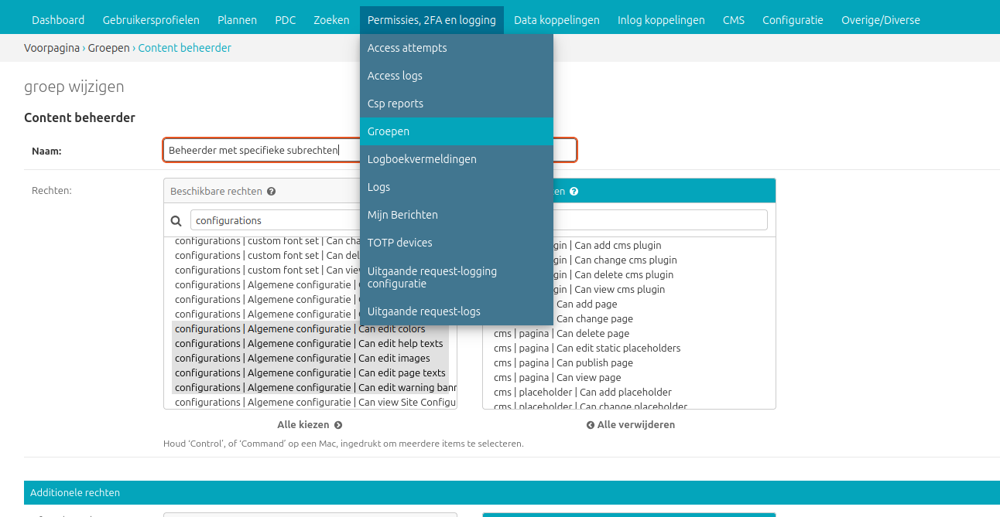

.. _inloggen_op_de_beheeromgeving:

================================
2. Inloggen op de beheeromgeving
================================

Om in te loggen op de beheeromgeving van Open Inwoner gaat u in uw browser naar [uw domeinnaam]/admin . Vul in dit scherm het aan uw Open Inwoner omgeving gekoppelde e-mailadres in en het bijbehorende wachtwoord. Klik vervolgens op [inloggen].

2.1. Nieuw wachtwoord aanvragen
===============================

Bent u uw wachtwoord vergeten? Klik dan op de knop [wachtwoord of gebruikersnaam vergeten]. U krijgt dan op uw e-mailadres instructies toegestuurd om een nieuw wachtwoord in te stellen.

2.2. Tweestapsverificatie: token invoeren
=========================================

Om in te loggen op Open Inwoner is het noodzakelijk een token in te voeren dat gegenereerd is met een tokengenerator. Gebruik hiervoor bijvoorbeeld de app Google Authenticator en scan de QR-code.
Wanneer de app een token heeft gegenereerd, kunt u dit in het venster invoeren. Klik vervolgens op [volgende]. U bent nu volledig ingelogd op Open Inwoner.

.. _beperkte_toegang_beheeromgeving:

2.3. Beperkte toegang verlenen
==============================

Open Inwoner ondersteunt beperkte toegangsrechten binnen de beheeromgeving. Dit betekent
dat het mogelijk is om bepaalde gebruikers slechts toegang te verlenen tot specifieke
onderdelen van de :ref:`Algemene Configuratie <configuratie>`, in plaats van volledige
beheerdersrechten. Hiermee kunnen bijvoorbeeld beheerders worden aangesteld om de
uiterlijke kenmerken van de site te beheren (kleuren en teksten) zonder dat deze
gebruikers de meer gevoelige, functionele configuratie kunnen aanpassen.

**Hoe werkt beperkte toegang?**

De toegang wordt geregeld per sectie ("fieldset") van de siteconfiguratie. De volgende
secties kunnen afzonderlijk toegekend worden:

* **Kleuren** (``configurations | Algemene configuratie | Can edit colors``) - Toegang
  tot kleurinstellingen van de website
* **Afbeeldingen** (``configurations | Algemene configuratie | Can edit images``) -
  Toegang tot logo's, favicon en andere afbeeldingen
* **Waarschuwingsbanner** (``configurations | Algemene configuratie | Can edit warning
  banner``) - Toegang tot de waarschuwingsbanner instellingen
* **Paginateksten** (``configurations | Algemene configuratie | Can edit page texts``) -
  Toegang tot verschillende teksten op de website
* **Helpteksten** (``configurations | Algemene configuratie | Can edit help texts``) -
  Toegang tot de helpteksten voor verschillende pagina's

**Rechten toekennen**

Beperkte toegang kan op twee manieren worden ingesteld:

1. **Direct aan gebruikers**: In de Django admin onder "Gebruikers" kunnen de
   bovenstaande rechten direct aan individuele gebruikers worden toegekend.

2. **Via groepen**: Maak groepen aan in de Django admin en ken de gewenste rechten toe
   aan deze groepen. Voeg vervolgens gebruikers toe aan de juiste groepen.

**Vereisten voor toegang**

* **Beheerder status**: Een gebruiker moet altijd "Beheerder status" (Staff status)
  aangevinkt hebben om toegang te krijgen tot de beheeromgeving, ook bij gedeeltelijke
  toegang.
* **Specifieke rechten**: Daarnaast moeten de gewenste sectie-rechten toegekend worden
  zoals hierboven beschreven.

**Belangrijk**: Gebruikers met gedeeltelijke toegang kunnen alleen de secties zien en
bewerken waarvoor zij rechten hebben. Superusers en gebruikers met volledige
``configurations.change_siteconfiguration`` rechten hebben altijd toegang tot alle
secties.

