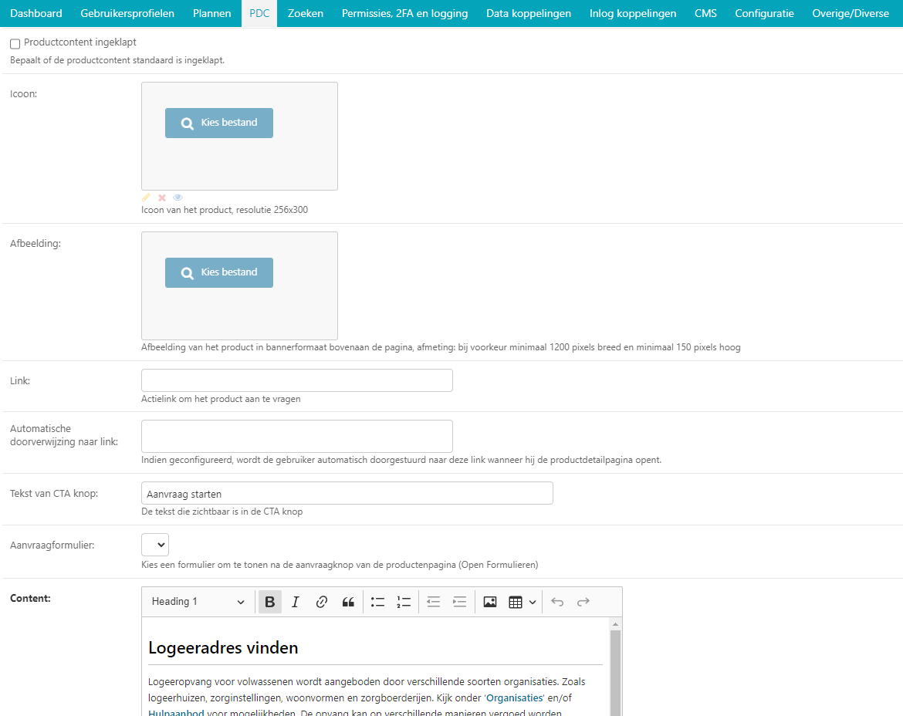

.. _pdc:

========================================
6. PDC (Producten en Diensten Catalogus)
========================================

In het topmenu vindt u de knop PDC. Wanneer u hier met uw muis over
hovert, verschijnt er een submenu met daarin alle onderdelen van de
producten en diensten catalogus. Deze lijst is tevens zichtbaar in het
dashboard van Open Inwoner. Zowel via het menu als via het dashboard
kunt u naar het gewenste onderdeel van de PDC doorklikken.

6.1. Condities
==============

Onder condities vindt u een overzicht condities – voorwaarden – die voor
sommige producten uit de PDC gelden. U kunt extra condities toevoegen,
condities wijzigen en verwijderen.

.. image:: images/image26.png
   :width: 494px
   :height: 112px

6.1.1. Item toevoegen
---------------------

Door op de knop [conditie toevoegen +] rechts bovenin uw scherm te
klikken kunt u een nieuwe conditie toevoegen. Er wordt een nieuw scherm geopend waarin u de regels voor de
conditie kunt opstellen. Dit scherm is gelijk aan het scherm om een conditie te wijzigen.

6.1.2. Item wijzigen
--------------------

Door op de betreffende conditie in de lijst te klikken, kunt u deze
wijzigen. Er wordt een nieuw scherm geopend waar u de voorwaarde zelf en een bevestigend en ontkennend
antwoord kunt formuleren.

| *Naam*
| Hier kunt u de conditie een naam geven.

| *Vraag*
| Hier formuleert u de vraag die gesteld wordt om erachter te komen of
  de gebruiker in aanmerking komt voor een product of dienst uit de PDC.

| *Bevestigend antwoord*
| Hier formuleert u het bevestigende antwoord op de conditie. Waarmee
  voldoet men aan de gestelde conditie?

| *Ontkennend antwoord*
| Hier formuleert u het ontkennende antwoord op de conditie. Waarmee
  voldoet men niet aan de gestelde conditie?

| *Regel*
| Hier worden regels opgegeven voor de automatische controle van de
  betreffende conditie. Dit is momenteel nog niet beschikbaar in Open
  Inwoner.

| *Opslaan of verwijderen*
| U kunt in dit scherm ook de betreffende organisatie verwijderen door
  onderaan het scherm op de rode knop [verwijderen] te klikken.

Als u uw wijzigingen tussentijds wilt opslaan, klikt u op [opslaan en
opnieuw bewerken]. Wanneer u tevreden bent met uw wijzigingen klikt u op
[opslaan] om terug te keren naar het overzicht. Of u klikt op [opslaan
en nieuwe toevoegen] als u een extra item wilt toevoegen.

6.1.3. Item verwijderen
-----------------------

Items kunnen op twee manieren worden verwijderd. U kunt items
verwijderen door de gewenste conditie in het overzicht aan te vinken en
in het drop down menu bij Actie “Geselecteerde condities verwijderen”
selecteren en op de knop [uitvoeren] te drukken.

Daarnaast kunt u op een specifieke conditie in het overzicht klikken. In
het nieuw geopende scherm kunt u de betreffende conditie verwijderen
door op de rode knop [verwijderen] te klikken.

6.2. Onderwerpen
================

Onder onderwerpen vindt u een overzicht van uw Open Inwoner-omgeving. Op
deze pagina vindt u de lijst met onderwerpen die u ook aan de voorkant
van de omgeving kunt zien en u ziet in het overzicht de rechten die
toegekend zijn per onderwerp (zie hoofdstuk 6.1.3). U kunt onderwerpen
toevoegen, wijzigen, verwijderen, importeren of exporteren.

Daarnaast kunt u eenvoudig de volgorde van de onderwerpen veranderen
door op het icoontje met vier pijltjes te klikken en het betreffende
onderwerp te verslepen. Wilt u een onderwerp onder een ander onderwerp
hangen? Dan sleept u het onderwerp naar het gewenste hoofdonderwerp.

6.2.1. Importeren
-----------------

Door op de knop [importeren] rechts bovenin uw scherm te klikken kunt u
een bestaande lijst onderwerpen vanuit .csv of .xlsx importeren. Er
wordt een nieuw scherm geopend waar u een bestand kunt selecteren om te
importeren. De import voegt de velden: *naam*, *slug* en *description*
toe. Klik op [bestand kiezen] en selecteer het gewenste bestand.
Selecteer het gewenste bestandsformaat in het drop down menu en klik op
[indienen].

6.2.2. Exporteren
-----------------

Door op de knop [exporteren] rechts bovenin uw scherm te klikken kunt u
het onderwerp-overzicht exporteren naar .csv of .xlsx. Er wordt een
nieuw scherm geopend waar u het gewenste bestandsformaat kunt
selecteren. Klik hierna op [indienen] om te exporteren.

6.2.3. Item toevoegen
---------------------

| Door op de knop [onderwerp toevoegen +] rechts bovenin uw scherm te
  klikken kunt u een nieuw onderwerp toevoegen. Er wordt een nieuw
  scherm geopend waar u diverse gegevens kunt invullen.

| *Naam*
| Hier kunt u de naam van het onderwerp invullen of wijzigen

| *Slug*
| Dit is het onderdeel van de URL wat het onderwerp beschrijft. Gebruik
  enkel kleine letters en koppeltekens (-) in plaats van spaties.
  Bijvoorbeeld activiteiten-en-meedoen.

| *Omschrijving*
| In dit veld vult u de omschrijving van het onderwerp in. Dit is de
  tekst die aan de voorkant op de betreffende onderwerppagina komt te
  staan.

| *Icoon*
| Hier kunt u een passend icoon voor het onderwerp uploaden. Sleep het
  gewenste bestand naar het veld of klik op [kies bestand]. Let op de
  afmetingen van de afbeelding.

Om een eerder gekozen icoontje te wijzigen klikt u op het icoontje van
het potlood. Om het huidige logo te verwijderen klikt u op [x].

| *Afbeelding*
| Hier kunt u een passende afbeelding voor het onderwerp uploaden. Sleep
  het gewenste bestand naar het veld of klik op [ kies bestand]. Let op
  de afmetingen van de afbeelding. Deze afbeelding wordt in het
  onderwerp-overzicht op de onderwerp-pagina weergegeven.

Om een eerder gekozen afbeelding te wijzigen klikt u op het icoontje van
het potlood. Om het huidige logo te verwijderen klikt u op [x].

| *Automatische doorverwijzing naar link*
| Hier kunt u een URL opgeven waarnaar de gebruiker automatisch wordt
  doorgestuurd wanneer deze de detailpagina van de betreffende categorie
  bezoekt.

| *Positie + Ten opzichte van*
| In dit veld vult u de positie van het onderwerp in. Selecteer ‘naast’
  om het onderwerp in hoofdlaag van de boomstructuur te plaatsen.
  Selecteer ‘onderdeel’ om er een subniveau van te maken. Wanneer u er
  een subniveau van wilt maken, kunt u bij het drop down menu *ten
  opzichte van* een onderwerp selecteren waaronder dit onderwerp moet
  komen.

| *Onderwerp rechten*
| Hier kunt u aangeven wanneer het onderwerp zichtbaar mag zijn op het
  Open Inwoner Platform. U kunt hier kiezen uit de volgende opties:

| - Gepubliceerd: dit betekent dat het onderwerp zichtbaar mag zijn
 voor eindgebruikers. De drie volgende vinkjes bepalen voor wie het
 onderwerp zichtbaar is. Om een onderwerp zichtbaar te maken moet er
 minimaal een vinkje bij gepubliceerd staan én een vinkje bij een
 van de overige opties (anoniem, bedrijven, inwoner)
| - Anonieme deel: dit betekent dat het onderwerp zichtbaar is op het
 anonieme deel van het platform, waarvoor niet hoeft worden ingelogd
| - Bedrijven content: dit betekent dat het onderwerp beschikbaar is
 wanneer iemand als bedrijf of met eHerkenning of KVK ingelogd is
| - Inwoner content: dit betekent dat het onderwerp beschikbaar is
 wanneer iemand aangeeft een inwoner te zijn, of wanneer is ingelogd
 met BSN
| - Beperken tot beheerdersgroepen: dit betekent dat het onderwerp
 alleen gewijzigd kan worden door beheerders die tot een bepaalde
 groep behoren.

| *Zichtbaarheid onderwerpen voor plug-in op startpagina*
| Het is mogelijk onderwerpen te tonen op de homepage. Onderwerpen
  worden standaard NIET getoond op de homepage, behalve als er een
  vinkje wordt gezet bij ‘uitgelicht’.

Daarnaast is er een mogelijkheid om bepaalde onderwerpen conditioneel
weer te geven op de homepage, wanneer een gebruiker (inwoner of bedrijf)
een zaak heeft (gehad) van het geselecteerde zaaktype. Om een onderwerp
enkel weer te geven wanneer een gebruiker een zaak heeft (gehad) van een
bepaald zaaktype, haalt u het vinkje weg bij ‘uitgelicht’, maar
selecteert u het gewenste zaaktype om de voorwaarde te configureren.

| *Category products*
| Hier kunt u producten selecteren die onder het betreffende onderwerp
  moeten komen te hangen. U kunt hier meerdere producten selecteren door
  op [+] te klikken. Om een bepaald product te verwijderen klikt u op
  [x] achter het betreffende category product. De geselecteerde
  producten komen aan de voorkant van het platform op de pagina van het
  betreffende onderwerp te staan.

| *Veelgestelde vragen*
| Hier kunt u veelgestelde vragen formuleren die betrekking hebben op
  het onderwerp. Bij ‘vraag’ vult u de vraag in en bij ‘antwoord’ vult u
  het antwoord op de vraag in. Deze veelgestelde vragen worden
  weergegeven bij het betreffende onderwerp. Een veelgestelde vraag kan
  slechts betrekking hebben op één onderwerp. Indien een vraag voor
  meerdere onderwerpen van toepassing is dient deze vraag gedupliceerd
  te worden en moet de vraag bij allebei de onderwerpen worden
  gekoppeld.

| *Opslaan of verwijderen*
| Als u uw wijzigingen tussentijds wilt opslaan, klikt u op [opslaan en
  opnieuw bewerken]. Wanneer u tevreden bent met uw wijzigingen klikt u
  op [opslaan] om terug te keren naar het overzicht. Of u klikt op
  [opslaan en nieuwe toevoegen] als u een extra item wilt toevoegen.

6.3. Organisaties
=================

Onder organisaties vindt u alle organisaties die relevant zijn voor uw
Open Inwoner-omgeving. Indien gewenst kunt u extra organisaties
toevoegen, organisaties wijzigen en verwijderen. Bovendien kunt u
organisaties eenvoudig filteren op naam of op stad.

6.3.1. Item toevoegen
---------------------

Door op de knop [organisatie toevoegen +] rechts bovenin uw scherm te
klikken kunt u een nieuwe organisatie toevoegen.

6.3.2. Item wijzigen
--------------------

| Door op de betreffende organisatie in de lijst te klikken, kunt u deze
  wijzigen. Er wordt een nieuw scherm geopend waar u naast de adres- en
  contactgegevens diverse wijzigingen kunt aanbrengen. Een voorbeeld van dit scherm is weergegeven in de eerstvolgende afbeelding.

| *Naam*
| Hier kunt u de naam van de organisatie wijzigen.

| *Slug*
| Dit is het onderdeel van de URL wat de organisatie beschrijft. Gebruik
  enkel kleine letters en koppeltekens (-) in plaats van spaties.
  Bijvoorbeeld gemeente-deventer.

| *Type*
| Hier selecteert of wijzigt u het organisatietype van de betreffende
  organisatie. Door op het icoontje van het potlood te klikken kunt u
  het gekozen organisatietype wijzigen. Klik op [+] om een nieuw
| organisatietype toe te voegen.

| *Logo*
| Hier kunt u het logo van de organisatie uploaden. Sleep het gewenste
  bestand naar het veld of klik op [ kies bestand].

Om een eerder gekozen logo te wijzigen klikt u op het icoontje van het
potlood. Om het huidige logo te verwijderen klikt u op [x].

| *Wijk*
| Hier selecteert of wijzigt u de wijk van de betreffende organisatie.
  Door op het icoontje van het potlood te klikken kunt u de gekozen wijk
  wijzigen. Klik op [+] om een nieuwe wijk toe te voegen. Om de huidige
  wijk te verwijderen klikt u op [x].

| *Contact*
| Hier vult u de contactgegevens van de organisatie in: het e-mailadres
  en telefoonnummer.

| *Adres*
| Hier vult u de adresgegevens van de organisatie in. De weergegeven
  locatie op de kaart is afhankelijk van de ingevulde postcode.

| *Opslaan of verwijderen*
| U kunt in dit scherm ook de betreffende organisatie verwijderen door
  onderaan het scherm op de rode knop [verwijderen] te klikken.

Als u uw wijzigingen tussentijds wilt opslaan, klikt u op [opslaan en
opnieuw bewerken]. Wanneer u tevreden bent met uw wijzigingen klikt u op
[opslaan] om terug te keren naar het overzicht. Of u klikt op [opslaan
en nieuwe toevoegen] als u een extra item wilt toevoegen.

6.3.3. Item verwijderen
-----------------------

Items kunnen op twee manieren worden verwijderd. U kunt items
verwijderen door de gewenste organisatie in het overzicht aan te vinken
en in het drop down menu bij Actie “Geselecteerde organisaties
verwijderen” selecteren en op de knop [uitvoeren] te drukken.

Daarnaast kunt u op een specifieke organisatie in het overzicht klikken.
In het nieuw geopende scherm kunt u de betreffende organisatie
verwijderen door op de rode knop [verwijderen] te klikken.

6.3.4. Geschiedenis / logboek raadplegen
----------------------------------------

Van alle wijzigingen aan organisaties wordt een logboek bijgehouden. Om
de geschiedenis te raadplegen klikt u op de knop [geschiedenis] rechts
bovenin het scherm van de betreffende organisatie. In de geschiedenis
vindt u alle informatie van wijzigingen rond deze organisatie met
betrekking tot datum en tijd, de gebruiker die de wijziging heeft
aangebracht en de actie die is uitgevoerd.

6.4. Organisatietypes
=====================

Onder organisatietype vindt u alle soorten organisaties die relevant
zijn voor uw Open Inwoner-omgeving.

Indien gewenst kunt u extra organisatietypes toevoegen, organisatietypes
wijzigen en organisatietypes verwijderen.

6.4.1. Item toevoegen
---------------------

Door op de knop [organisatietype toevoegen +] rechts bovenin uw scherm
te klikken kunt u een nieuw organisatietype toevoegen.

6.4.2. Item wijzigen
--------------------

Door op het betreffende organisatietype in de lijst te klikken, kunt u
dit organisatietype wijzigen. Er wordt een nieuw scherm geopend waar u
de naam van het organisatietype in het invoerveld kunt veranderen. U
kunt in dit scherm het betreffende organisatietype verwijderen door op
de rode knop [verwijderen] te klikken.

Wanneer u tevreden bent met uw wijzigingen klikt u op [opslaan] om terug
te keren naar het overzicht, of u klikt op [opslaan en nieuwe toevoegen]
als u een extra item wilt toevoegen.

6.4.3. Item verwijderen
-----------------------

Items kunnen op twee manieren worden verwijderd. U kunt items
verwijderen door de gewenste organisatietypes in het overzicht aan te
vinken en in het drop down menu bij Actie “Geselecteerde
organisatietypes verwijderen” selecteren en op de knop [uitvoeren] te
drukken.

Daarnaast kunt u op een specifiek organisatietype in het overzicht
klikken. In het nieuw geopende scherm kunt u het betreffende
organisatietype verwijderen door op de rode knop [verwijderen] te
klikken.

6.4.4. Geschiedenis / logboek raadplegen
----------------------------------------

| Van alle organisatietypes wordt een logboek bijgehouden met
  wijzigingen. Om de geschiedenis te raadplegen klikt u op de knop
  [geschiedenis] rechts bovenin het scherm van het betreffende
| organisatietype. In de geschiedenis vindt u alle informatie van
  wijzigingen aan het betreffende organisatietype met betrekking tot
  datum en tijd, de gebruiker die de wijziging heeft aangebracht en de
  actie die is uitgevoerd.

6.5. Productcontacten
=====================

Onder productcontacten vindt u een overzicht van de contactgegevens
van de betrokken personen bij producten. U kunt het overzicht
filteren op product.

6.5.1. Item toevoegen
---------------------

Door op de knop [productcontact toevoegen +] rechts bovenin uw scherm
te klikken kunt u een nieuwe contactpersoon toevoegen. Er wordt een
nieuw scherm geopend. Hier kunt u de contactgegevens aan het juiste –
of nieuw gespecificeerde – product en de juiste organisatie koppelen
in de drop down menu’s.

Voer in de invulvelden de betreffende adresgegevens in.

| *Opslaan of verwijderen*
| Als u uw wijzigingen tussentijds wilt opslaan, klikt u op [opslaan
 en opnieuw bewerken]. Wanneer u tevreden bent met uw wijzigingen
 klikt u op [opslaan] om terug te keren naar het overzicht. Of u
 klikt op [opslaan en nieuwe toevoegen] als u een extra item wilt
 toevoegen.

6.6. Producten
==============

Onder producten vindt u een overzicht van de producten binnen uw Open
Inwoner-omgeving. Er wordt een nieuw scherm geopend waarin u
producten kunt toevoegen, wijzigingen kunt maken en u kunt producten
importeren en exporteren. U kunt het overzicht filteren op
creatiedatum, categorie of op tag.

6.6.1. Importeren
-----------------

Door op de knop [importeren] rechts bovenin uw scherm te klikken kunt u
een bestaande lijst producten vanuit .csv of .xlsx importeren. Er wordt
een nieuw scherm geopend waar u een bestand kunt selecteren om te
importeren. De import voegt de velden: *name, slug, summary, link,
content, costs, categories, organizations, related_products, tags* toe.
Klik op [bestand kiezen] en selecteer het gewenste bestand. Selecteer
het gewenste bestandsformaat in het drop down menu en klik op
[indienen].

6.6.2. Exporteren
-----------------

Door op de knop [exporteren] rechts bovenin uw scherm te klikken kunt u
het productoverzicht exporteren naar .csv of .xlsx. Er wordt een nieuw
scherm geopend waar u het gewenste bestandsformaat kunt selecteren. Klik
hierna op [indienen] om te exporteren.

6.6.3. (De)Publiceren
---------------------

In het overzicht van de producten staat een kolom “Gepubliceerd” met
achter ieder product een blauw vinkje. Deze vinkjes geven aan dat het
betreffende product zichtbaar is op het Open Inwoner platform.

Wanneer u de publicatie van een product (tijdelijk) ongedaan wilt maken,
maar u de inhoud van het product niet wilt verliezen, dan kunt u hier
eenvoudig het vinkje weghalen door erop te klikken. Het betreffende
product is dan niet meer te raadplegen op Open Inwoner.

6.6.4. Item toevoegen
---------------------

Door op de knop [product toevoegen +] rechts bovenin uw scherm te
klikken kunt u een nieuw product toevoegen. Er wordt een nieuw scherm
geopend waarin u diverse dingen kunt invullen of wijzigingen kunt
aanbrengen.

| *Naam*
| Hier kunt u de productnaam invullen of wijzigen

| *Slug*
| Dit is het onderdeel van de URL wat het product beschrijft. Gebruik
  enkel kleine letters en koppeltekens (-) in plaats van spaties.
  Bijvoorbeeld individuele-studietoeslag-aanvragen.

| *Gepubliceerd*
| Wanneer deze tickbox is aangevinkt, is het product gepubliceerd.
  Wanneer u het product (tijdelijk) niet gepubliceerd wilt hebben dient
  u hier het vinkje weg te halen.

| *Samenvatting*
| In dit veld vult u een korte samenvatting van het product in. Dit is
  de tekst die aan de voorkant op de betreffende productpagina komt te
  staan.

| *Productcontent ingeklapt*
| Wanneer deze tickbox is aangevinkt, is de productcontent standaard
  ingeklapt. Wanneer u de productcontent altijd uitgeklapt wilt hebben
  dient u hier het vinkje weg te halen.

| *Icoon*
| Hier kunt u een passend icoon voor het product uploaden. Sleep het
  gewenste bestand naar het veld of klik op [kies bestand]. Let op de
  afmetingen van de afbeelding: maximaal 256x300px.

Om een eerder gekozen icoontje te wijzigen klikt u op het icoontje van
het potlood. Om het huidige logo te verwijderen klikt u op [x].

| *Afbeelding*
| Hier kunt u een passende afbeelding voor het onderwerp uploaden. Sleep
  het gewenste bestand naar het veld of klik op [kies bestand]. Let op
  de afmetingen van de afbeelding. Deze afbeelding wordt in het
  productoverzicht op de onderwerp-pagina weergegeven.

Om een eerder gekozen afbeelding te wijzigen klikt u op het icoontje van
het potlood. Om het huidige logo te verwijderen klikt u op [x].

| *Link*
| Voer hier de URL van het betreffende product in.

| *Automatische doorverwijzing naar link*
| Voer hier, indien gewenst, de URL in waarnaar u de productpagina wilt
  laten doorverwijzen. Dit betekent dat de productpagina niet naar de
  betreffende productpagina van Open Inwoner doorklikt.

| *Tekst van CTA knop*
| Hier kunt u de tekst invullen die u aan de call-to-action button wilt
  meegeven. De CTA button is de opvallende knop op de pagina die
  gebruikers aanspoort een specifieke actie te ondernemen (call to
  action). Een CTA-knop is visueel aantrekkelijk en strategisch
  geplaatst en beschikt over een overtuigende, duidelijke en beknopte
  tekst (Bijvoorbeeld: Meld je aan)

| *Aanvraagformulier*
| Hier kunt u een aanvraagformulier uit Open Formulieren selecteren dat
  wordt getoond na het klikken op de CTA button op de betreffende
  productpagina.

| *Content*
| In deze WYSIWYG editor kunt u de productpagina creëren. U kunt de
  gehele pagina opmaken door gebruik te maken van de tekstopties.
  Gebruik headings voor kopteksten en paragraph voor lopende tekst. U
  kunt in de editor ook links en quotes invoegen; lijsten creëren met
  bullets of nummers en afbeeldingen invoegen. Wanneer u over de icoontjes hovert krijgt u te zien wat de functie van de betreffende knop in de editor is.

In het content veld is het tevens mogelijk een **CTA button**
(aanvraagformulier) in de lopende tekst toe te voegen. De tekst van de
button in een bovenstaand veld worden aangepast, maar op deze manier is
het mogelijk zelf de plek van de Call To Action button te bepalen, in
plaats van dat deze standaard onder het tekstveld staat.

Wanneer u in de teksteditor de tekst netjes opmaakt door gebruik te
maken van de hiërarchie van headers en paragraphs, maakt u de pagina
direct overzichtelijk. Kies voor de koppen de “Heading 1” om ervoor te
zorgen dat deze koppen direct in het linker menu op de pagina te
raadplegen zijn. Dit zorgt ervoor dat men direct kan doorklikken naar
een bepaald onderdeel van de pagina. In de twee volgende screenshots is
weergegeven hoe dit er in de backend en frontend uitziet.

| *Video*
| Hier selecteert u of én welke YouTube video u wilt tonen onder de
  introductietekst van het betreffende product. U selecteert de gewenste
  video in het drop down menu. Om nog een extra video toe te voegen
  klikt u op [+] achter het drop down menu. Om een video te verwijderen
  klikt u op [X]. Wilt u de detailpagina van de video bekijken, dan
  klikt u op het oogje. U komt dan op de detailpagina van de video, waar
  u enkele gegevens kunt wijzigen.

| *Gerelateerde producten*
| Hier selecteert of wijzigt u gerelateerde producten. Klik op het veld
  om een overzicht van producten te zien. Wanneer u in het veld typt,
  wordt automatisch gezocht naar beschikbare opties. Klik op [+] om
  indien nodig een nieuw gerelateerd product toe te voegen.

| *Tags*
| Hier selecteert of wijzigt u gerelateerde tags (labels). Klik op het
  veld om een overzicht van tags te zien. Wanneer u in het veld typt,
  wordt automatisch gezocht naar beschikbare opties. Klik op [+] om
  indien nodig een nieuwe tag toe te voegen.

| *Kosten*
| Hier vult u de kosten die aan het product verbonden zijn in. Dit is
  een bedrag in euro’s.

| *Organisaties*
| Hier selecteert of wijzigt u organisaties die het betreffende product
  aanbieden. Klik op het veld om een overzicht van organisaties te zien.
  Wanneer u in het veld typt, wordt automatisch gezocht naar beschikbare
  opties. Klik op [+] om indien nodig een nieuwe organisatie toe te
  voegen.

| *Zoekwoorden*
| Hier vult u de zoekwoorden in die met het betreffende product te maken
  hebben. Deze zoekwoorden verbeteren de vindbaarheid van het product.

| *Uniforme productnaam*
| Hier vult u de uniforme productnaam in om de gegevens vanuit externe
  bronnen te kunnen synchroniseren. Dit is momenteel nog niet van
  toepassing voor het Open Inwoner platform.

| *Productcontacten*
| Hier kunt u de contactgegevens invullen van personen die bij het
  betreffende product betrokken zijn. Selecteer de organisatie van de
  betreffende persoon in het drop down menu en vul de verdere gegevens
  in. Staat de gewenste organisatie er nog niet bij? Klik dan op [+]
  onder het drop down menu met organisaties. Wilt u direct de
  betreffende organisatie wijzigen? Klik dan op [√]. (Vergeet niet
  tussentijds op te slaan).

Klik op [+ nog een productcontact toevoegen] om nog contactpersoon toe
te voegen. Om een contactpersoon te verwijderen klikt u op [x] achter de
betreffende persoon.

| *Productlocaties*
| Hier kunt u de adresgegevens van het betreffende product invullen.
  Klik op [+ nog een productlocatie toevoegen] om nog locatie toe te
  voegen. Om een locatie te verwijderen klikt u op [x] achter de
  betreffende link.

| *Condities*
| Bij condities selecteert u de eventuele voorwaarden waaraan de
  gebruiker van het betreffende product moet voldoen. U kunt extra
  condities toevoegen door op de [+] te klikken. Er wordt dan een nieuw
  scherm geopend. Meer informatie over dit scherm vindt u in hoofdstuk
  5.1.2.

| *Toegestane beheeronderwerpen*
| Hier selecteert of wijzigt u de categorie waar het product onder moet
  vallen. Klik op het veld om een overzicht van categorieën te zien.
  Wanneer u in het veld typt, wordt automatisch gezocht naar beschikbare
  opties. Door op het pijltje naar rechts (  ) te klikken selecteert u
  de betreffende categorie. Klik op [alle kiezen] of [alle verwijderen]
  om indien gewenst alle categorieën te selecteren.

| *Productbestanden*
| Hier kunt u productbestanden uploaden of verwijderen. Om een bestand
  te uploaden sleept u het gewenste bestand naar het veld of klik op [
  kies bestand]. Klik op [+ nog een productbestand toevoegen] om nog een
  bestand te selecteren. Om een productbestand te verwijderen klikt u op
  [x] achter het betreffende bestand.

| *Productlinks*
| Hier kunt u links naar het product invullen. Vul de naam van de
  productlink en de URL in. Klik op [+ nog een productlink toevoegen] om
  nog een link aan te maken. Om een link te verwijderen klikt u op [x]
  achter de betreffende link.

| *Veelgestelde vragen*
| Hier kunt u veelgestelde vragen formuleren die betrekking hebben op
  het onderwerp. Bij ‘vraag’ vult u de vraag in en bij ‘antwoord’ vult u
  het antwoord op de vraag in. Deze veelgestelde vragen worden
  weergegeven bij het betreffende onderwerp. Een veelgestelde vraag kan
  slechts betrekking hebben op één onderwerp. Indien een vraag voor meerdere onderwerpen van toepassing is dient deze vraag gedupliceerd te worden en moet de vraag bij allebei de onderwerpen worden gekoppeld.

| *Opslaan of verwijderen*
| Als u uw wijzigingen tussentijds wilt opslaan, klikt u op [opslaan
 en opnieuw bewerken]. Wanneer u tevreden bent met uw wijzigingen
 klikt u op [opslaan] om terug te keren naar het overzicht. Of u
 klikt op [opslaan en nieuwe toevoegen] als u een extra item wilt
 toevoegen.

6.7. Productlocaties
====================

Onder productlocaties vindt u een overzicht van de adresgegevens van
de producten. U kunt het overzicht filteren op stad.

6.7.1. Item toevoegen
---------------------

Door op de knop [productlocatie toevoegen +] rechts bovenin uw scherm
te klikken kunt u een nieuwe locatie toevoegen. Er wordt een nieuw
scherm geopend waar u de locatie aan het juiste – of nieuw
gespecificeerde – product kunt koppelen in het drop down menu.

Voer in de invulvelden de betreffende adresgegevens in.

| *Opslaan of verwijderen*
| Als u uw wijzigingen tussentijds wilt opslaan, klikt u op [opslaan
 en opnieuw bewerken]. Wanneer u tevreden bent met uw wijzigingen
 klikt u op [opslaan] om terug te keren naar het overzicht. Of u
 klikt op [opslaan en nieuwe toevoegen] als u een extra item wilt
 toevoegen.

6.8. Tag types
==============

Onder tag types vindt u een overzicht van de soorten tags die aan
producten binnen uw Open Inwoner-omgeving zijn gekoppeld.

6.8.1. Item toevoegen
---------------------

Door op de knop [tag type toevoegen +] rechts bovenin uw scherm te
klikken kunt u een nieuw tag type toevoegen. Er wordt een nieuw scherm
geopend waar u de naam van het tag type kunt invullen.

| *Opslaan of verwijderen*
| Als u uw wijzigingen tussentijds wilt opslaan, klikt u op [opslaan en
  opnieuw bewerken]. Wanneer u tevreden bent met uw wijzigingen klikt u
  op [opslaan] om terug te keren naar het overzicht. Of u klikt op
  [opslaan en nieuwe toevoegen] als u een extra item wilt toevoegen.

6.9. Tags
==============

Onder tags vindt u een overzicht van de labels die aan producten binnen
uw Open Inwoner-omgeving gekoppeld zijn. U kunt het overzicht filteren
op naam.

6.9.1. Item toevoegen
---------------------

Door op de knop [tag toevoegen +] rechts bovenin uw scherm te klikken
kunt u een nieuwe tag toevoegen. Er wordt een nieuw scherm geopend waar
u de gegevens van de tag kunt invullen.

Voer in de invulvelden de betreffende adresgegevens in.

| *Naam*
| Hier kunt u de naam van de tag invullen of wijzigen

| *Slug*
| Dit is het onderdeel van de URL wat de tag beschrijft. Gebruik enkel
  kleine letters en koppeltekens (-) in plaats van spaties. Bijvoorbeeld
  huiselijk-geweld.

| *Icoon*
| Hier kunt u een passend icoon voor de tag uploaden. Sleep het gewenste
  bestand naar het veld of klik op [ kies bestand]. Let op de afmetingen
  van de afbeelding.

Om een eerder gekozen icoontje te wijzigen klikt u op het icoontje van
het potlood. Om het huidige logo te verwijderen klikt u op [x].

| *Type*
| Hier selecteert of wijzigt u het type van de betreffende tag. Door op
  het icoontje van het potlood te klikken kunt u het gekozen type
  wijzigen. Klik op [+] om een nieuw type toe te voegen.

| *Opslaan of verwijderen*
| Als u uw wijzigingen tussentijds wilt opslaan, klikt u op [opslaan en
  opnieuw bewerken]. Wanneer u tevreden bent met uw wijzigingen klikt u
  op [opslaan] om terug te keren naar het overzicht. Of u klikt op
  [opslaan en nieuwe toevoegen] als u een extra item wilt toevoegen.

6.10.Veelgestelde vragen
========================

De veelgestelde vragen ofwel FAQ, zijn vragen die vaker door gebruikers
gesteld worden. De sectie met deze veelgestelde vragen én hun antwoorden
kan gebruikers snel(ler) op weg helpen wanneer zij met een van deze
vragen zitten. Dit onderdeel kunt u gebruiken om vragen van gebruikers
voor te zijn, door er alvast op in te spelen. U kunt in het overzicht
vragen toevoegen, verplaatsen, wijzigen of verwijderen. Bovendien kunt u
de veelgestelde vragen filteren op onderwerp.

**Let op! Een vraag kan slechts aan één onderwerp worden gekoppeld. Wilt
u dezelfde vraag onder twee onderwerpen terug laten komen? Dan
dupliceert u de vraag en het bijbehorende antwoord en koppelt u deze aan
een tweede of derde onderwerp. Vergeet niet dat u bij het wijzigen van
de vraag of het antwoord óók de vraag onder een eventueel ander
onderwerp aanpast.**

6.10.1. Veelgestelde vraag toevoegen
------------------------------------

Door op de knop [Vraag toevoegen +] rechts bovenin uw scherm te klikken
kunt u een nieuwe veelgestelde vraag toevoegen. Er wordt dan een nieuw
scherm geopend waar u de velden genoemd onder 7.1.2. kunt invullen.

6.10.2. Veelgestelde vraag wijzigen
-----------------------------------

Door op de betreffende vraag in de lijst te klikken, kunt u deze
wijzigen. Er wordt een nieuw scherm geopend waar u diverse wijzigingen
kunt aanbrengen. Dit scherm is weergegeven in deze afbelding:

| *Onderwerp*
| Hier selecteert u het onderwerp waar de veelgestelde vraag betrekking
  op heeft. U selecteert een van de onderwerpen in het dropdown menu. Om
  het geselecteerde onderwerp aan te passen klikt u op het potloodje.
  Wilt u een nieuw - nog niet bestaand - onderwerp toevoegen dat nog
  niet in de lijst voorkomt, dan klikt u op [+].

**Let op! Bij het toevoegen van een nieuw onderwerp, door te klikken op
[+] komt u in het scherm terecht waar u een nieuw onderwerp toevoegt. U
dient als beheerder voorzichtig met deze optie om te gaan en hem
volledig in te vullen, anders ontstaat er aan de voorkant een wildgroei
aan incomplete onderwerpen.**

| *Product*
| Selecteer hier het product waaraan de veelgestelde vraag moet worden
  gekoppeld. U selecteert een van de producten in het dropdown menu. Om
  het geselecteerde product aan te passen klikt u op het potloodje. Wilt
  u een nieuw - nog niet bestaand - product toevoegen dat nog niet in de
  lijst voorkomt, dan klikt u op [+]. Denk eraan dat een vraag maar aan
  één product kan worden gekoppeld. Indien een vraag betrekking zou
  kunnen hebben op meerdere producten dupliceert u de vraag en koppelt u
  deze per duplicaat aan een andere vraag.

Indien er geen product wordt geselecteerd geldt de vraag als een
algemene veelgestelde vraag en wordt hij in het menu weergegeven.

**Let op! Bij het toevoegen van een nieuw product, door te klikken op
[+] komt u in het scherm terecht waar u een nieuw product toevoegt. U
dient als beheerder voorzichtig met deze optie om te gaan en hem
volledig in te vullen, anders ontstaat er aan de voorkant een wildgroei
aan incomplete producten.**

| *Vraag*
| Formuleer hier de veelgestelde vraag.

| *Antwoord*
| Bij antwoord vult u de het antwoord op de veelgestelde vraag in.
 Hiervoor is een eenvoudige editor aanwezig, zoals hieronder
 afgebeeld.

.. image:: images/image47.png
   :width: 616px
   :height: 106px

| 1.Hier selecteert u wat voor soort tekst u aan het typen bent. Dit heeft gevolgen voor de standaardopmaak. Kies uit *paragraph*,*heading 1, heading 2, heading 3* etc.
| 2.Hiermee maakt u de tekst vetgedrukt
| 3.Hiermee maakt u de tekst italic
| 4.Hiermee voegt u een link toe aan de tekst
| 5.Hiermee voegt u een citaat aan de tekst toe
| 6.Hiermee maakt u een ongenummerde lijst (met bulletpoints)
| 7.Hiermee maakt u een genummerde lijst
| 8.Hiermee kunt u de inspringing vergroten of verkleinen
| 9.Hiermee voegt u een afbeelding aan de tekst toe
| 10.Hiermee voegt u een tabel in
| 11.Stap terug (ongedaan maken) of stap vooruit (opnieuw doen)

| *Opslaan of verwijderen*
| U kunt in dit scherm ook de betreffende veelgestelde vraag
 verwijderen door onderaan het scherm op de rode knop [verwijderen]
 te klikken.

Als u uw wijzigingen tussentijds wilt opslaan, klikt u op [opslaan en
opnieuw bewerken]. Wanneer u tevreden bent met uw wijzigingen klikt u
op [opslaan] om terug te keren naar het overzicht. Of u klikt op
[opslaan en nieuwe toevoegen] als u een extra item wilt toevoegen.

6.10.3. Veelgestelde vraag verwijderen
--------------------------------------

Veelgestelde vragen kunnen op twee manieren worden verwijderd. U kunt
vragen verwijderen door de gewenste vraag in het overzicht aan te
vinken en in het drop down menu bij Actie “Geselecteerde veelgestelde
vragen verwijderen” selecteren en op de knop [uitvoeren] te drukken.

Daarnaast kunt u op een specifieke vraag in het overzicht klikken. In
het nieuw geopende scherm kunt u de betreffende vraag verwijderen
door op de rode knop [verwijderen] te klikken.

6.11.Vragenlijststappen
=======================

| De vragenlijststappen zijn de vragen die gebruikers helpen de
  producten te tonen die passend zijn bij hun situatie of hulpvraag.
  Deze vragen zijn te vinden onder *Mijn profiel* bij *Zelftest*. De
  vragenlijststappen kunnen naar behoeven worden uitgebreid en
  aangepast. Ook kan de boomstructuur van de stappen eenvoudig worden
  gewijzigd en kunnen vragen worden verwijderd. In het overzicht van de
| vragenlijststappen kunt u aan de groene vinkjes zien of een
  vragenlijststap gepubliceerd (en actief) is. Dit betekent dat de
  vragenboom door gebruikers gestart kan worden.

6.11.1. Vragenlijststap toevoegen
---------------------------------

Door op de knop [Vragenlijststap toevoegen +] rechts bovenin uw scherm
te klikken kunt u een nieuw onderdeel van de zelfdiagnose toevoegen. Er
wordt dan een nieuw scherm geopend waar u de velden genoemd bij 6.11.2.
kunt invullen. Een screenshot van dit scherm is weergegeven op de
volgende pagina.

6.11.2. Vragenlijststap wijzigen
--------------------------------

Door op de betreffende vraag in de lijst te klikken, kunt u deze
wijzigen. Er wordt een nieuw scherm geopend waar u diverse wijzigingen
kunt aanbrengen, zoals op de volgende pagina is weergegeven. Let op dat
er in dit scherm twee onderdelen moeten worden uitgeklapt om alle velden
aan te passen. Het gaat om de in de blauwe balk weergegeven onderdelen
‘Stappenplan’ en ‘Eindstatus velden’. Wanneer u op [tonen] klikt krijgt
u alle invulvelden te zien.

| *Antwoord op de vorige vraag*
| Wanneer de vraag een vervolgvraag is die enkel bij een bepaald
  antwoord op de vorige vraag relevant is, wordt het antwoord op de
  vorige vraag hier ingevuld. Als de vraag zelf een hoofdvraag is blijft
  dit veld leeg.

| *Vraag*
| Formuleer hier de huidige vraag.

| *Onderwerp vraag*
| Vul hier het onderwerp van de vraag in. Dit onderwerp wordt
  weergegeven op plekken waar geen ruimte is om het volledige antwoord
  te tonen.

| *URL-vriendelijke naam / slug*
| Maak van de vragenlijststap een URL-vriendelijke versie. Gebruik enkel
  kleine letters en koppeltekens (-) in plaats van spaties. Bijvoorbeeld
  op-welke-manier-wil-je-werkervaring-opdoen.

| *Code voor intern gebruik*
| Hier kunt u een eigen code voor intern gebruik toevoegen.

| *Ondersteunende tekst*
| Dit is de hulptekst die bij de vragenlijststap wordt weergegeven.

Stappenplan
~~~~~~~~~~~

Onder stappenplan kunt u door op [tonen] te klikken enkele technische
velden zichtbaar maken om vragen in de boomstructuur te plaatsen en de
hiërarchie te bepalen. De hiërarchie dient echter via de
overzichtspagina te worden aangepast. Dit is eenvoudiger en minder
foutgevoelig.

| *Positie*
| Bij positie heeft u de keuze tussen ‘eerste onderdeel’, ‘voor’ of ‘na’
  en bepaalt u de plek van de vraag in de boomstructuur. De positie
  staat in relatie tot het bij *Ten opzichte van* geselecteerde
  antwoord.

| *Ten opzichte van*
| Bij *Ten opzichte* van heeft u de keuze tussen ‘hoofdmenu’ of
  respectievelijk ‘1e onderdeel’ en vragen op hetzelfde niveau. De keuze
  die u krijgt is afhankelijk van of de vraag een vervolgvraag in een
  bepaalde vragenboom is of een aparte vragenboom.

**Let op! De hiërarchie van de vragenbomen dient via de overzichtspagina
te worden aangepast, aangezien het wijzigen van de hiërarchie van de
vragen een stuk gebruiksvriendelijker is door gebruik te maken van de
drag-and-drop mogelijkheid.**

| *Titel*
| Dit is de titel van de gehele vragenboom (vragenlijst) en is bovenaan
  de gehele vragenlijst zichtbaar. De titel van de hoofdstap wordt
  overgenomen als deze leeg blijft.

| *Beschrijving*
| Deze tekst wordt ter ondersteuning onder de titel en boven de vraag
  getoond. Wanneer dit veld leeg blijft wordt de tekst van de hoofdstap
  overgenomen.

| *Onderwerp*
| Hier selecteert u het onderwerp waar de vragenlijststap betrekking op
  heeft. U selecteert een van de onderwerpen in het dropdown menu. Om
  het geselecteerde onderwerp aan te passen klikt u op het potloodje.
  Wilt u een nieuw - nog niet bestaand - onderwerp toevoegen dat nog
  niet in de lijst voorkomt, dan klikt u op [+].

Net als voor de veelgestelde vragen geldt dat een vragenlijststap
slechts aan één onderwerp kan worden gekoppeld. Indien een
vragenlijststap op meerdere onderwerpen betrekking zou kunnen hebben
dupliceert u de vragenlijststap en koppelt u het duplicaat aan de
verschillende onderwerpen.

**Let op! Bij het toevoegen van een nieuw onderwerp, door te klikken op
[+] komt u in het scherm terecht waar u een nieuw onderwerp toevoegt. U
dient als beheerder voorzichtig met deze optie om te gaan en hem
volledig in te vullen, anders ontstaat er aan de voorkant een wildgroei
aan incomplete onderwerpen.**

| *Uitgelicht*
| U kunt ervoor kiezen bepaalde vragenlijststappen standaard weer te
  geven op de homepage, zodat men snel bepaalde zelfdiagnoses kan
  uitvoeren. Dit kunt u doen door in de kolom “Uitgelicht” een vinkje te
  zetten bij de gewenste vraag. Een vinkje betekent dat deze vragenlijst
  kan worden gestart zonder eerst naar “Mijn profiel” te gaan. U kunt de
  uitgelichte vragen naar eigen inzicht veranderen. Deze optie is alleen
  relevant voor vragenlijststappen op het hoofdniveau.

| *Gepubliceerd*
| Dit geeft aan of de vragenlijststap gepubliceerd is en dus zichtbaar
  is voor gebruikers van Open Inwoner. Dit heeft alleen betrekking op
  vragenlijststappen op het hoofdniveau van de vragenboom. Wanneer deze
  optie is uitgevinkt zal de gehele vragenboom onzichtbaar worden voor
  gebruikers.

| *Doorsturen naar andere stap*
| Wanneer dit is ingesteld wordt de gebruiker nadat er gekozen is voor
  een bepaald antwoord
| doorgestuurd naar een andere vragenlijststap. Dit kan ook een
  vragenlijststap in een andere vragenboom zijn.

**Eindstatus velden (uitgebreide informatie en producten)**

| *Uitgebreide informatie*
| Hier kunt u extra content neerzetten die wordt weergegeven bij de
  vragenlijststap. Voor dit invoerveld is een uitgebreide editor
  beschikbaar om de tekst zorgvuldig te kunnen opmaken. Er kunnen indien
  gewenst afbeeldingen, links en tabellen worden geplaatst. Voor meer
  informatie over de functies van de tekst editor raadpleegt u de
  beschrijving in hoofdstuk 6.10.2.

| *Gerelateerde producten*
| Hier selecteert u producten die aan de vragenlijststap gerelateerd
  zijn. Deze producten worden bij de betreffende vragenlijststap getoond
  op het scherm van de gebruiker. Zo kunnen ze eventueel de vragenlijst
  onderbreken en direct op een relevant product klikken. Om meerdere
  producten te selecteren houdt u [ctrl] of [command] ingedrukt.

**Bijlagen vragenlijststap**

| *Bestand*
| Hier kunt u het bestand dat bij de vragenlijststap hoort uploaden.
  Sleep het gewenste bestand naar het veld of klik op [kies bestand].

| *Opslaan of verwijderen*
| U kunt in dit scherm ook de betreffende vragenlijststap verwijderen
 door onderaan het scherm op de rode knop [verwijderen] te klikken.

Als u uw wijzigingen tussentijds wilt opslaan, klikt u op [opslaan en
opnieuw bewerken]. Wanneer u tevreden bent met uw wijzigingen klikt u
op [opslaan] om terug te keren naar het overzicht. Of u klikt op
[opslaan en nieuwe toevoegen] als u een extra item wilt toevoegen.

6.11.3. Volgorde en hiërarchie vragenlijststappen wijzigen
----------------------------------------------------------

| U kunt in het overzicht eenvoudig de boomstructuur (hiërarchie)
 en/of de volgorde van de
| vragenlijststappen aanpassen. Dit doet u door op het
 verplaats-icoontje – het icoontje met vier pijltjes die in alle
 richtingen wijzen - te klikken en deze ingedrukt te houden. De
 geselecteerde vragenlijststap wordt nu in blauw weergegeven. U kunt
 deze vragenlijststap nu naar believen verplaatsen.

Wanneer u een vraag met daaraan gekoppelde onderliggende vragen
verplaatst, worden ook deze vervolgvragen verplaatst naar de nieuwe
plek in de boomstructuur.

| *Naastliggend onderdeel maken (zelfde niveau)*
| Om een vragenlijststap op een naastgelegen niveau te verplaatsen
 sleept u de gewenste vraag naar boven of onder een andere
 vragenlijststap tot er een dunne paarse lijn zichtbaar is. Deze
 dunne lijn geeft aan dat de vraag verplaatst wordt als naastliggend
 onderdeel van de vraag die erboven staat. Wanneer dit een vraag op
 subniveau is (vervolgvraag), dan wordt de verplaatste vraag ook
 naar dit niveau verplaatst.

| *Subonderdeel maken (lager of hoger niveau)*
| Om een vragenlijststap naar een lager niveau te verplaatsen sleept
 u de gewenste vraag naar boven of onder een andere vragenlijststap
 tot deze in paars wordt weergegeven. Dit geeft aan dat de vraag
 verplaatst wordt als subonderdeel van de met paars gemarkeerde
 vraag.

| *Wijziging in structuur opslaan*
| Nadat een vraag verplaatst is wordt de verplaatste vraag korte tijd
 geel weergegeven en ziet u een groene balk bovenin het scherm.
 Hieraan kunt u zien dat de vraag is verplaatst en de wijziging in
 de boomstructuur is opgeslagen.

6.11.4. Vragenlijststap weergeven op website
--------------------------------------------

Aangezien het soms niet direct duidelijk kan zijn op welke pagina een
bepaalde vragenlijststap wordt weergegeven is het mogelijk via de
beheeromgeving direct naar de live-pagina te gaan waar de betreffende
vraag staat. Om via de backend direct naar de juiste pagina op de
website te gaan waar de betreffende vraag staat, klikt u onder *Vragen
en antwoorden* -> *Vragenlijststappen* op de gewenste vraag. In het nieuw
geopende scherm klikt u vervolgens op de knop [weergeven op website]
rechts bovenin het scherm.

6.11.5. Vragenlijststap verwijderen
-----------------------------------

Onderdelen van de vragenlijststappen kunnen op twee manieren worden
verwijderd. U kunt vragen verwijderen door de gewenste vraag in het
overzicht aan te vinken en in het drop down menu bij Actie
“Geselecteerde vragenlijststappen verwijderen” selecteren en op de knop
[uitvoeren] te drukken.

Daarnaast kunt u op een specifieke vraag in het overzicht klikken. In
het nieuw geopende scherm kunt u de betreffende vraag verwijderen door
op de rode knop [verwijderen] te klikken.

| *Gekoppelde vragen verwijderen*
| Wanneer u een vraag met daaraan gekoppelde onderliggende vragen wilt
  verwijderen, zult u na het klikken op [verwijderen] een samenvatting
  van de te verwijderen vragen te zien krijgen. In deze samenvatting
  ziet u exact wat er wordt verwijderd als u dit definitief doorvoert en
  waaraan de vragen zijn gekoppeld. Dit kunnen pagina’s zijn, maar ook
  bestanden. Om er zeker van te zijn dat u het juiste verwijdert, is het
  raadzaam de vragen één voor één te verwijderen.
