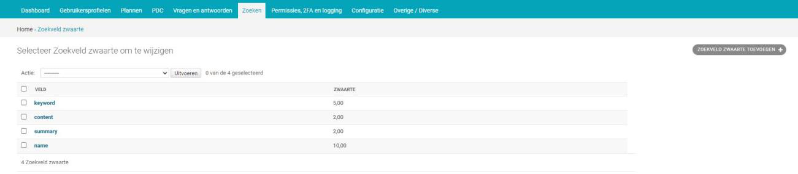

.. _zoeken:

=========
7. Zoeken
=========

Onder zoeken vindt u de onderdelen feedback, synoniemen en
zoekveldgewicht. Feedback biedt het overzicht aan terugkoppelingen van
gebruikers na het uitvoeren van een zoekopdracht. Bij synoniemen kunt u
het systeem slimmer maken door synoniemen voor bepaalde zoektermen aan
te geven.

Zoekveldgewicht is van invloed op de zoekresultaten. U kunt daar zorgen
dat een zoekterm (of gedeelte ervan) op een bepaalde plaats zwaarder
weegt en daardoor hoger in de zoekresultaten komt.

*Let op! De filters van de zoekresultaten die in Open Inwoner aan de
linkerkant van het zoekmenu worden weergegven zijn te deactiveren in de
algemene configuratie.*

7.1. Feedback
=============

Bij feedback vindt u het overzicht aan door gebruikers gegeven feedback
op de zoekresultaten.

| Gebruikers kunnen na het uitvoeren van een zoekopdracht feedback geven
  of ze met deze
| zoekresultaten geholpen zijn etc. Het feedbackformulier staat onder de
  lijst met zoekresultaten. Men kan een duimpje omhoog of omlaag geven
  en er is een tekstveld waarin opmerkingen kunnen worden geplaatst. In
  de onderstaande schermafbeelding ziet u het scherm met zoekresultaten
  en het feedbackformulier, zoals de gebruikers te zien krijgen. In het
  overzicht met feedback kunt u eenvoudig raadplegen of de gegeven
  feedback positief of negatief is. Dit wordt weergegeven met een groen
  vinkje (positief) of een rood kruisje (negatief). Ook kunt u zien
  wanneer de feedback is gegeven en op welke zoekterm.

7.2. Synoniemen
===============

Bij synoniemen vindt u het overzicht van de synoniemen voor zoekwoorden
en andere termen. Deze lijst is standaard gevuld met een import. U kunt
het systeem slimmer maken door zelf synoniemen toe te voegen. Daarnaast
kunnen synoniemen worden aangepast en worden verwijderd, kunt u hem
verrijken met een geïmporteerde lijst en u kunt de synoniemenlijst in
zijn geheel exporteren.

7.2.1. Importeren
-----------------

| Door op de knop [importeren] rechts bovenin uw scherm te klikken kunt
  u een bestaande
| synoniemenlijst vanuit .csv of .xlsx importeren. Er wordt een nieuw
  scherm geopend waar u een bestand kunt selecteren om te importeren.
  Klik op [bestand kiezen] en selecteer het gewenste bestand. Selecteer
  het gewenste bestandsformaat in het drop down menu en klik op
  [indienen].

7.2.2. Exporteren
-----------------

Door op de knop [exporteren] rechts bovenin uw scherm te klikken kunt de
synoniemenlijst exporteren naar .csv of .xlsx. Er wordt een nieuw scherm
geopend waar u het gewenste bestandsformaat kunt selecteren. Klik hierna
op [indienen] om te exporteren.

7.2.3. Item toevoegen
---------------------

Door op de knop [synoniem toevoegen +] rechts bovenin uw scherm te
klikken kunt u een nieuwe synoniem toevoegen. Er wordt een nieuw scherm
geopend waar u de term en de bijbehorende synoniemen kunt invullen. Door
op [extra synoniem toevoegen] te klikken kunt u nog een synoniem aan
dezelfde term toevoegen. Om wijzigingen op te slaan klikt u op de knop
[opslaan].

| *Term*
| Hier vult u de zoekterm in waar u synoniemen bij wilt aangeven.

| *Synoniemen*
| Hier vult u alle relevante synoniemen van de zoekterm in. Klik op
  [extra synoniem toevoegen] om een extra veld aan te maken voor een
  extra synoniem. Door op [x] te klikken kunt u een synoniem

verwijderen. Met de pijltjes omhoog en omlaag kunt u de gecreëerde
synoniemen omhoog of omlaag verplaatsen in de synoniemenlijst.

7.2.4. Item wijzigen
--------------------

Door op een zoekterm in het overzicht te klikken kunt u deze term en de
bijbehorende synoniemen wijzigen. Er wordt een nieuw scherm geopend met
de velden beschreven in 7.2.3, maar wanneer er al synoniemen ingevuld
zijn ziet dit scherm er anders uit. Ook hier kunt u door op [x] te
klikken een synoniem verwijderen en gebruikt u de pijltjes omhoog en
omlaag om de synoniemen omhoog of omlaag verplaatsen in de
synoniemenlijst. Om wijzigingen op te slaan klikt u op de knop
[opslaan].

| *Opslaan of verwijderen*
| Als u uw wijzigingen tussentijds wilt opslaan, klikt u op [opslaan en
  opnieuw bewerken]. Wanneer u tevreden bent met uw wijzigingen klikt u
  op [opslaan] om terug te keren naar het overzicht. Of u klikt op
  [opslaan en nieuwe toevoegen] als u een extra item wilt toevoegen.

7.3. Zoekveldgewicht
====================

Bij zoekveldgewicht kunt u bepaalde velden meer gewicht meegeven. Dit
betekent dat als een zoekwoord in een van deze elementen voorkomt hij
hoger in de lijst met zoekresultaten wordt weergegeven. U kunt het
zoekveldgewicht aanpassen en u kunt extra velden met zoekveldgewicht
toevoegen.

7.3.1. Zoekveldgewicht toevoegen
--------------------------------

| Door op de knop [zoekveldgewicht toevoegen +] rechts bovenin uw scherm
  te klikken kunt u
| zoekveldgewicht aan een nieuw veld toekennen. Er wordt een nieuw
  scherm geopend waar u het betreffende veld kunt selecteren en een
  zwaarte ingeven. Een zoekveldgewicht van >1 maakt een term voorkomend
  in het specifieke veld belangrijker. Een zoekveldgewicht van <1 maakt
  een term
| voorkomend in het specifieke veld minder belangrijk.

| Naast de mogelijkheid om bij een match met een gehele zoekterm extra
  gewicht mee te geven, kunt u er ook voor kiezen extra gewicht mee te
  geven bij een match met slechts een gedeelte van een
| zoekterm/samenvatting/content/naam. Dit doet u door in het dropdown
  menu bij ‘veld’ te kiezen voor een van de opties met daarachter
  .partial. Bijvoorbeeld als de naam van een product “logeeropvang” is,
  dan geldt een ingesteld zoekveldgewicht zonder .partial enkel als er
  op de volledige zoekterm
| (logeeropvang) wordt gezocht. Bij het gebruik van .partial kan een
  bepaald (lager/hoger) gewicht gegeven worden aan een deel van de
  productnaam. Bijvoorbeeld wanneer gezocht wordt op “opvang” geldt het
  .partial gewicht. Om wijzigingen op te slaan klikt u op de knop
  [opslaan].

7.3.2. Zoekveldgewicht wijzigen
-------------------------------

Door op een specifiek veld in het overzicht te klikken kunt u de
zoekveldgewicht aanpassen. Er wordt een nieuw scherm geopend (zie 7.3.1)
waar u de zoekveldgewicht en eventueel het veld kunt wijzigen. Om
wijzigingen op te slaan klikt u op de knop [opslaan].

