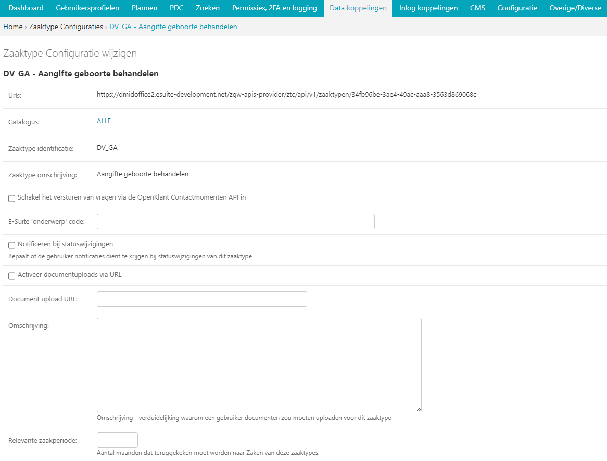

.. _datakoppelingen:

==================
9. Datakoppelingen
==================

Onder datakoppelingen vindt u als beheerder alle elementen met betrekking tot de koppelingen van het
Open Inwoner platform. Denk aan de koppelingen met Haal centraal, Open Klant, Open Formulieren,
DigID en Open Zaak. Ook kunnen hier de koppelingen worden geconfigureerd.

Wat betreft koppelingen worden er aan de voorkant van het platform andere namen gebruikt dan in de
backend en sommige koppelingen hebben betrekking op particulieren, andere weer op zakelijke
gebruikers. Dit is overzichtelijk weergegeven in de tabel op deze pagina.

+-----------------------------------+---------------------------------------------------------------+
|    **Backend**                    |    **Frontend**                                               |
+===================================+===============================================================+
|    | Open Klant                   |    | Mijn vragen                                              |
|    | Laposta                      |    | Mijn profiel – nieuwsbrieven. Voorkeuren en meldingen    |
|    | Qmatic                       |    | Mijn afspraken                                           |
|    | SSD                          |    | Mijn uitkeringen                                         |
|    | SOAP services                |    | Mijn uitkeringen                                         |
|    | Catalogus configs            |    | Mijn aanvragen                                           |
|    | Open Zaak                    |    | Mijn aanvragen                                           |
|    | Open Formulieren             |    | Producten                                                |
|    | Webhook-abonnementen         |    | Mijn aanvragen - notificaties                            |
+-----------------------------------+---------------------------------------------------------------+

9.1 Catalogus Configs
=====================

Catalogus configs worden automatisch geïmporteerd vanuit Open Zaak of eSuite via de 
ZGW-koppeling. Aan deze catalogi zijn zaaktypes gekoppeld, zoals geconfigureerd in 
het onderdeel Zaaktypeconfiguratie.

.. _CatalogusImportExport:

Catalogus Configs Importeren en Exporteren
------------------------------------------

Catalogi en Zaaktype Configuraties kunnen worden geëxporteerd en geïmporteerd tussen
verschillende OIP-installaties (bijvoorbeeld tussen acceptatie- en testomgevingen).

.. note::
   De import/export-functionaliteit vereist dat de gekoppelde zaaksystemen 
   materieel gelijk zijn. Dit betekent dat de catalogi en onderliggende zaaktypes 
   in beide ZGW API's aanwezig moeten zijn (hoewel de URLs en UUIDs mogen verschillen).
   Voer daarom de ``Importeer ZGW data`` periodieke taak eerst handmatig uit op zowel de
   bron als bestemming zodat de ZGW objecten volledig in sync zijn.
  

.. note::
   Het onderstaande proces spitst zich toe op het importeren van hele Catalogus
   Configuraties. Echter, het is eveneens mogelijk om alleen bepaalde Zaaktype Configuraties
   te importeren/exporteren. Dit werkt op exact dezelfde wijze als in deze sectie is
   omschreven voor de Catalogus Configuraties. Ongeacht via welk scherm de export is
   aangemaakt, kunnen de opgeslagen bestande op zowel de totaaloverzichten van
   Catalogus Configuraties en Zaaktype Configruates geïmporteerd worden.
   Zie ook :ref:`ZTCImportExport`.

Importproces
^^^^^^^^^^^^

Tijdens de import zoekt de ontvangende installatie catalogi en zaaktypes op basis van 
specifieke kenmerken. Deze matching bepaalt hoe bijbehorende data (beschrijvingen, 
instellingen en metadata) worden gekoppeld.

Matching-attributen
"""""""""""""""""""

- **Catalogus Config**: ``domein`` en ``rsin`` moeten gelijk zijn
- **Zaaktype Configuratie**: ``identificatie`` en bovenliggende ``catalogus`` moeten gelijk zijn
- **Status, Resultaat en Informatie Object Typen**: ``omschrijving`` en de bovenliggende
  ``zaaktype`` moeten gelijk zijn

Exporteren
----------

Stappen voor exporteren:

#. Selecteer een of meer Catalogus Config-objecten of Zaaktype Configuratie-objecten
#. Kies "Opslaan als bestand" in de "Actie" dropdown linksboven de catalogilijst

   Exporteren van catalogus configuraties

De export omvat alle catalogi, zaaktypes en onderliggende objecten (resultaattypen, 
informatie-objecttypen, etc.) van de geselecteerde catalogi.

Importeren
----------

Stappen voor importeren:

#. Klik op "Importeer uit een bestand" rechtsboven op de catalogus configs-overzichtspagina

   Importeren van catalogus configuraties

#. Selecteer een bestand van uw lokale computer
#. Upload het bestand

    .. warning::
      - Het importeren kan aanzienlijke tijd in beslag nemen

#. Na afloop toont het systeem:

     * Aantal succesvol geïmporteerde objecten
     * Aantal niet-geïmporteerde objecten. De meest voorkomende reden voor foutmeldingen
       betreft pntbrekende objecten met de gespecificeerde matching-attributen. De
       attributen die ertoe leidde dat bepaalde objecten niet gevonden konden worden,
       zullen zoveel mogelijk worden vermeld.

9.2. Configuratie ‘Open Klant’
==============================

Dit is de configuratie voor de koppeling van het Open Inwoner platform met Open Klant. Om Mijn
Aanvragen te kunnen gebruiken is het noodzakelijk om de Open Zaak API en de Contactmomenten API in
te stellen. Hierdoor worden – na het inloggen met DigiD - de aanvragen van burgers getoond onder het
onderdeel Mijn aanvragen onder het uitvouwmenu bij de gebruikersnaam.

Er zijn diverse zaken die ingesteld moeten worden om Mijn aanvragen naar behoren te laten
functioneren. In het volgende screenshot is te zien om welke elementen het gaat.

9.2.1. E-mailregistratie
------------------------

Hier vult u het e-mailadres in waarop de ingezonden contactformulieren ontvangen moeten worden.

9.2.2. Klanten en contacten API registratie
-------------------------------------------

Hier kunt u aanvinken of u de aanvraag in de contactmomenten API geregistreerd wilt hebben. Laat u het
vinkje hier weg, dan wordt de aanvraag niet geregistreerd in de contactmomenten API. De Organisatie
RSIN is het nummer van de betreffende organisatie (Gemeente). Bij contactmoment type komt te staan
om wat voor soort ‘contacttype’ de aanvraag gaat. Contactmomenttype dient te worden gedefinieerd
middels een contacttype uit e-Suite. Het kanaal van het contactmoment behelst de manier waarop er
contact is gezocht en de aanvraag is gedaan. Ook kan er een gebruikersnaam te worden ingevuld van een
specifieke medewerker van de gemeente, zoals ingegeven op e-Suite. Als dit veld wordt leeggelaten
komt het contactformulier op basis van het onderwerp bij de juiste afdeling.

U kunt een vinkje zetten bij “Haal bronnen op uit de Klanten- en Contactmomenten-API's voor gebruikers
die zijn geauthenticeerd met eHerkenning via RSIN”. Indien dit is ingeschakeld, worden bronnen uit de
Klanten- en Contactmomenten-API's voor eHerkenning-gebruikers opgehaald via RSIN (Open Klant).
Indien dit niet is ingeschakeld, worden deze bronnen via het KVK-nummer opgehaald.
U kunt een vinkje zetten bij “Stuur contactformulier e-mailbevestiging”. Indien dit is ingeschakeld wordt
het 'contactform_confimation' e-mailsjabloon gebruikt om een e-mailbevestiging te sturen na het
insturen van het contactformulier. Indien dit is uitgeschakeld wordt aangenomen dat de externe
contactmomenten API (eg. eSuite) de e-mailbevestiging zal sturen.

9.2.3. Services
---------------

Hier staan de API’s van de te koppelen services. Bij de configuratie van Open Zaak gaat het om een
Klanten API en een Contactmomenten API. Deze services kunnen niet worden verwijderd of veranderd.
U selecteert hier de juiste API van de betreffende gemeente.

9.2.4. Contactformulier onderwerpen
-----------------------------------

Bij Mijn Aanvragen vindt de gebruiker een contactformulier om de aanvraag in te dienen. U kunt als
beheerder dit contactformulier configureren door de tekstuele labels aan te passen. Deze onderdelen
kunt u indien gewenst ook voorzien van e-Suite onderwerpcode. Wanneer deze code is ingevuld komt
een contactformulier op basis van deze automatisch bij de juiste afdeling terecht.
De volgorde van de elementen van het contactformulier kan indien gewenst worden aangepast.
Bovendien kunt u elementen uit het formulier verwijderen door een vinkje te zetten bij [verwijderen].
Om nog een onderwerp aan het contactformulier toe te voegen klikt u op [+ Nog een contactformulier
onderwerp toevoegen]. Als alles naar wens is geconfigureerd klikt u op [Opslaan].

9.3. Configuratie ‘Open Zaak’
=============================

Dit is de configuratie voor de koppeling van het Open Inwoner platform met Open Zaak of eSuite. Om
Mijn Aanvragen te kunnen gebruiken is het noodzakelijk om de Open Zaak API en de Catalogi API in te
stellen. Hierdoor worden – na het inloggen met DigiD - de zaken van burgers getoond onder het
onderdeel Mijn aanvragen. Om eventueel de mogelijkheid te bieden om documenten te uploaden en in
te zien, of verder te gaan met niet-afgeronde formulieren is het noodzakelijk de Documenten API en de
Formulieren API in te stellen.

9.3.1. Geavanceerde opties
--------------------------

Wanneer u de geavanceerde opties zichtbaar maakt, krijgt u extra opties om de vertrouwelijkheid van
een Zaak of een geüpload document in te stellen. In het bijbehorende dropdown menu selecteert u het
gewenste niveau zichtbaarheid. Dit staat standaard op Vertrouwelijk, maar kan worden aangepast aan
diverse niveaus, variërend van openbaar tot zeer geheim.

.. image:: images/image65.png
   :width: 624px
   :height: 840px

| *Standaard actie deadline termijn in dagen*
| Hier stelt u in hoeveel dagen de gebruiker standaard krijgt om actie
  te ondernemen.

| *Maximale upload grootte (in MB)*
| Hier kiest u de maximaal toegestane grootte van te uploaden
  documenten.

| *Toegestane bestandsformaten uploads*
| Hier kiest u welk bestandsformaat te uploaden documenten mogen hebben.

| *Titel tekst*
| Hier stelt u de tekst in die getoond wordt als titel/introductietekst
  in de lijstweergave van *Mijn aanvragen*.

9.3.2. Feature Flags
--------------------

Wanneer hier een vinkje staat, worden na inloggen met DigiD of eHerkenning de op de homepage
getoonde onderwerpen bepaald aan de hand van de zaken van de ingelogde gebruiker. De gebruiker ziet
op deze manier dus enkel relevante onderwerpen.

9.3.3. eSuite-specifieke ZGW API opties
---------------------------------------

Bij de Configuratie van ‘Open Zaak’ kunt u ook de mogelijkheid om Open Inwoner met eSuite te
koppelen aanvinken. Wanneer u gebruik wilt maken van de workaround om StatusType.informeren zet u
hier het vinkje aan. Dit dient u alleen te doen wanneer StatusType.informeren niet wordt ondersteund
door de ZGW API, waar Open Inwoner aan is gekoppeld (zoals de eSuite ZGW API). Hierdoor wordt het
verplicht om per zaaktype aan te geven wanneer een inwoner hier een notificatie van dient te krijgen.

9.3.4. ZGW API sets
-------------------

Een API set bestaat uit verschillende API’s die samen een zaaksysteem vormen. Om een API set te
configureren moeten enkele elementen worden ingevuld. Er is geen maximum aantal te configureren API
sets. Door meerdere sets te configureren kunnen meerdere zaaksystemen parallel worden gebruikt. U
kunt een extra API set toevoegen door op de [+] onder de reeds geconfigureerde API set te klikken.

| *Naam*
| Hier kunt u de API set een naam geven. Deze naam is vrij in te vullen.

| *Zaken API*
| Deze API vult de zaken of aanvragen uit *Mijn aanvragen* in.

| *Documenten API*
| Deze API haalt de documenten op die bij een bepaalde zaak horen.

| *Catalogi API*
| In de catalogi zit alle informatie over zaaktypes en andere
  gerelateerde informatie. De Catalogi API vult de zaaktypeconfiguratie
  in. Denk hierbij aan statussen, documenten, resultaten.

| *Formulieren API (Open Aanvragen)*
| Deze API slaat de gegevens van onvoltooide formulieren op en vult deze
  automatisch in. Dit is een optioneel veld.

9.4. KlantContactMomenten
=========================

Bij KlantContactMomenten vindt u een overzicht van alle door gebruikers gestelde vragen. In dit
overzicht wordt weergegeven van welke gebruiker de vraag afkomstig is. Ook staat er een URL van het
contactmoment in en wordt er door middel van een groen vinkje of een rood kruisje weergegeven of de
gebruiker het antwoord op de vraag al heeft bekeken.

9.5. Laposta configuratie
=========================

Laposta is de API voor nieuwsbriefintegratie. In de backend kunt u aangeven voor welke nieuwsbrieven
gebruikers zich moeten kunnen inschrijven. Zoals aangegeven in de onderstaande screenshot.

Aan de voorkant van Open Inwoner krijgen gebruikers in Mijn Profiel de mogelijkheid zich in te schrijven
voor diverse nieuwsbrieven. Afhankelijk van wat er in de backend door de beheerder mogelijk is
gemaakt. Gebruikers kunnen zich te allen tijde aan- en afmelden en hun voorkeuren wijzigen.

9.5.1. E-mailverificatie vereist
================================

Om de Laposta API te kunnen laten functioneren is het belangrijk dat er bij de Algemene configuratie
een vinkje staat bij “E-mailverificatie vereist”. Wanneer dit is ingeschakeld krijgen nieuwe gebruikers na
registratie een mail met een link waarmee zij hun e-mailadres moeten bevestigen.

9.6. Notificaties componentconfiguratie
=======================================

Wanneer u de notificaties van de componentconfiguratie instelt kunt u notificaties ontvangen van
wijzigingen aan Zaken of documenten in eSuite of Open Zaak. Bij de instellingen kan aangegeven worden
hoeveel afleverpogingen het systeem mag doen en de vertraging die er tussen de afleverpogingen mag
zitten.

9.6.1. Notificaties instellen
=============================

Om de notificaties van de componentconfiguratie in te stellen volgt u het volgende stappenplan:

1) Creëer een ZGW Service voor de notificatie-API (NRC) met door de ZGW backend verzorgde
referenties (/admin/zgw_consumers/service/).
De ZGW heeft de volgende rechten nodig om referenties te kunnen verzorgen:

-  catalogi.lezen
-  zaken.lezen
-  zaken.bijwerken
-  documenten.lezen
-  documenten.aanmaken
-  notificaties.consumeren

2) Update Notificaties componentconfiguratie (/admin/notifications_api_common/notificationsconfig/)
Selecteer de bovenstaande service.

3) Creëer een Webhook-abonnement (/admin/notifications_api_common/subscription/)
De Callback-url is het OIP domein met het volgende pad: /api/openzaak/notifications/webhook/zaken.
Bijvoorbeeld: https://open-inwoner.gemeente.nl/api/openzaak/notifications/webhook/zaken

De Client-ID en Client-secret kunnen arbitrair zijn, maar de Client-secret moet moeilijk te raden zijn. Het
veld ‘kanalen’ moet de Zaken bevatten.
Sla op en registreer de Webhook explciet door het in de lijst te selecteren en te klikken op [Webhook
registreren]. De NRC-API zal worden gebruikt om de Webhook te registreren. Zodra deze met succes is
geregistreerd zal de Webhook een URL set krijgen waarmee men zich kan abonneren.

4) De Configuratie 'Open Zaak' moet worden ingesteld voor Zaken (ZRC), Catalogus (ZTC) en
Documenten (DRC). (/admin/openzaak/openzaakconfig/)
Selecteer in eSuite ook "Maak gebruik van StatusType.informeren workaround (eSuite)".

5) Configureer in eSuite de Zaaktypes (/admin/openzaak/zaaktypeconfig/)
Selecteer de Zaaktypes en InformatieObjectTypes en configureer de bijbehorende notificatieopties. Er is
een cronjob om deze catalogus te importeren. Dit commando kan te allen tijde worden uitgevoerd
python src/manage.py zgw_import_data (from the virtual env)

9.7. Open Forms client configuration
====================================

Bij Open Forms client configuration kunt u de configuratie van de Open Forms client gekoppeld aan het
Open Inwoner Platform wijzigen. Hiermee kunt u Open Inwoner koppelen aan Open Formulieren.
Wanneer dit is ingesteld is het mogelijk bij ieder product een formulier te selecteren uit Open
Formulieren in plaats van via een externe URL om zo een aanvraag in gang te zetten.
De Open Forms client configuration dient eenmalig te worden ingesteld. Dit kan door de beheerder of
door Maykin worden gedaan.

9.7.1. SDK
----------

Bij SDK kunnen de instellingen rond de voorkant van Open Formulieren worden aangepast. Het gaat hier
om de CSS en Javascript instellingen voor wat betreft de vormgeving van Open Formulieren zoals ze voor
de gebruiker na het doorklikken zichtbaar zijn. Op deze manier kan de huisstijl eenvoudig worden
doorgevoerd in het betreffende formulier.

9.7.2. Gebruik Sentry
---------------------

Open Formulieren kan gebruik maken van logs op Sentry. Wanneer er een vinkje is gezet bij “Gebruik
Sentry” worden SDK errors van Open Formulieren automatisch doorgestuurd naar de ingestelde Sentry
instantie.

9.8. Open Zaak informatieobject notificatie records
===================================================

Bij Open Zaak informatieobject notificatie records vindt u een register met daarin gegevens over naar
welke gebruikers welke notificaties zijn verstuurd naar aanleiding van het toevoegen of wijzigen van een document.

9.9. Open Zaak statusnotificatie records
========================================

Bij Open Zaak statusnotificatie records vindt u naar welke gebruikers welke notificaties zijn verstuurd
naar aanleiding van een statuswijziging.

9.10. Qmatic configuratie
=========================

De Qmatic configuratie maakt het mogelijk dat gebruikers in Mijn profiel hun balie-afspraken bij de
Gemeente kunnen raadplegen. Hiervoor wordt gebruik gemaakt van een calendar API waar de gegevens
vandaan gehaald worden. Ook is er de mogelijkheid een reservering URL in te geven, zodat gebruikers
hun afspraak bij de gemeente kunnen wijzigen of verwijderen.

9.10.1. E-mailverificatie vereist
---------------------------------

Om de Qmatic API te kunnen laten functioneren is het belangrijk dat er bij de Algemene configuratie een
vinkje staat bij “E-mailverificatie vereist”. Wanneer dit is ingeschakeld krijgen nieuwe gebruikers na
registratie een mail met een link waarmee zij hun e-mailadres moeten bevestigen.

9.11. SOAP services
===================

Bij SOAP Services staan alle externe SOAP-API koppelingen met het Open Inwoner Platform ingesteld.
Deze mogen niet worden gewijzigd.

9.12. SSD
=========
Bij SSD kunt u het onderdeel Mijn Uitkeringen configureren. Denk hierbij aan alles wat in het onderdeel
Mijn Uitkeringen zichtbaar is en op welke manier dit zichtbaar moet worden.

9.12.1. SSD clients
-------------------

Hier kunt u de koppelingen voor de Suite voor Sociaal Domein te configureren. U kunt hier alle gegevens
rond PDF’s van maandspecificaties en jaaropgaven instellen en wijzigen. Gebruikers kunnen in het
platform hun overzichten van uitkeringen downloaden.

| *SOAP Service*
| Selecteer hier de betreffende SOAP service. Dit is de algemene manier
  om de SSD dienst te bevragen.

| *Maandspecificaties endpoint*
| De API die moet worden gebruikt om maandspecificatie-informatie op te
  halen.

| *Jaaropgave endpoint*
| De API die moet worden gebruikt om jaaropgave-informatie op te halen.

| *Bedrijfsnaam*
| Hier komt de naam van de leverancier te staan. In dit geval is dat
  Open Inwoner.

| *Applicatie naam*
| Hier komt de naam van de applicatie die gebruik maakt van de SSD
  Client te staan. In dit geval is dat Open Inwoner.

| *Gemeente code*
| Vul hier de gemeentecode in voor zaakregistratie

9.12.2. Mijn uitkeringen
------------------------

Hier kunt u de begeleidende tekst invullen voor het onderdeel Mijn uitkeringen. Er is hier een groot tekstveld beschikbaar zonder uitgebreide editor.

9.12.3. Maandspecificatie
-------------------------

Bij maandspecificatie kunnen alle overzichten van het tabblad Maandspecificatie in het onderdeel Mijn
uitkeringen worden geconfigureerd.

| *Activeer document downloads*
| Door hier een vinkje te zetten wordt het voor de gebruiker mogelijk
  documenten te downloaden.

| *Toon overzichten van de recente \# maanden*
| Hier geeft u aan van hoeveel maanden er overzichten moeten worden
  weergegeven.

| *Overzicht beschikbaar vanaf \# dag van de maand*
| Hier vult u in vanaf de hoeveelste dat van een maand het nieuwe
  maandoverzicht beschikbaar is om te downloaden

| *Tabblad tekst*
| Hier kunt u de begeleidende tekst invullen voor het
 maandoverzicht-tabblad binnen *Mijn uitkeringen.* Er is hier een
 groot tekstveld beschikbaar zonder uitgebreide editor.

9.12.4. Jaaropgave
------------------

Bij Jaaropgave kunnen alle overzichten van het tabblad Maandspecificatie in het onderdeel Mijn
uitkeringen worden geconfigureerd.

| *Activeer document downloads*
| Door hier een vinkje te zetten wordt het voor de gebruiker mogelijk
 documenten te downloaden.

| *Toon overzichten van de afgelopen \# jaren*
| Hier geeft u aan van hoeveel jaar er overzichten moeten worden
 weergegeven.

| *Jaarverzicht beschikbaar vanaf \# (dag-maand)*
| Hier vult u in vanaf de hoeveelste dat van welke maand de nieuwe
 jaaropgave beschikbaar is om te downloaden

| *Tabblad tekst*
| Hier kunt u de begeleidende tekst invullen voor het
 jaaropgave-tabblad binnen *Mijn uitkeringen.* Er is hier een groot
 tekstveld beschikbaar zonder uitgebreide editor.

| *PDF helpteksten*
| Hier vult u de helptekst voor de kolommen in de jaaropgave PDF in.
 Deze helpteksten worden ingesloten in de PDF.

9.13. Services
==============

Bij Services staan alle externe REST-API koppelingen met het Open Inwoner Platform ingesteld. Deze mogen niet worden gewijzigd.

9.14. Statusvertalingen
=======================

Bij Statusvertalingen kunt u de statussen personaliseren. Zo kunt u standaardteksten naar believen
veranderen in statussen die beter passen bij de situatie. Het gaat hier dus niet om vertalingen van taal naar taal.

9.15. Webhook-abonnementen
==========================

Bij Webhook-abonnementen kunt u instellen dat u alle notificaties van een bepaald kanaal
(zaken/documenten/besluiten) terug ontvangt van open zaak of eSuite.

9.16. Zaaktype configuraties
============================

Bij Zaaktype configuraties vindt u alle soorten Zaken die in Open Zaak of eSuite aanwezig zijn. Wanneer u klikt op een bepaald Zaaktype (zaaktype identificatie) wordt er een nieuw scherm geopend waarin u het betreffende Zaaktype configuratie kunt wijzigen.

9.16.1. Zaaktype configuratie wijzigen
--------------------------------------
In dit scherm, weergegeven op de volgende pagina, vindt u de gegevens van het betreffende Zaaktype.
De catalogus, de identificatie en de omschrijving. Naast deze vaste gegevens kunt u ook enkele dingen
wijzigen. U kunt aangeven of er notificaties moeten worden verstuurd en of het mogelijk moet zijn om
documenten te uploaden ter ondersteuning van het betreffende Zaaktype.

| *Schakel het versturen van vragen via de OpenKlant Contactmomenten in*
| Door hier een vinkje te zetten wordt het voor de gebruiker mogelijk
  vragen te sturen via de contactmomenten API.

| *Notificeren bij statuswijzigingen*
| Door hier een vinkje te zetten wordt de gebruiker op de hoogte gesteld
  van veranderingen rond zijn Zaken van dit type.

| *Activeer documentuploads via URL*
| Door een vinkje te zetten bij Activeer documentuploads via URL wordt
  het mogelijk documenten te laten uploaden via een extern systeem dat
  niet geïntegreerd is in het Open Inwoner Platform. Wanneer dit
  aangevinkt is komt er een knop in beeld om naar het betreffende
  externe systeem te gaan. Wilt u de mogelijkheid hebben om via het Open
  Inwoner Platform bestanden te uploaden, dan klikt u dit aan bij
  Zaaktype informatieobject configuraties.

| *Document upload URL*
| Hier vult u de externe URL in van het systeem om een document te
  uploaden.

| *Omschrijving*
| Hier vult u een omschrijving in. Dit is de verduidelijking waarom een
  gebruiker documenten zou moeten uploaden voor dit zaaktype.

| *Relevante zaakperiode*
| Hier vult u het aantal maanden in waarna er moet worden teruggekeken
  naar Zaken van dit zaaktype.

| *Zaaktype informatieobject configuraties*
| Hier kunt u de informatieobjecten die bij het betreffende Zaaktype
  horen configureren. U kunt per informatieobject aangeven of documenten
  via het Open Inwoner Platform mogen worden geüpload. Wanneer er
  meerdere soorten bestanden bij een bepaald Zaaktype kunnen worden
  geüpload, moet de gebruiker per upload aangeven om wat voor soort
  document het gaat. Daarnaast kunt u notificaties activeren. Hierdoor krijgen alle gebruikers van het Open Inwoner Platform een bericht wanneer er een nieuw zaakdocument voor hen beschikbaar is. Dit kan worden gedaan door een vinkje te zetten bij de kolom ‘Activeer documentnotificaties’.

**Let op! Wanneer u bij Zaaktype informatieobject configuraties het
uploaden van bestanden activeert, vindt het uploaden plaats via het Open
Inwoner Platform zelf en niet via een extern systeem.**

.. image:: images/image75.png
   :width: 624px
   :height: 143px

9.16.2. Zaaktype statustype configuraties
-----------------------------------------
Hier kunt u de statustypes die bij het betreffende Zaaktype horen configureren. Enkele gegevens zijn vast
en kunnen niet worden gewijzigd. De elementen die kunnen worden gewijzigd worden hier behandeld.
Klik allereerst op ‘tonen’ om alle gegevens uit te vouwen.

| Hier kunt u de statustypes die bij het betreffende Zaaktype horen
  configureren. Enkele gegevens zijn vast en kunnen niet worden
  gewijzigd. De elementen die kunnen worden gewijzigd worden hier
  behandeld. Klik allereerst op ‘tonen’ om alle gegevens uit te vouwen.

| *Statustype indicator*
| Hier heeft u de mogelijkheid om een indicator te selecteren die voor
  het betreffende statustype wordt gebruikt. Dit is de balk die in de
  lijstweergave boven het statustype wordt gebruikt om extra nadruk te
  geven aan de gebruiker. Elk soort indicator (info, waarschuwing,
  negatief of succes) heeft zijn eigen kleur.

| *Status lijstweergave tekst*
| Indien hier tekst wordt ingevuld wordt er bij de lijstweergave van
  *Mijn Aanvragen* naast de kleur ook een melding getoond bij weergave
  van een zaak met de betreffende status.

| *Notificeer bij statuswijziging*
| Hier kunt u aangeven of een gebruiker een notificatie dient te krijgen
  wanneer een zaak de betreffende status krijgt. Indien aangevinkt
  ontvangt de gebruiker een notificatie.

| *Actie benodigd*
| Hier kunt u aangeven of de e-mailnotificatie van een andere soort moet
  zijn dan een gewone notificatie. De gebruiker ontvangt een meer dwingende notificatie waaruit blijkt dat de gebruiker actie moet ondernemen.

| *Documenten uploaden*
| Hier kunt u aangeven of een gebruiker documenten kan uploaden voor
  zaken met de betreffende status. Indien aangevinkt kunnen er voor zaken met de betreffende zaken bestanden worden geüploaded..

| *Document uploadomschrijving*
| Dit is de omschrijving die getoond wordt aan de gebruiker boven de
  uploadwidget van een zaak in *Mijn Aanvragen.* Hier heeft u de
  mogelijkheid een uitgebreide teksteditor te gebruiken.

| *Status detailweergave omschrijving*
| Hier kunt u de getoonde tekst invullen die met worden getoond bij het
  openklappen van de betreffende status op de detailweergave van een
  zaak in *Mijn Aanvragen.* Hier heeft u de mogelijkheid een uitgebreide
  teksteditor te gebruiken.

| *Statusknop URL*
| De statusknop URL maakt een call-to-action button aan waar mensen
  direct hun actie kunnen uitvoeren. Als er hier niets is ingevuld en er is wel een mogelijkheid om bestanden te uploaden, dan staat er een standaard uploadwidget.

| *Statusknop label*
| Hier vult u de tekst in die u de statusknop wilt meegeven. Denk aan de
  richtlijnen voor CTA-buttons.

| *Linknaam naar detailweergave*
| Hier vult u de linktekst in om van de lijstweergave naar de
  detailweergave te navigeren. Standaard staat hier “Bekijk aanvraag”.

.. _ZTCImportExport:

9.16.3. Zaaktype configuratie importeren/exporteren
---------------------------------------------------

Het is mogelijk om individuele Zaaktype Configuratie objecten te importeren, op
analoge wijze zoals beschreven voor de Catalogus Configuraties (zie 
:ref:`CatalogusImportExport`).

Voor meer details verwijzen we u naar deze sectie. In hoofdlijnen: via het totaaloverzicht
met alle Zaaktype Configuraties selecteert u 1 of meer objecten om te exporteren:

U kunt het aldus opgeslagen bestand vervolgens op een andere installatie importeren
via de knop "Importeer bestand":

.. note::
   Zaaktype Configuraties die via deze wijze worden gexporteerd, kunnen ook worden
   geimporteerd via het Catalogus Configuratie scherm, en omgekeerd. 
   Zie verder :ref:`CatalogusImportExport`.