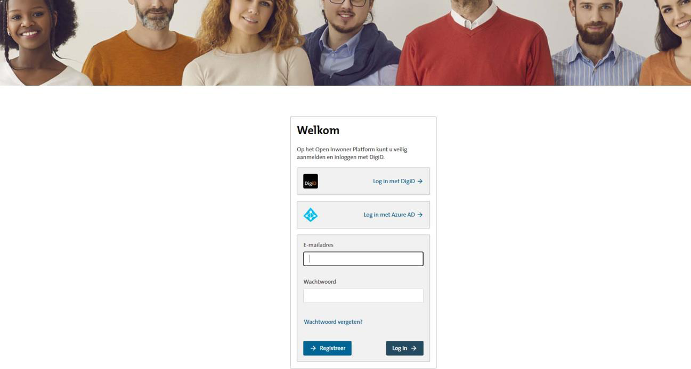

.. _inlog_koppelingen:

=====================
10. Inlog koppelingen
=====================

Bij inlog koppelingen kunt u de authenticatiemogelijkheden voor inwoners, bedrijven en beheerders instellen.

10.1. Configuratie ‘Haal centraal’
==================================

Dit dient ter configuratie van de BRP-integratie met de Open Inwoner omgeving. Hier kan de beheerder de Haal Centraal API die van toepassing is selecteren.

10.2. DigiD configuratie
========================

Dit is de configuratie voor de koppeling van het Open Inwoner platform met DigiD van Logius. Bij de onboarding van Open Inwoner wordt bij deze configuratie hulp geboden.

10.3. eHerkenning/eIDAS configuratie
====================================

Dit is de configuratie voor de koppeling van het Open Inwoner platform met eHerkenning bij een
eHerkenningsmakelaar. Bij de onboarding van Open Inwoner wordt bij deze configuratie hulp geboden.

10.4. KVK configuratie
======================

Dit is de configuratie voor de koppeling van het Open Inwoner platform met de KVK. Om Mijn Bedrijven te kunnen gebruiken is het noodzakelijk om de KVK API in te stellen. Hierdoor worden – na het inloggen met eHerkenning - de gegevens van het bedrijf opgehaald en getoond en vooraf ingevuld.
Om de KVK API in te kunnen stellen zijn de API key, een client certificate (SSL) en een server certificate (SSL) noodzakelijk.

10.5. OpenID Connect configuratie voor DigiD
============================================

Open Inwoner ondersteunt de DigiD login voor burgers via het OpenID Connect protocol (OIDC). Via de Open ID Connect configuratie kan deze manier van inloggen worden ingesteld. OpenID Connect staat
standaard uitgeschakeld, maar kan door de technisch beheerder worden ingeschakeld. OpenID Connect maakt het mogelijk dat medewerkers niet met hun privé DigiD voor werkdoeleinden te hoeven inloggen.
Het gebruik van OpenID Connect is met name bedoeld voor medewerkers die veel met inwoners of cliënten in samenwerkingsomgevingen werken.

Er zijn diverse OpenID Connect methodes (bijvoorbeeld Azure AD). Afhankelijk van de gewenste OpenID Connect methode dienen de betreffende technische gegevens te worden ingevuld alvorens het
ingeschakeld kan worden. Wanneer OpenID Connect is ingeschakeld wordt dit op de loginpagina duidelijk door middel van het logo en de knoptekst.
De technische details voor het configureren van OpenID Connect voor DigiD kunt u raadplegen in `de documentatie van Open Formulieren <https://open-forms.readthedocs.io/en/latest/configuration/authentication/oidc_eherkenning.html>`_.

Let op! Enkel de technisch beheerder dient de OpenID Connect Configuratie te wijzigen.

10.5.1. Geschiedenis
--------------------

Wanneer er wijzigingen aan de OpenID Connect configuratie hebben plaatsgevonden, kunnen deze
worden nagetrokken in de geschiedenis rechts bovenin beeld.

10.6. OpenID Connect configuratie voor eHerkenning
==================================================

Open Inwoner ondersteunt de eHerkenning login voor ondernemers via het OpenID Connect protocol (OIDC). Via de Open ID Connect configuratie kan deze manier van inloggen worden ingesteld. OpenID
Connect staat standaard uitgeschakeld, maar kan door de technisch beheerder worden ingeschakeld.
eHerkenning is een Nederlandse standaard voor het veilig en betrouwbaar inloggen bij overheidsdiensten en bedrijven. Door OIDC te gebruiken met eHerkenning, kunnen organisaties
profiteren van de gestandaardiseerde en veilige authenticatiediensten die eHerkenning biedt, terwijl ze gebruik maken van de moderne functionaliteiten van OIDC.
De technische details voor het configureren van OpenID Connect voor eHerkenning kunt u raadplegen in `de documentatie van Open Formulieren <https://open-forms.readthedocs.io/en/latest/configuration/authentication/oidc_eherkenning.html>`_.

**Let op! Enkel de technisch beheerder dient de OpenID Connect Configuratie te wijzigen.**
