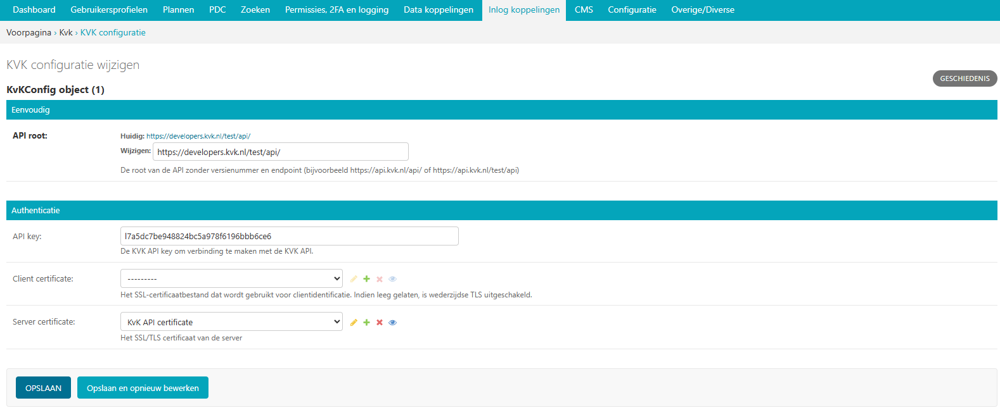
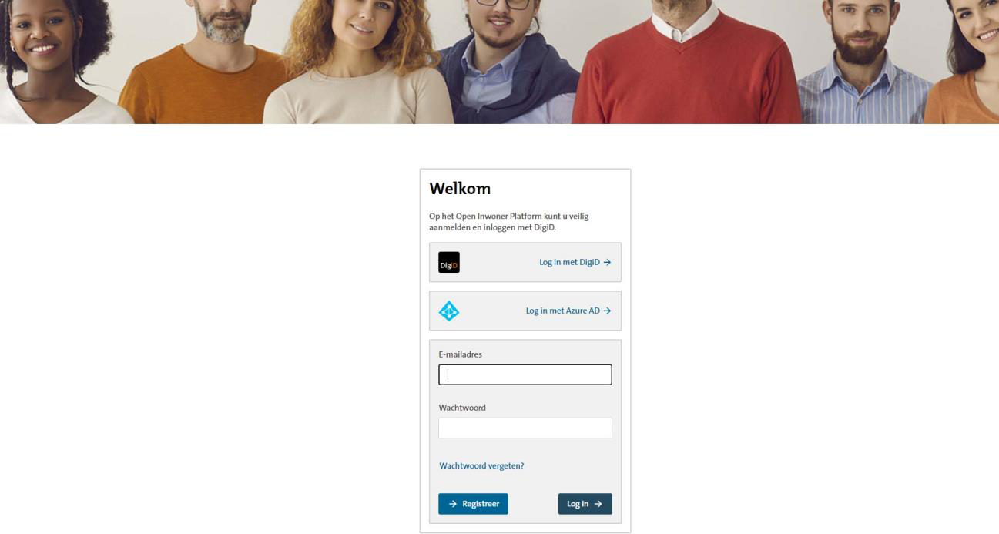

.. _inlog_koppelingen:

=====================
10. Inlog koppelingen
=====================

Bij inlog koppelingen kunt u de authenticatiemogelijkheden voor inwoners, bedrijven en beheerders instellen.

10.1. Configuratie ‘Haal centraal’
==================================

Dit dient ter configuratie van de BRP-integratie met de Open Inwoner omgeving. Hier kan de beheerder de Haal Centraal API die van toepassing is selecteren. In het venster zijn twee onderdelen zichtbaar: Headers voor I Connect en Headers voor Centric. Welke velden u exact dient in te vullen is afhankelijk van welke leverancier u heeft. U vult of de velden in bij I Connect óf bij Centric. Voor meer informatie over de in te vullen velden verwijzen wij u graag door naar de documentatie van de betreffende leverancier.

10.2. DigiD configuratie
========================

Dit is de configuratie voor de koppeling van het Open Inwoner platform met DigiD van Logius. Bij de onboarding van Open Inwoner wordt bij deze configuratie hulp geboden.

10.3. eHerkenning/eIDAS configuratie
====================================

Dit is de configuratie voor de koppeling van het Open Inwoner platform met eHerkenning bij een eHerkenningsmakelaar. Bij de onboarding van Open Inwoner wordt bij deze configuratie hulp geboden.

10.4. KVK configuratie
======================

Dit is de configuratie voor de koppeling van het Open Inwoner platform met de KVK. Om Mijn Bedrijven te kunnen gebruiken is het noodzakelijk om de KVK API in te stellen. Hierdoor worden – na het inloggen met eHerkenning - de gegevens van het bedrijf opgehaald en getoond en vooraf ingevuld. Om de KVK API in te kunnen stellen zijn de API key, een client certificate (SSL) en een server certificate (SSL) noodzakelijk.

**API root**
De API root is verschillend voor de testomgeving en de productieomgeving van Open Inwoner. Bij de testomgeving moet de root https://developers.kvk.nl/test/api/ zijn en bij de productieomgeving https://api.kvk.nl/api/v2

Let op! Er is een abonnement noodzakelijk om gebruik te kunnen maken van deze API. Meer informatie over de KVK API kunt u vinden op: https://developers.kvk.nl/documentation

**API Key**
De API Key ontvangt u wanneer u zich aanmeldt om gebruik te maken van de KVK API.

**Client certificate**
Het SSL-certificaat dat wordt gebruikt voor clientidentificatie. Dit veld kan leeg blijven.

**Server certificate**
Het SSL/TLS certificaat van de server. Dit certificaat kunt u downloaden van de KVK
website: https://developers.kvk.nl/documentation/certificates

Het gedownloade zip-bestand bevat meerdere certificaat bestanden die u moet combineren
tot één bestand:

1. Pak het zip-bestand uit
2. Combineer alle ``.crt`` bestanden tot één bestand via de commandline:

   .. code-block:: bash

      cat bestand1.crt bestand2.crt bestand3.crt > combined.crt

   Bijvoorbeeld (bestandsnamen kunnen afwijken):

   .. code-block:: bash

      cat api.kvk.nl.crt "DigiCert G2 TLS EU RSA4096 SHA384 2022 CA1.crt" \
          "DigiCert Global Root G2.crt" > combined.crt

3. Upload het gecombineerde bestand bij **Server certificate** door een bestand
   certificaat bij te werken (potlood icoon) of een nieuw certificaat toe te voegen
   (via het plus icoon).

10.5. OpenID Connect configuratie voor DigiD
============================================

Open Inwoner ondersteunt de DigiD login voor burgers via het OpenID Connect protocol (OIDC). Via de Open ID Connect configuratie kan deze manier van inloggen worden ingesteld. OpenID Connect staat standaard uitgeschakeld, maar kan door de technisch beheerder worden ingeschakeld. OpenID Connect maakt het mogelijk dat medewerkers niet met hun privé DigiD voor werkdoeleinden te hoeven inloggen. Het gebruik van OpenID Connect is met name bedoeld voor medewerkers die veel met inwoners of cliënten in samenwerkingsomgevingen werken.

Er zijn diverse OpenID Connect methodes (bijvoorbeeld Azure AD). Afhankelijk van de gewenste OpenID Connect methode dienen de betreffende technische gegevens te worden ingevuld alvorens het ingeschakeld kan worden. Wanneer OpenID Connect is ingeschakeld wordt dit op de loginpagina duidelijk door middel van het logo en de knoptekst. De technische details voor het configureren van OpenID Connect voor DigiD kunt u raadplegen in `de documentatie van Open Formulieren <https://open-forms.readthedocs.io/en/latest/configuration/authentication/oidc_eherkenning.html>`_.

**Let op! Enkel de technisch beheerder dient de OpenID Connect Configuratie te wijzigen.**

10.5.1. Geschiedenis
--------------------

Wanneer er wijzigingen aan de OpenID Connect configuratie hebben plaatsgevonden, kunnen deze worden nagetrokken in de geschiedenis rechts bovenin beeld.

10.6. OpenID Connect configuratie voor eHerkenning
==================================================

Open Inwoner ondersteunt de eHerkenning login voor ondernemers via het OpenID Connect protocol (OIDC). Via de Open ID Connect configuratie kan deze manier van inloggen worden ingesteld. OpenID Connect staat standaard uitgeschakeld, maar kan door de technisch beheerder worden ingeschakeld. eHerkenning is een Nederlandse standaard voor het veilig en betrouwbaar inloggen bij overheidsdiensten en bedrijven. Door OIDC te gebruiken met eHerkenning, kunnen organisaties profiteren van de gestandaardiseerde en veilige authenticatiediensten die eHerkenning biedt, terwijl ze gebruik maken van de moderne functionaliteiten van OIDC. De technische details voor het configureren van OpenID Connect voor eHerkenning kunt u raadplegen in `de documentatie van Open Formulieren <https://open-forms.readthedocs.io/en/latest/configuration/authentication/oidc_eherkenning.html>`_.

**Let op! Enkel de technisch beheerder dient de OpenID Connect Configuratie te wijzigen.**

10.7. OpenID Connect sessie management
=======================================

Bij gebruik van OpenID Connect (OIDC) voor DigiD en eHerkenning is het belangrijk om
rekening te houden met sessie-management. Open Inwoner vernieuwt periodiek de
authenticatiesessie om te controleren of de gebruiker nog steeds ingelogd is bij de
Identity Provider (IdP).

10.7.1. Automatische sessievernieuwing
--------------------------------------

De omgevingsvariabele ``OIDC_RENEW_ID_TOKEN_EXPIRY_SECONDS`` bepaalt hoe vaak
de sessie wordt ververst. De standaardwaarde is **15 minuten**. Na deze periode wordt de
gebruiker automatisch en onzichtbaar doorgestuurd naar de IdP:

- **Als de IdP-sessie nog actief is**: De gebruiker wordt automatisch teruggestuurd naar
  Open Inwoner en kan ongestoord doorwerken. Dit gebeurt op de achtergrond zonder dat de
  gebruiker het merkt.

- **Als de IdP-sessie verlopen is**: De gebruiker wordt uitgelogd en krijgt een
  foutmelding te zien:

  - DigiD: *"Uw DigiD-sessie is verlopen. Log alstublieft opnieuw in."*
  - eHerkenning: *"Uw eHerkenning-sessie is verlopen. Log alstublieft opnieuw in."*

.. important::

   Stel de sessieduur bij uw Identity Provider (DigiD/eHerkenning) in op **minimaal de
   duur van één vernieuwingsinterval langer** dan ``OIDC_RENEW_ID_TOKEN_EXPIRY_SECONDS``.
   Bij voorkeur zelfs aanzienlijk langer om te voorkomen dat gebruikers onverwacht worden
   uitgelogd tijdens het werken. Houd hierbij rekening met de eisen en aanbevelingen van
   Logius en uw identity broker (bijvoorbeeld Signicat).

   Bijvoorbeeld:

   - Als ``OIDC_RENEW_ID_TOKEN_EXPIRY_SECONDS`` is ingesteld op 10 minuten (600 seconden)
   - Stel de IdP-sessieduur in op minimaal 21 minuten of langer, zodat de gebruiker tot
     tweemaal toe de sessie kan laten vernieuwen.

   Als de IdP-sessieduur korter is dan het vernieuwingsinterval, kunnen gebruikers
   onverwacht worden uitgelogd. Let ook op dat een korter vernieuwingsinterval betekent
   dat er vaker een redirect plaatsvindt naar de IdP. Hierdoor is de kans groter dat
   een redirect gebeurt tijdens het versturen van een formulier (POST-verzoek), wat kan
   leiden tot verlies van ingevulde gegevens.
