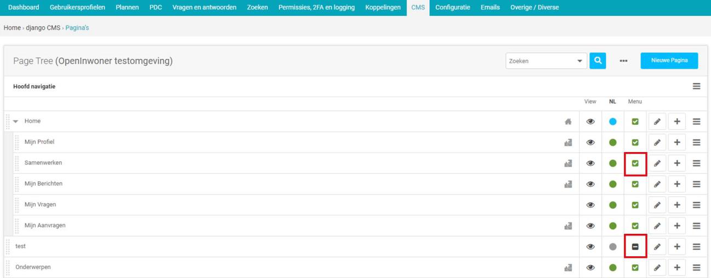

.. _cms:

=======
11. CMS
=======

Onder CMS vindt u alle dingen die u middels het CMS kunt aanpassen. Bij Page types kunt u het soort pagina definiëren en onder Pagina’s kunt u de menustructuur van uw Open Inwoner aanpassen. Het gaat hier om de pagina’s die worden weergegeven in het uitklapmenu op de homepage. Middels het CMS kunt u eenvoudig pagina’s aan- en uitzetten en verplaatsen. Tevens kunt u als beheerder door het CMS nu wijzigingen aan de voorkant van Open Inwoner doorvoeren zonder dat u hiervoor in de backend naar de configuratie hoeft te gaan.

11.1. Pagina’s
==============
Bij Pagina’s ziet u de boomstructuur van het menu van Open Inwoner. In het screenshot rood omkaderd.

U kunt hier eenvoudig allerlei wijzigingen aanbrengen aan dit menu. Zo kunt u de volgorde van de menu
items veranderen, de items aan applicaties koppelen, u kunt de status van het menu item wijzigen, items
toevoegen of verwijderen, items (tijdelijk) uit het menu halen, kopiëren en pagina’s wijzigen.

11.1.1. Menu items verslepen
----------------------------

Door een menu item aan te klikken kunt u de plek in het menu (de boomstructuur) wijzigen. Dit kunt u doen middels drag-and-drop. Wanneer u een item versleept krijgt u een blauwe pop-up met het betreffende item en wordt er met een blauwe lijn weergegeven waar het item wordt geplaatst als u het loslaat.

11.1.2. Een pagina als startpagina instellen
--------------------------------------------

Wanneer u een andere pagina dan de homepage als startpagina (aangegeven met het icoontje van het
lichtgrijze huisje) wilt instellen, dan selecteert u in het hamburgermenu achter de betreffende pagina
[Instellen als startpagina]. Wanneer u dit heeft gedaan komt het icoontje van het huisje achter de
geselecteerde pagina te staan.

11.1.3. Gekoppelde applicatie wijzigen
--------------------------------------

Wanneer u dubbelklikt op het grijze icoontje met puzzelstukjes achter een menu item kunt u de
gekoppelde applicatie wijzigen. Door te dubbelklikken komt u in het scherm met geavanceerde
instellingen, waar bij “Applicatie” de gekoppelde applicatie kan worden aangepast. Zie het rode kader in
het onderstaande screenshot. Klik na het wijzigen op [Opslaan] om de wijzigingen door te voeren.

11.1.4. Status wijzigen
-----------------------

Wanneer u onder de kolom ‘NL’ op het gekleurde bolletje klikt, kunt u de status van de gekozen pagina
wijzigen. Een groen bolletje betekent dat de pagina gepubliceerd is. Een blauw bolletje geeft aan dat er
niet opgeslagen wijzigingen op een pagina zijn en een grijs bolletje betekent dat de pagina nog niet of
niet meer gepubliceerd is en dus niet aan de voorkant van de site wordt weergegeven. Bezoekers kunnen
deze pagina dus níet bereiken als het bolletje grijs is.

Wanneer u op een bolletje klikt komt er een pop-up in beeld met de mogelijkheid om een voorbeeld van
de pagina te bekijken of om de status te wijzigen. Wanneer u in de kolom klikt als de pagina
gepubliceerd is (zoals in het screenshot het geval is) krijgt u hier de optie te zien om de publicatie van de
pagina te ongedaan te maken. Klikt u hier op een pagina met een grijs bolletje, dan kunt u hier kiezen
voor publiceren.

11.1.5. Items toevoegen
-----------------------

Wanneer u nieuwe pagina’s wilt toevoegen klikt u op de blauwe button met [Nieuwe pagina]. U maakt
dan een nieuwe pagina op hoofdniveau aan. U komt in een nieuw scherm waarin u de gegevens van de
nieuwe pagina moet invullen. Wanneer alle gegevens zijn ingevuld klikt u op [Opslaan]. U keert hierna
terug naar het paginaoverzicht. Wilt u een nieuwe subpagina aanmaken? Dan klikt u op [+] achter de
betreffende hoofdpagina. U komt vervolgens op een nieuw scherm waarin u de gegevens van de nieuwe
subpagina moet invullen. Dit zijn dezelfde gegevens als bij een nieuwe hoofdpagina. Wanneer alle
gegevens zijn ingevuld klikt u op [Opslaan].

Let op! De zojuist aangemaakte pagina is nog niet gepubliceerd (grijs bolletje). U dient de pagina eerst te
publiceren (zie hoofdstuk 11.1.4)

Wanneer u na het aanmaken van de pagina de plek in de boomstructuur wilt veranderen, kunt u de pagina volgens de in hoofdstuk 11.1.1 beschreven methode een gewenste plek geven.

11.1.6. Preview van een pagina bekijken
---------------------------------------

Om een voorbeeld van een pagina te bekijken en te zien hoe het er frontend uitziet, klikt u op het oogje
achter de betreffende pagina. In hetzelfde venster opent de website op de aangeklikte pagina. Wilt u dit
in een ander tabblad of ander venster, gebruik dan uw rechter muisknop en klik op [open link in nieuw
venster] of [open link in nieuw tabblad].

.. image:: images/image85.png
   :alt: CMS dashboard
   :width: 600px
   :align: center

In het nieuw geopende scherm ziet u tevens bovenin beeld een balk met frontend navigatie voor het CMS. Op deze manier kunt u via de voorkant van de website/pagina dingen aanpassen zonder dat u eerst weer terug hoeft te gaan naar de beheeromgeving. Zie meer hierover in hoofdstuk 11.2.

11.1.7. Items kopiëren
----------------------

Wanneer u een pagina wilt dupliceren klikt u op het hamburgermenu achter de betreffende pagina op
[kopiëren] te klikken. Wanneer niets gekopieerd is, is de knop [plakken] grijs. Wanneer u echter een
pagina gekopieerd heeft krijgt u wel de mogelijkheid te plakken. De gekopieerde pagina wordt geplakt op
de geselecteerde locatie, maar kan vervolgens eenvoudig op de bij hoofdstuk 11.1.1 beschreven
methode worden versleept.

11.1.8. Items (tijdelijk) uit het menu halen
--------------------------------------------

Wanneer u een (sub)pagina al dan niet tijdelijk uit het menu wilt halen, klikt u onder de kolom ‘Menu’
op het groene vinkje. Wanneer u het vinkje hier weghaalt haalt u de pagina uit het menu. Er komt dan
een grijs vierkantje met een streep in de kolom te staan. Wilt u de pagina weer toevoegen aan het
menu? Dan klikt u dit vierkantje weer aan en komt er weer een groen vinkje te staan.

Let op! U verwijdert door het vinkje weg te klikken niet de volledige pagina en u maakt ook de publicatie
niet ongedaan. De betreffende pagina is alleen niet meer via het menu te raadplegen. Dit betekent dat
mensen door middel van een directe link nog altijd de pagina kunnen bereiken.

11.1.9. Pagina’s wijzigen
-------------------------

U kunt pagina’s (menu items) wijzigen door in het overzicht op het potloodje te klikken achter de
betreffende pagina, zoals middels het rode kader is weergegeven.

Wanneer u op het potlood-icoontje klikt komt u op een nieuw scherm waarin u allerlei dingen rond de
pagina kunt wijzigen. Standaard ziet u enkel de basisinstellingen om te wijzigen. Dit zijn dezelfde
gegevens als bij het aanmaken van een nieuw pagina.

Geavanceerde instellingen
~~~~~~~~~~~~~~~~~~~~~~~~~
U kunt echter ook op de button [Geavanceerde instellingen] klikken, waarna u de geavanceerde
instellingen kunt wijzigen. U komt dan op een ander scherm terecht waar u aanvullende gegevens kunt
wijzigen. Na het wijzigen klikt u op [Opslaan]. U kunt dit scherm ook direct bereiken door in het
hamburgermenu achter de betreffende pagina op [Geavanceerde instellingen] te klikken.

Overschrijf URL
~~~~~~~~~~~~~~~
Vul hier een nieuwe URL in als u voor de pagina een andere URL wilt gebruiken

Doorsturen
~~~~~~~~~~
Vul hier een URL in waarnaar de pagina moet worden doorgestuurd. Of kies een pagina uit het drop-
down menu.

Sjabloon
~~~~~~~~
Hier kiest u eventueel een sjabloon om voor de indeling en opmaak van de pagina te gebruiken.

ID
~~
Vul hier de pagina-ID in. Dit is een unieke identificatie die gebruikt wordt door de page_url templatetag
voor koppelingen naar deze pagina.

Schijn-oorsprong
~~~~~~~~~~~~~~~~
Schijn-oorsprong maakt het mogelijk de navigatie-hiërarchie in te korten, zodat de URL overzichtelijker
wordt. De schijn-oorsprong maakt het mogelijk dit aan te passen zonder dat de verandering ten koste
gaat van de hiërarchische structuur. Door dit vakje aan te klikken lijkt het in de navigatie alsof de pagina
een hoofdpagina is in plaats van een subpagina.

Gekoppeld menu
~~~~~~~~~~~~~~
Hier kiest u aan welk menu de pagina moet worden gekoppeld.
Applicatie
Hiermee kunt u een applicatie aan de betreffende pagina koppelen.

X-frame opties
~~~~~~~~~~~~~~
Hier kunt u aangeven of de pagina kan worden ingevoegd in andere pagina’s of websites. De beschikbare
opties worden weergegeven in het drop-down menu:

- Van bovenliggende pagina erven: Instellingen overnemen van de bovenliggende pagina
- Ontzeggen: De pagina kan NIET worden ingevoegd in andere pagina’s of websites
- Alleen deze website: De pagina kan enkel worden ingevoegd in deze website
- Toestaan: De pagina kan worden ingevoegd in andere pagina’s of websites

11.1.10. Pagina’s verwijderen
-----------------------------
Om een pagina helemaal te verwijderen klikt u op het hamburgermenu (de drie streepjes) achter de
betreffende pagina. Er verschijnt nu een pop-up met diverse opties, waaronder [Verwijderen]. Wanneer
u hierop klikt verwijdert u de gehele pagina. U haalt hiermee dus alles weg en verwijdert niet enkel de
pagina uit het menu.

11.2. Via de frontend wijzigingen doorvoeren
============================================

Het CMS maakt het mogelijk aan de voorkant van Open Inwoner direct bepaalde wijzigingen door te
voeren. Op deze manier hoeft u voor sommige wijzigingen niet meer eerst naar de configuratie in de
backend te gaan. Om frontend wijzigingen te maken gaat u eerst in de backend naar het onderdeel
‘pagina’s’ onder het menu-item CMS en klikt u op het oogje achter de pagina die u wilt wijzigen, zie
hoofdstuk 11.1.6.

.. image:: images/image85.png
   :alt: CMS dashboard
   :width: 600px
   :align: center

In het nieuw geopende scherm ziet u nu bovenin beeld een balk met frontend navigatie voor het CMS. Op deze manier kunt u via de voorkant van de website/pagina dingen aanpassen zonder dat u eerst weer terug hoeft te gaan naar de beheeromgeving.

11.2.1. Sitebrede mogelijkheden via CMS menu
--------------------------------------------

U kunt frontend diverse sitebrede dingen (geldend voor de gehele website) aanpassen. Dit doet u door
in het CMS menu op de knop [OpenInwoner] te klikken. Er verschijnt een uitvouwmenu met
verschillende opties die u kunt uitvoeren.

Wanneer u op een van de menu-items klikt, verschijnt er een pop-up pagina met het betreffende scherm uit de backend. Als u klaar bent met de wijzigingen kunt u dit scherm weer wegklikken en zit u weer volledig aan de voorkant van de website. In het screenshot kunt u zien dat het venster van de betreffende pagina in de backend óver de pagina aan de voorkant wordt weergegeven. Wanneer u uw gewenste wijzigingen heeft opgeslagen klikt u op het kruisje dat in het screenshot rood omkaderd is.

Pagina’s
~~~~~~~~
Wanneer u in het menu op [Pagina’s] klikt, komt u terecht op ‘Pagina’s’ onder het menu-item CMS
(Backend). Hier heeft u alle mogelijkheden die in hoofdstuk 11.2 beschreven staan.

Gebruikers
~~~~~~~~~~
Wanneer u in het menu op [Gebruikers] klikt, komt u terecht op ‘Gebruikers’ onder het menu-item
Gebruikersprofielen. Hier heeft u alle mogelijkheden die in hoofdstuk 4.6 beschreven staan.

Beheer
~~~~~~
Wanneer u in het menu op [Beheer] klikt, komt u terecht op het dashboard van de backend. Hier heeft u
alle mogelijkheden die in hoofdstuk 3 beschreven staan.

Gebruikersinstellingen
~~~~~~~~~~~~~~~~~~~~~~
Wanneer u in het menu op [Gebruikersinstellingen] klikt, kunt u de instellingen van de ingelogde
gebruiker wijzigen.

Klembord
~~~~~~~~
Wanneer u plugins gekopieerd heeft komen deze op het klembord te staan. Zo kunt u deze eenvoudig op
een andere pagina plakken. U kunt meerdere plugins in één keer kopiëren.

Klembord leegmaken
~~~~~~~~~~~~~~~~~~
Selecteer dit om alle gekopieerde items uit het geheugen te verwijderen.

11.2.2. Paginamogelijkheden via CMS menu
----------------------------------------

U heeft frontend diverse mogelijkheden om pagina’s te bewerken, aan te maken, verwijderen en
instellingen van pagina’s te wijzigen. Deze mogelijkheden ziet u in het submenu onder [Pagina].

Maak pagina
~~~~~~~~~~~
Via dit menu-item maakt u een nieuwe pagina of subpagina. Selecteer de juiste optie in het menu. U
kunt hier tevens de huidige pagina dupliceren.

Paginaopties
~~~~~~~~~~~~
Wanneer u in het menu op [Paginaopties] klikt, komt er een pop-up scherm in beeld met daarop
common extensions. Hier kunt u aangeven of men voor de betreffende pagina – al dan niet met DigiD –
ingelogd moet zijn. U kunt ook een indicator (teller) kiezen en een icoon voor de betreffende pagina
selecteren.

.. image:: images/image97.png
   :alt: CMS dashboard
   :width: 600px
   :align: center

Pagina-instellingen
~~~~~~~~~~~~~~~~~~~
Wanneer u in het menu op [Pagina-instellingen] klikt, gaat u direct naar de basisinstellingen van de
betreffende pagina. Deze zijn ook te vinden in de backend onder het sub-item Pagina’s onder menu-item
CMS. Zie hoofdstuk 11.1.9.

Geavanceerde instellingen
~~~~~~~~~~~~~~~~~~~~~~~~~
Wanneer u in het menu op [Geavanceerde instellingen] klikt, gaat u direct naar de geavanceerde
instellingen van de betreffende pagina. Deze zijn ook te vinden in de backend onder het sub-item
Pagina’s onder menu-item CMS. Zie hoofdstuk 11.1.9.

Sjablonen
~~~~~~~~~
Hier kunt u de pagina direct in een reeds aangemaakt sjabloon gieten of u kunt de structuur van de
bovenliggende pagina laten overnemen.

Opslaan als paginatype
~~~~~~~~~~~~~~~~~~~~~~
Hier kunt u de pagina een nieuw paginatype toewijzen. Wanneer u hierop klikt krijgt u direct de
mogelijkheid een nieuwe page type te definiëren. Dit kunt u ook doen in de backend via ‘Page types’
onder het menu-item CMS. Via deze weg dient u echter nog wel te klikken op [Nieuwe Page type].

Publicatiedatums
~~~~~~~~~~~~~~~~
Hier kunt u indien gewenst de begin- en einddatum van een pagina invullen.
Verberg in navigatie / Toon in navigatie
Selecteer [verberg in navigatie] om de pagina uit de navigatiebalk te verwijderen. Wanneer de pagina al
is verborgen staat hier de knop [Toon in navigatie] om de pagina juist weer in de navigatiebalk weer te
geven. Zie hoofdstuk 11.1.8.

Publicatie pagina ongedaan maken
~~~~~~~~~~~~~~~~~~~~~~~~~~~~~~~~
Hiermee maakt u de publicatie van een pagina ongedaan. Zie hoofdstuk 11.1.4.

Terugdraaien naar live
~~~~~~~~~~~~~~~~~~~~~~
Hiermee keert u terug naar de versie van de pagina die live staat. Eventuele wijzigingen worden niet
doorgevoerd. Sla de wijzigingen eerst op als u deze daadwerkelijk wilt doorvoeren.

Pagina verwijderen
~~~~~~~~~~~~~~~~~~
Selecteer dit om de huidige pagina te verwijderen. Zie hoofdstuk 11.1.10

Configuratie mijn profiel
~~~~~~~~~~~~~~~~~~~~~~~~~

Wanneer u op de pagina ‘Mijn Profiel’ bent kunt u deze pagina configureren. U kunt hier individuele
opties in- of uitschakelen.

11.2.3. Hulpmogelijkheden via CMS menu
--------------------------------------

Onder ‘Help’ vindt u diverse mogelijkheden om antwoord op uw vragen te krijgen rond het Django CMS.
U kunt de ontwikkelhandleiding, documentatie en de gebruikershandleiding raadplegen. U kunt op het
forum terecht voor vragen en antwoorden over het Django CMS. U kunt via Slack hulp krijgen bij het
Django CMS en bij ‘Wat is nieuw’ ziet u de laatste updates aan het Django CMS.

11.2.4. Taalmogelijkheden via CMS menu
--------------------------------------

Onder ‘Taal’ kunt u aangeven in welke taal u de pagina wilt hebben. Dit is voor Open Inwoner echter
enkel Nederlands. Ook kunt u hier de vertaling van het Django CMS verwijderen.

11.2.5. Frontend een nieuwe pagina maken
----------------------------------------

U kunt eenvoudig en snel een nieuwe pagina aanmaken wanneer u op de knop [Maken] klikt. Afhankelijk
van op welke pagina u zich bevindt krijgt u de mogelijkheid een nieuwe pagina of subpagina te maken.
Maak een keuze en klik op [Volgende].

Er opent nu een nieuw scherm waarin u de titel en slug van de pagina kunt invoeren en eventueel
content kunt maken in een editor. Klik wanneer u klaar bent op [Maken].

11.2.6. Frontend een pagina wijzigen
------------------------------------

U kunt eenvoudig een pagina bewerken wanneer u op de knop [Bewerken] klikt. Let op! Deze knop is
alleen zichtbaar als u op de live versie (gepubliceerde pagina) bent. Bevindt u zich op een pagina waar al
zaken gewijzigd zijn, dan ziet u hier de knop [Bekijk gepubliceerde pagina].

Wanneer u op de knop [Bewerken] heeft geklikt krijgt u de mogelijkheid dingen aan te passen. Wanneer
u met de muis over de elementen op de pagina hoovert kunt u zien wat u kunt aanpassen. Er verschijnt
een pop-up die zegt dat u kunt dubbelklikken om te bewerken. Onder deze tekst staat wát u kunt
aanpassen (welk element).

Als u dubbelklikt krijgt u een nieuw venster met de aan te passen dingen. Indien er geen te bewerken
plugin is krijgt u hier een melding van in het nieuwe venster.

Nadat u de gewenste aanpassingen heeft gedaan slaat u deze op door op de knop [Publiceer
veranderingen in de pagina] te klikken.

11.2.7. Frontend een onderwerp wijzigen
---------------------------------------
U kunt eenvoudig een onderwerp wijzigen door op de onderwerp-pagina op het potloodicoontje te
klikken. Als u hierover hoovert ziet u staat ‘Bekijk in beheeromgeving’. Wanneer u op het
potloodicoontje klikt, opent in een nieuw venster de backend van het betreffende onderwerp. Hier kunt
u alles wijzigen rond dit onderwerp. Zie meer hierover in hoofdstuk 6.9.

.. image:: images/image105.png
   :alt: CMS dashboard
   :width: 600px
   :align: center

11.2.8. Plugin menu
-------------------
Wanneer u de homepage bewerkt krijgt u de mogelijkheid het plugin menu aan te klikken. Dit is de knop
met rechts uitgelijnde regels en bullets. Zie het rode kader in het screenshot.

Wanneer dit wordt uitgevouwen ziet u alle actieve plugins. Deze plugins kunt u bewerken door op het
potloodicoontje van de betreffende plugin te klikken. U kunt nieuwe plugins toevoegen door op [+] te
klikken en u kunt de plugins eenvoudig een andere plek op de pagina geven door ze te verslepen naar de
gewenste plek.

Wanneer u op het hamburgermenu klikt krijgt u de mogelijkheid de plugins te knippen, kopiëren,
plakken, verwijderen, markeren en een alias te creëren. Knippen, kopiëren, plakken en verwijderen
spreken voor zich.

Markeren
~~~~~~~~
Wanneer u op markeren klikt wordt de betreffende plugin op de pagina weergegeven met een blauw
kader. Zo weet u precies welk element op de pagina met de betreffende plugin wordt bedoeld.

Creëer alias
~~~~~~~~~~~~
Door een alias te creëren kunt u content hergebruiken op verschillende pagina’s en deze op één plek
beheren. Wanneer hergebruikte content op één plek wordt gewijzigd, wordt dit door de alias ook op de
andere plekken gewijzigd.

11.2.9. Footer aanpassen via CMS
--------------------------------

De footer van Open Inwoner kan worden aangepast via het Django CMS. Dit doet u door naar het CMS
menu te gaan. U krijgt dan frontend van het Open Inwoner de opties om pagina’s te wijzigen, maar in
het plugin menu vindt u ook de diverse opties rond de footer. De footer bestaat uit 3 kolommen: Footer
linkerzijde, Footer midden en Footer rechterzijde. In het huidige screenshot bevat de footer enkel
elementen in de linker- en rechter kolom. De middelste is leeg. Om de footerkolommen te wijzigen
Wanneer u op het uitvouwmenu van de betreffende kolom klikt, kunt u op het potloodicoontje klikken
om de footertekst aan te passen. Klik op [+] om een plugin toe te voegen aan de kolom.

Footer plugins
~~~~~~~~~~~~~~
De footer bevat diverse soorten plugins: link, paginalijst of tekst. In het bovenstaande screenshot bevat
de linker kolom uit tekst en de rechter kolom uit de paginalijst. Dit zijn de platte pagina’s die in de via de
backend geconfigureerd zijn.

Footertekst wijzigen
~~~~~~~~~~~~~~~~~~~~
Wanneer u aangegeven heeft dat een plugin tekst moet bevatten kunt u de tekst aanpassen door op het
uitvouwmenu [Tekst] te klikken en op het potloodicoontje klikken. U krijgt dan een pop-up editor in
beeld waar u de tekst kunt opmaken en aanpassen, zoals in het volgende screenshot is weergegeven.
Scheid de diverse onderdelen met een enter. Zo maakt u nieuwe ‘blokken’ in de footer. U kunt de tekst
geheel naar wens aanpassen en opmaken. Er kunnen ook links worden ingevoegd. Klik op [opslaan]
wanneer u klaar bent met wijzigen.

Extra plugin toevoegen aan footer
~~~~~~~~~~~~~~~~~~~~~~~~~~~~~~~~~
Wanneer er in een kolom van de footer nog een extra plugin gewenst is, kunt u een extra plugin
toevoegen door op de betreffende kolom van de footer op [+] te klikken. U krijgt dat wederom de pop-
up met de keuzemogelijkheden voor de betreffende plugin. Zo kunt u bijvoorbeeld tekst met de
paginalijst combineren etc. Wanneer u meerdere elementen in de footer heeft, kunt u deze slepen en
rangschikken op gewenste volgorde.

Footer link invoegen
~~~~~~~~~~~~~~~~~~~~
U kunt in de footer ook een link invoegen. Wanneer u kiest voor de link plugin krijgt u een pop-up
scherm waarin u diverse gegevens kunt invoeren. U kunt kiezen voor een interne of externe link. Voer bij
externe link de URL in en voer bij “Linktekst” de tekst die u voor deze link wilt gebruiken in.
Kiest u voor een interne link, dan kunt u een van de pagina’s van de Open Inwoner omgeving selecteren
in het dropdown menu. In het linker dropdown menu kiest u de website en bij het rechter menu de
specifieke pagina.

Paginalijst invoegen
~~~~~~~~~~~~~~~~~~~~

Wanneer u de paginalijst in de footer wilt weergeven, selecteert u deze plugin. Het gaat in dit geval om de platte pagina’s zoals deze in de backend onder “Configuratie” als platte pagina’s zijn gedefinieerd. Wijzigingen aan deze lijst kunt u aanbrengen via de backend. Zie hoofdstuk 12.4.
