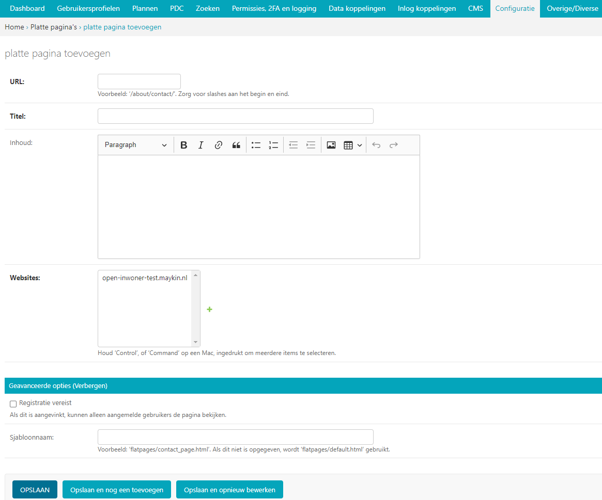
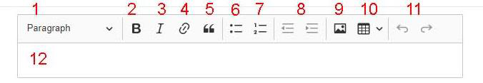

.. _configuratie:

================
12. Configuratie
================

Onder configuratie vindt u als beheerder alle elementen met betrekking tot de configuratie en koppeling van het Open Inwoner platform. Denk aan de configuratie met Haal centraal en Open Zaak. Ook kunnen hier de platte pagina’s die via de footer van het platform te bereiken zijn worden gecreëerd en – in beperkte mate – worden opgemaakt.

12.1. Algemene configuratie
===========================

De algemene configuratie is de hoofdconfiguratie. Hier kunt u de gehele Open Inwoner omgeving configureren. Het gaat hierbij om kleurgebruik, paginavoorkeuren, afbeeldingen, logo’s, adresgegevens,
footer-indeling, teksten op de belangrijkste pagina’s en Google Analytics of Siteimprove ID.

Indien gewenst kunt u wijzigingen aan de weergave en voorkeuren van uw omgeving aanbrengen door de configuratie te veranderen. Houd er rekening mee dat wijzigingen aan een liveomgeving direct aan de
voorkant zichtbaar zijn. Door de knop [Geschiedenis] te raadplegen kunt u zien wanneer wie welke wijzigingen heeft doorgevoerd. Let op: vanwege de paginalengte zijn enkele te wijzigen onderdelen
standaard ingeklapt. Klik op [tonen] om de paginateksten en hulpteksten te wijzigen.

12.1.1. Naam en opties
----------------------

In het bovenste gedeelte van het scherm kunt u de naam van uw gemeente aanpassen en u kunt bepaalde voorkeuren instellen door deze aan te vinken.

| *Naam*
| Voer hier de naam van uw gemeente in.

| *Toon inlogknop rechts bovenin*
| Dit zorgt ervoor dat er standaard een knop is om in te loggen. Wanneer
  deze optie uit staat is er nog altijd de mogelijkheid om in te loggen
  via accounts/login, maar de functie is niet zichtbaar.

| *Sta lokale registratie toe*
| Wanneer deze optie uit staat is het enkel toegestaan om met DigiD in
  te loggen. Zet deze instelling aan om ook het inloggen met
  gebruikersnaam/wachtwoord en het aanmelden zonder DigiD toe te staan.

| *Login met 2FA-met-SMS*
| Vink dit aan om te bepalen of gebruikers die met een gebruikersnaam en
  wachtword inloggen verplicht een verificiatiecode in moeten voeren die
  per SMS naar het geregistreerde telefoonnummer wordt verstuurd.
  Wanneer deze optie is uitgeschakeld kunnen gebruikers met enkel
  gebruikersnaam en wachtwoord inloggen.

| *Sta het delen van bestanden via Mijn Berichten toe*
| Vink dit aan om te bepalen of gebruikers via Mijn Berichten bestanden
  kunnen delen als attachment bij berichten. Wanneer deze optie is
  uitgeschakeld kunnen gebruikers enkel tekstberichten versturen.

| *Stuur niet-ingelogde gebruiker door naar*
| Geef hier een URL of pad op waar niet-ingelogde gebruikers naartoe
  doorgestuurd moeten worden vanuit de niet-ingelogde homepagina.

Een pad is bijvoorbeeld: '/accounts/login'.

Een URL is bijvoorbeeld: 'https://gemeente.groningen.nl'.

12.1.2. Kleur
-------------

Hier kunt u het kleurgebruik op uw Open Inwoner omgeving instellen. Gebruik hier de huisstijlkleuren
van uw gemeente. Wanneer u de huisstijlkleuren hebt geselecteerd kunt u aangeven of de tekst die in
blokken van deze kleuren wordt weergegeven donker of licht moet zijn. Selecteer de optie die voor de
beste leesbaarheid zorgt. Bij accentkleur gaat het om de kleur die gebruikt wordt om dingen te
accentueren (highlighten). De accent tekstkleur is de kleur die tekst moet krijgen die op vlakken met de
accentkleur wordt gebruikt.

12.1.3. Afbeeldingen
--------------------

Hier kunt u diverse afbeeldingen die gebruikt worden op uw Open Inwoner omgeving instellen. Het gaat
hier om logo’s, de Favicon (de thumbnail die in de browser klein wordt gebruikt) en de banners.

| *Logo*
| Hier kunt u het logo van de gemeente uploaden. Sleep het gewenste
  bestand naar het veld of klik op [ kies bestand].

| *Footer logo*
| Hier kunt u het logo van de gemeente naar de footer uploaden. Sleep
  het gewenste bestand naar het veld of klik op [kies bestand].

| *Footer logo title*
| Hier kunt u de titel van het footer logo invullen. Dit is de hulptekst
  die bij het logo hoort.

| *Footer logo link*
| Hier vult u de URL in van de link naar het footer logo. Indien u geen
  bestand geüpload heeft.

| *Hoofdafbeelding op de inlogpagina*
| Hier kunt u de hoofdbanner van uw Open Inwoner omgeving uploaden. Deze
  banner is zichtbaar op de homepage wanneer men niet is ingelogd. Sleep
  het gewenste bestand naar het veld of klik op [ kies bestand].

| *Favicon image (32x32) als png*
| Dit is een pictogrammetje dat bij uw gemeente of Open Inwoner Platform
  hoort. Dit pictogrammetje wordt gebruikt in uw internetbrowser.

| *Banner samenwerken*
| Hier kunt u de banner voor het onderdeel *Samenwerken* wijzigen indien
  gewenst.

12.1.4. Waarschuwingsbanner
---------------------------

De waarschuwingsbanner is een gekleurde band bovenin beeld die u kunt gebruiken om belangrijke
meldingen weer te geven. Hier kunt u de waarschuwingsbanner aan- of uitzetten en configureren. De
configuratie van de waarschuwingsbanner heeft betrekking op zowel opmaak als inhoud.

| *Toon waarschuwingsbanner*
| Vink dit aan wanneer u wilt dat de waarschuwingsbanner bovenin de
  schermen van het Open Inwoner Platform zichtbaar is. Wanneer u deze
  optie heeft aangevinkt wordt de waarschuwingsbanner op **alle
  pagina’s** weergegeven.

| *Tekstinhoud waarschuwingsbanner*
| Hier kunt u de tekst invoeren die op de waarschuwingsbanner wordt
  weergegeven. Denk hierbij aan onderhoudsmomenten, updates etc.

| *Waarschuwingsbanner achtergrond en Waarschuwingsbanner tekst*
| Hier kunt u de kleuren selecteren voor respectievelijk de
  achtergrondkleur en de tekstkleur van de waarschuwingsbanner. De kleur
  kan worden geselecteerd in een pop-up kleurvinder of door het invoeren
  van de gewenste kleurcode.

Houd er rekening mee dat de waarschuwingsbanner moet opvallen. Kies bij het gebruik van de waarschuwingsbanner daarom géén kleur die bij de huisstijl van de Gemeente past. Roodtinten worden
vaak gebruikt als waarschuwing, maar kan als negatief worden ervaren. Oranje heeft een minder
negatieve associatie en valt desondanks vaak goed op.

12.1.5. Paginateksten
---------------------

Hier kunt u de paginateksten van de vaste pagina’s aanpassen. U kunt hier eenvoudige tekstuele
wijzigingen aanbrengen. Er wordt geen gebruik gemaakt van een editor.

| *Login tekst*
| Dit is de tekst die wordt weergegeven wanneer de gebruiker aan de voorkant op [Login] rechts bovenin het scherm klikt.

| *Registratie tekst*
| Dit is de tekst die wordt weergegeven op de registratiepagina.

| *Koptekst homepage*
| Dit is de header die op de homepage wordt weergegeven.

| *Introductietekst homepage*
| Dit is de tekst die op de homepage wordt weergegeven.

| *Onderwerpentitel op de homepage*
| Dit is de header van het tweede blok op de homepage. (Het blok met onderwerpen).

| *Introductietekst onderwerpen, op de homepage*
| Dit is de lopende tekst die bij het tweede blok op de homepage wordt
  weergegeven. (Het blok met onderwerpen).

| *Paginatitel onderwerp-pagina*
| Dit is de header die op de onderwerp-pagina wordt weergegeven. Wijzig
  deze titel alleen als u de term onderwerpen wilt wijzigen.

| *Introductietekst onderwerp-pagina*
| Dit is de lopende tekst die op de onderwerp-pagina boven de
  onderwerpblokken wordt weergegeven.

| *Koptekst van de kaart op de homepage*
| Dit is de header die bij de kaart wordt weergegeven.

| *Introductietekst kaart*
| Dit is de lopende tekst die bij de kaart wordt weergegeven.

| *Productzoeker titel*
| Dit is de titel die bij de productzoeker op de homepage wordt
  weergegeven.

| *Introductietekst productzoeker homepage*
| Dit is de introductietekst van de productzoeker op de homepage.

| *Paginatitel onderwerp-pagina*
| Dit is de header op de onderwerp-pagina.

| *Introductietekst onderwerp-pagina*
| Dit is de lopende tekst die op de onderwerp-pagina wordt weergegeven.

| *Titel vragenlijst homepage*
| Dit is de titel van de vragenlijst die op de homepage staat.

| *Introductietekst vragenlijst homepage*
| Dit is de introductietekst die bij de vragenlijst op de homepage wordt
  weergegeven.

| *Titel Vragenlijst widget*
| Dit is de titel van de vragenlijst widget om de zelfdiagnose te
  starten. Deze wordt weergegeven op de onderwerp- en profielpagina’s.

| *Introductietekst vragenlijst widget*
| Dit is de introductietekst die bij de vragenlijst widget op de
  onderwerp- en profielpagina’s wordt weergegeven.

| *Introductietekst samenwerken*
| Dit is de introductietekst die op de *Samenwerken* pagina’s wordt
  weergegeven.

| *Standaardtekst geen samenwerkingen*
| Deze tekst wordt weergegeven als een gebruiker nog geen
  samenwerkingsplannen heeft aangemaakt.

| *Standaardtekst ‘doel wijzigen’*
| Deze tekst wordt weergegeven als een gebruiker een doel wil wijzigen.

12.1.6. Helpteksten
-------------------

Dit zijn de teksten die in een pop-up worden getoond wanneer de gebruiker op een specifieke pagina op
de knop [Help] in het topmenu heeft geklikt. Deze teksten geven een korte uitleg van wat de gebruiker
op de betreffende pagina kan doen/vinden.

| *Helptekst homepage*
| Dit is de tekst die wordt weergegeven wanneer de gebruiker op de
  homepage op [Help] klikt.

| *Helptekst onderwerp-pagina*
| Dit is de tekst die wordt weergegeven wanneer de gebruiker op de
  onderwerppagina op [Help] klikt.

| *Helptekst producten*
| Dit is de tekst die wordt weergegeven wanneer de gebruiker op een
  productpagina op [Help] klikt.

| *Helptekst zoeken*
| Dit is de tekst die wordt weergegeven wanneer de gebruiker op de
  zoekpagina op [Help] klikt.

| *Helptekst Mijn profiel*
| Dit is de tekst die wordt weergegeven wanneer de gebruiker op de
  profielpagina op [Help] klikt.

| *Helptekst vragenlijst/zelftest*
| Dit is de tekst die wordt weergegeven wanneer de gebruiker tijdens de
  vragenlijst of zelftest op [Help] klikt.

| *Helptekst samenwerken*
| Dit is de tekst die wordt weergegeven wanneer de gebruiker op de
  pagina *Samenwerken* op [Help] klikt.

12.1.7. Zoekfilter opties
-------------------------

Hier kunt u een onderwerpenfilter, een tagfilter en/of een organisaties-filter toevoegen aan de
zoekresultaten. U kunt deze filters naar eigen inzicht selecteren. Deze filters worden weergegeven aan de
linkerkant van de pagina met zoekresultaten. Een voorbeeld hiervan is weergegeven in het screenshot hier:

12.1.8. E-mails
---------------

Hier kunt u selecteren of u wilt dat gebruikers een mail ontvangen wanneer zij een nieuw bericht hebben.

| *Stuur een e-mail bij nieuwe berichten*
| Wanneer dit is aangevinkt wordt er een e-mailnotificatie gestuurd naar
  gebruikers als zij in Open Inwoner een nieuw bericht hebben ontvangen.

| *Ontvangers e-mailsamenvatting*
| Hier vult u de e-mailadressen van beheerders die dagelijks een
 samenvatting dienen te ontvangen van alle op te lossen zaken
 (e-mails die niet aankomen).

| *E-mailverificatie vereist*
| Hier kunt u selecteren of gebruikers verplicht zijn om na het
 inloggen hun e-mailadres te verifiëren voor bepaalde handelingen.

12.1.9. OpenID Connect
----------------------

Dit is een alternatieve login methode die naast DigiD kan worden ingesteld (zie 10.9). In de algemene
configuratie kunt u de login button voor OpenID Connect configureren. Alle andere zaken rond de OpenID Connect configuratie vindt u onder inlog koppelingen (hoofdstuk 10.5 en 10.6).

| *OpenID Connect logo*
| Hier kunt u het logo uploaden van de OpenID connect methode die u
 wilt gebruiken. Door een logo te uploaden maakt u het voor de
 gebruiker duidelijker welke login methode er wordt geboden.

| *OpenID Connect login tekst*
| Hier voegt u de tekst toe die bij de login knop komt te staan. Deze
 tekst moet in ieder geval “Log in met [X]” of iets vergelijkbaars
 bevatten.

| *Toon optie om in te loggen via OpenID Connect*
| Hier kunt u selecteren welk soort gebruiker er de mogelijkheid moet
 krijgen om via OpenID Connect in te loggen. Dit kan de
 standaardgebruiker zijn of de Hoofdbeheerder.

12.1.10. Authenticatie
----------------------

| *eHerkenning authenticatie ingeschakeld*
| Hier kunt u aanvinken of u gebruikers de mogelijkheid wilt bieden in
  te loggen met eHerkenning. Standaard wordt er gebruik gemaakt van de
  SAML integratie (bij een rechtstreekse aansluiting op een eHerkenning
  Makelaar). Een OpenID Connect koppeling met eHerkenning kunt u
  configureren onder inlog koppelingen (zie hoofdstuk 10.6).

12.1.11. Analytics
------------------
Dit zijn de gegevens die u dient in te vullen als u Google Analytics of Matomo – het Open Source
alternatief voor Google Analytics - wilt laten draaien op het platform. Hierdoor krijgt u inzicht in het
gedrag van de bezoekers van het platform.

| *Google Tag Manager code*
| Deze code ziet er meestal uit als ‘GTM-XXXX’. Het invoeren van deze
  code zorgt ervoor dat Google Tag Manager geïnstalleerd wordt.
  Installeer Google Tag Manager om tags te configureren en te
| implementeren, inclusief tags van Google Ads, Google Analytics,
  Floodlight en tags van derden.

| *Google Analytics code*
| Deze trackingcode ziet er meestal uit als ‘G-XXXXX’. Het invoeren van
  deze code zorgt ervoor dat Analytics geïnstalleerd wordt. Google
  Analytics verzamelt statistische gegevens waarmee inzicht kan worden
  verkregen in het gedrag van bezoekers. Hierdoor kan er beter op de
  bezoeker worden ingespeeld.

| *Matomo server URL*
| Vul hier de URL in van uw Matomo server. Matomo is het open source
  alternatief voor Google Analytics.

| *Matomo site ID*
| Vul hier de Matomo ID in van de website die u wilt analyseren. Deze
  code is te vinden wanneer u ingelogd bent in Matomo.

| *SiteImprove ID*
| Vul hier de SiteImprove ID in van de website die u wilt analyseren.
  Deze code kunt u vinden in de SiteImprove snippet. Dit is onderdeel
  van een URL zoals
| '//siteimproveanalytics.com/js/siteanalyze_xxxxx.js' waarbij het
  xxxxx-deel de SiteImprove ID is die hier moet worden ingevuld.

Let op! Wanneer de SiteImprove ID is ingevuld dienen ook de volgende twee CSP settings ingesteld te worden via het menu-item CSP settings:

.. code::

    default-src https://siteimproveanalytics.com

    img-src https://*.siteimproveanalytics.io

12.1.12. Toestemming voor cookies
---------------------------------

Open Inwoner maakt gebruik van cookies om de website te verbeteren. Deze melding wordt
weergegeven wanneer een nieuwe gebruiker op de site komt. De gebruiker krijgt een cookiemelding
(cookiebanner) in beeld waarmee akkoord moet worden gegaan voordat verder kan worden gegaan. In
dit hoofdstuk vindt u de gegevens die in de cookiebanner worden weergegeven. U kunt hier de tekst, link
en de URL naar de privacyverklaring aanpassen.

| *Tekst cookiebanner informatie*
| Hier kunt u de tekstuele informatie invoeren die in de cookiebanner
  wordt weergegeven. Dit is een disclaimer voor het gebruik van cookies,
  zoals: “Wij gebruiken cookies om onze website en dienstverlening te
  verbeteren.”

| *Tekst cookiebanner link*
| Hier kunt u de tekst invoeren waaronder de link naar de privacypagina
  zit. Deze tekst is klikbaar indien er een URL is opgegeven.

| *URL van de privacypagina*
| Plaats hier de link naar de privacypagina.

12.1.13. Gebruikersfeedbackonderzoek
------------------------------------

Hier kunt u de mogelijkheid voor gebruikers om feedback te geven over het platform configureren.

| *Feedbackknop label*
| Hier vult u de tekst in die op de CTA button wordt weergegeven om
  gebruikersfeedback te verzamelen. Denk hierbij aan de CTA richtlijnen.

| *Feedbackknop URL*
| Hier vult u de URL in naar het formulier waar gebruikers feedback
  kunnen geven.

12.1.14. Weergaveopties voor anonieme gebruikers
------------------------------------------------

Hier kunt u selecteren of u het onderwerpen-menu en/of de zoekbalk voor anonieme gebruikers wilt
verbergen. Wanneer u het vakje heeft aangevinkt zal de betreffende optie alleen zichtbaar zijn voor
ingelogde gebruikers.

12.1.15. Geavanceerde opties
----------------------------

Hier kunt u extra CSS-stijlen invoegen die op de site gebruikt worden. Let op, er kan enkel gebruik
worden gemaakt van een beperkte, veilige subset van CSS-eigenschappen. Niet alle CSS-stijlen worden
door het systeem ondersteund. In de aangegeven lijst staan de toegestane CSS-attributen die men eventueel nog aan de site kan toevoegen.

12.1.16. Sociale media
----------------------

Hier kunt u selecteren of u de mogelijkheid wilt bieden producten te delen op sociale media, zoals
Facebook, LinkedIn en X. Indien u deze optie aanvinkt zullen er knoppen zichtbaar zijn om bepaalde
elementen extern te delen.

12.1.17. Platte pagina’s in footer
----------------------------------

Hier kunt u de volgorde van de platte pagina’s in de footer veranderen, een nieuwe platte pagina
toevoegen aan de footer of een platte pagina verwijderen.

| *Platte pagina aan footer toevoegen*
| Klik op de [+ nog een platte pagina toevoegen] om een extra platte
  pagina aan de footer toe te voegen.U kunt in het drop down menu de gewenste pagina selecteren. Moet de nieuwe pagina nog worden aangemaakt? Dan klikt u op de [+] naast het drop down menu. Er wordt nu een nieuw scherm geopend waar u een nieuwe platte pagina kunt creëren. Meer uitleg hierover vindt u in hoofdstuk 7.5.

| *Volgorde platte pagina’s veranderen*
| U kunt de volgorde van de platte pagina’s in de footer veranderen.
  Onder ‘volgorde’ ziet u de huidige volgorde, waarbij 0 de bovenste
  link is en het hoogste getal de onderste. Om de volgorde te veranderen
  gebruikt u de pijltjes knoppen achter de platte pagina’s, onder
  ‘verplaatsen’.

.. image:: images/image117.png
   :alt: Overige
   :width: 15px
   :align: left

helemaal naar boven

.. image:: images/image118.png
   :alt: Overige
   :width: 15px
   :align: left

één plaats naar boven

éen plaats naar onder

.. image:: images/image120.png
   :alt: Overige
   :width: 15px
   :align: left

helemaal naar onderen

| *Platte pagina’s uit footer verwijderen*
| Selecteer de gewenste platte pagina door het vierkantje onder
  ‘verwijderen’ aan te klikken. Wanneer u nu op [Opslaan] klikt wordt de
  geselecteerde platte pagina uit de footer verwijderd.

| *Opslaan*
| Als u uw wijzigingen tussentijds wilt opslaan, klikt u op [opslaan en
  opnieuw bewerken]. Wanneer u tevreden bent met uw wijzigingen klikt u
  op [opslaan] om terug te keren naar het overzicht.

12.1.18. Fonts
--------------

Hier kunt u de gebruikte fonts van het systeem aanpassen. U kunt hier diverse TTF lettertypes uploaden
voor de heading (koppen), bodytext (lopende tekst), italic (schuingedrukt), bold (vetgedrukt) en bold
italic (schuin vetgedrukt).

12.2. CSP settings
==================

De CSP (content security policy) settings moeten worden ingesteld wanneer u gebruik wilt maken van
Google Analytics, Matamo, SiteImprove of een vergelijkbare tool.
Met de CSP instellingen kunt u aangeven welke verzoeken er zijn toegestaan vanuit de Open Inwoner
omgeving. Wanneer bijvoorbeeld Google Analytics wordt gebruikt, dan moet bij de CSP settings worden
ingesteld dat verzoeken naar Google Analytics vanaf de browser zijn toegestaan. Standaard staan de CSP
settings dusdanig ingesteld dat verzoeken naar derde partijen niet toegestaan zijn. Dit is in verband met
het gebruik van DigiD en de noodzakelijke security audit.
Voor meer informatie over CSP settings, raadpleeg: https://developer.mozilla.org/en-
US/docs/Web/HTTP/CSP

12.3. Mail templates
====================

Bij mail templates kunt u e-mailsjablonen opstellen, wijzigen en verwijderen. E-mailsjablonen zijn vooraf
opgemaakte standaardmails die ideaal zijn om te gebruiken voor mails die regelmatig moeten worden
verstuurd. Denk aan uitnodigingen, herinneringen enzovoorts.

12.3.1. Mail template toevoegen
-------------------------------

Door in het overzicht op de knop [mail template toevoegen +] rechts bovenin uw scherm te klikken kunt
u een nieuwe mail template toevoegen. Er wordt een nieuw scherm geopend waar u enkele gegevens
dient in te vullen. Wanneer alle gegevens zijn ingevuld klikt u op [opslaan].

12.3.2. Mail template wijzigen
------------------------------

Door op een mail template in het overzicht te klikken, kunt u deze wijzigen. Er wordt een nieuw scherm
geopend waar u diverse wijzigingen kunt aanbrengen.

| *Interne naam*
| Hier zet u de naam van het e-mailsjabloon voor intern gebruik,
 zoals hij onder medewerkers vindbaar moet zijn.

| *Type*
| Selecteer de soort mailsjabloon: uitnodiging of nieuwe e-mail.

| *Taal*
| Selecteer de taal waarin de e-mailsjabloon is opgesteld.

| *Subject*
| Typ hier het onderwerp van de te verzenden e-mail. Dit is het
 onderwerp van de uiteindelijke mail. Deze is zichtbaar voor de
 ontvanger. Houd deze kort en bondig. Raadpleeg onder *Help* de
 subject variables voor beschikbare variabelen voor het onderwerp.
 Variabelen zijn automatisch ingevulde teksten op basis van de
 beschikbare gegevens op het moment van versturen. U plaatst deze
 tussen twee accolades, zoals: {{site_name}}.

| *Body*
| Hier kunt u de e-mail volledig opmaken. Hiervoor is een editor
 aanwezig, zoals hieronder afgebeeld. Raadpleeg onder *Help* de body
 variables voor beschikbare variabelen voor de body text.

1. Hier selecteert u de stijl die u aan de tekst wilt meegeven. Denk aan italic, bold, doorgehaald etc.
2. Hier selecteert u wat voor soort tekst u aan het typen bent. Dit heeft gevolgen voor de standaardopmaak. Kies uit paragraph, heading 1, heading 2, heading 3 etc.
3. Hiermee maakt u de tekst vetgedrukt
4. Hiermee maakt u de tekst italic
5. Hiermee maakt u de tekst onderstreept
6. Hiermee maakt u de tekst doorgehaald
7. Hiermee maakt u de laatste stap ongedaan (pijltje naar links), of voert u de laatste stap opnieuw uit (pijltje naar rechts)
8. Hiermee voegt u een link toe aan de tekst of wijzigt u deze, of verwijdert u de aanwezige link (met kruisje door het icoontje)
9. Hiermee voegt u een interne link toe
10. Hiermee voegt u een afbeelding aan de tekst toe
11. Hiermee voegt u een tabel in
12. Hiermee voegt u een horizontale lijn in
13. Hiermee verandert u de tekstkleur
14. Hiermee verandert u de achtergrondkleur
15. Hiermee voegt u een emoji in
16. Hiermee voegt u een speciaal teken in
17. Hiermee wisselt u naar de broncode van de tekst

| *Base template path*
| Dit is de locatie van de e-mailsjabloon. Laat dit veld leeg voor een
  automatisch gegenereerd pad.

Help
----

| *Subject variables, body variables*
| Subject variables en body variables zijn de beschikbare variabelen
  voor het onderwerp en de body text. Variabelen zijn automatisch
  ingevulde teksten op basis van de beschikbare gegevens op het moment
  van versturen. U plaatst deze tussen twee accolades, zoals:
  {{site_name}}.

| *Opmerkingen*
| Hier kunt u enkele opmerkingen met betrekking tot de mail template
  neerzetten. Deze opmerkingen zijn enkel voor intern gebruik.

| *Opslaan*
| Als u uw wijzigingen tussentijds wilt opslaan, klikt u op [opslaan en
  opnieuw bewerken]. Wanneer u tevreden bent met uw wijzigingen klikt u
  op [opslaan] om terug te keren naar het overzicht. Of u klikt op
  [opslaan en nieuwe toevoegen] als u een extra item wilt toevoegen.

12.3.3. Mail template verwijderen
---------------------------------
Wanneer u een of meerdere mail templates wilt verwijderen, kikt u in de checkbox links van de titel van
de template. Selecteer vervolgens in het dropdown menu bij ‘Actie’ de actie ‘Geselecteerde mail templates verwijderen’ en klik op de knop [uitvoeren]. De geselecteerde mail templates zijn nu verwijderd.

12.4. Platte pagina’s
=====================
Bij Platte pagina’s kunt u als beheerder de platte pagina’s aanmaken of aanpassen die bereikbaar zijn
vanuit de footer van de Open Inwoner omgeving. De platte pagina’s beschikken slechts over beperkte
opmaakmogelijkheden. In het overzicht vindt u alle bestaande platte pagina’s. U kunt nieuwe pagina’s
toevoegen, pagina’s wijzigen of verwijderen.

12.4.1. Platte pagina toevoegen
-------------------------------
Door in het overzicht op de knop [platte pagina toevoegen +] rechts bovenin uw scherm te klikken kunt u
een nieuwe platte pagina toevoegen. Er wordt een nieuw scherm geopend waar u de pagina in beperkte
mate kunt opmaken. Wanneer alle gegevens zijn ingevuld klikt u op [opslaan].
Let op! Bij de algemene configuratie kunt u de volgorde van de pagina’s in de footer wijzigen. Zie
hoofdstuk 12.1.17.

12.4.2. Platte pagina wijzigen
------------------------------
Door op een platte pagina in het overzicht te klikken, kunt u deze wijzigen. Er wordt een nieuw scherm
geopend waar u de pagina kunt opmaken.

| *URL*
| Voer hier het achtervoegsel van de URL in voor de betreffende
 platte pagina. Gebruik hiervoor kleine letters en indien nodig een
 koppelteken (-) in plaats van een spatie. Begin en eindig de URL
 met een / .
| Bijvoorbeeld: _/contact-opnemen/_

| *Titel*
| Voer hier de titel van de platte pagina in. Deze wordt in de footer
 weergegeven.

| *Content*
| Bij content vult u de inhoud in die u op de platte pagina wilt
 hebben. Hiervoor is een eenvoudige editor aanwezig, zoals hieronder
 afgebeeld.

1. Hier selecteert u wat voor soort tekst u aan het typen bent. Dit heeft gevolgen voor de
standaardopmaak. Kies uit paragraph, heading 1, heading 2, heading 3 etc.
2. Hiermee maakt u de tekst vetgedrukt
3. Hiermee maakt u de tekst italic
4. Hiermee voegt u een link toe aan de tekst
5. Hiermee voegt u een citaat aan de tekst toe
6. Hiermee maakt u een ongenummerde lijst (met bulletpoints)
7. Hiermee maakt u een genummerde lijst
8. Hiermee kunt u de inspringing vergroten of verkleinen
9. Hiermee voegt u een afbeelding aan de tekst toe
10. Hiermee voegt u een tabel in
11. Stap terug (ongedaan maken) of stap vooruit (opnieuw doen)

| *Websites*
| Selecteer hier op welke website(s) de betreffende platte pagina moet
  worden weergegeven. Houd [ctrl] ingedrukt om meerdere websites te
  selecteren. Staat de noodzakelijke website niet in de lijst? Dan voegt
  u deze toe door op [+] te klikken.

Registratie vereist?
~~~~~~~~~~~~~~~~~~~~

Wanneer dit is aangevinkt zal de betreffende pagina alleen worden
weergegeven wanneer de gebruiker is ingelogd.

| *Sjabloonnaam*
| Hier kunt u eventueel een vooraf opgemaakte paginasjabloon (html)
  gebruiken. Laat dit veld leeg om zonder sjabloon te werken.

| *Opslaan*
| Als u uw wijzigingen tussentijds wilt opslaan, klikt u op [opslaan en
  opnieuw bewerken]. Wanneer u tevreden bent met uw wijzigingen klikt u
  op [opslaan] om terug te keren naar het overzicht. Of u klikt op
  [opslaan en nieuwe toevoegen] als u een extra item wilt toevoegen.

12.4.3. Platte pagina verwijderen
---------------------------------

Wanneer u een of meerdere platte pagina’s wilt verwijderen, kikt u in de checkbox links van de titel van
de paginatitel. Selecteer vervolgens in het dropdown menu bij ‘Actie’ de actie ‘Geselecteerde platte
pagina’s verwijderen’ en klik op de knop [uitvoeren]. De geselecteerde platte pagina’s zijn nu verwijderd.

12.5. Websites
==============

Hier vult de beheerder de domeinnaam en weergavenaam van de website(s) in. Deze kunnen indien
noodzakelijk worden aangepast. Dit is ter inrichting van het systeem. De domeinnaam moet
overeenkomen met de domeinnaam van de omgeving.
