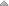

.. _overige_diverse:

=====================
13. Overige / Diverse
=====================

Onder overige / diverse vindt u de application groups, links naar
belangrijke bronnen en de mappen om afbeeldingen te wijzigen of te
uploaden.

13.1. Application groups
========================

Onder application groups vindt u de hoofditems van het topmenu. U kunt
nieuwe items toevoegen, items verplaatsen, wijzigen en verwijderen.

13.1.1. Application group toevoegen
-----------------------------------

Door in het overzicht op de knop [application group toevoegen +] rechts
bovenin uw scherm te klikken kunt u een nieuwe mail template toevoegen.
Er wordt een nieuw scherm geopend waar u enkele gegevens dient in te
vullen. Wanneer alle gegevens zijn ingevuld klikt u op [opslaan].

13.1.2. Application group verplaatsen
-------------------------------------

U kunt de volgorde van de menu-items veranderen door in het overzicht op
de icoontjes naast het betreffende menu-item te klikken.

|image5| \ = helemaal naar boven

|image6| \ = één plaats naar boven

|image7| \ = éen plaats naar onder

|image8| \ = helemaal naar onderen

13.1.3. Application group wijzigen
----------------------------------

Door op een menu-item in het overzicht te klikken, kunt u deze wijzigen.
Er wordt een nieuw scherm geopend waar u diverse wijzigingen kunt
aanbrengen.

| *Naam*
| Hier zet u de naam van het gewenste menu-item.

| *Slug*
| Dit is het onderdeel van de URL wat het onderwerp beschrijft. Gebruik
  enkel kleine letters en koppeltekens (-) in plaats van spaties.
  Bijvoorbeeld activiteiten-en-meedoen.

| *Modellen*
| Onder modellen kunt u de menustructuur. U selecteert hier de
 gewenste sub-items door ze naar het rechterveld te verplaatsen. Om
 een sub-item uit te schakelen verplaatst u het gekozen item weer
 naar het linker veld. In principe staat de menustructuur vast en
 dient deze niet door de beheerder te worden aangepast.

| *Applicatielinks*
| Hier kunt u de naam van en de link naar een applicatie toevoegen
 die bij de application group hoort. Door op het X icoontje te
 klikken kunt u een applicatielink verwijderen.

| *Opslaan*
| Als u uw wijzigingen tussentijds wilt opslaan, klikt u op [opslaan
 en opnieuw bewerken]. Wanneer u tevreden bent met uw wijzigingen
 klikt u op [opslaan] om terug te keren naar het overzicht. Of u
 klikt op [opslaan en nieuwe toevoegen] als u een extra item wilt
 toevoegen.

13.1.4. Application group verwijderen
-------------------------------------

Wanneer u een of meerdere application groups wilt verwijderen, kikt u
in de checkbox links van de titel van de template. Selecteer
vervolgens in het dropdown menu bij ‘Actie’ de actie ‘Geselecteerde
application groups verwijderen’ en klik op de knop [uitvoeren]. De
geselecteerde application groups zijn nu verwijderd.

13.2.Mappen
===========

Onder mappen vindt u alle uploads van uw Open Inwoner omgeving. Het
gaat hier om de gebruikte afbeeldingen en eventueel documenten. U
kunt onder mappen geheel naar wens mappen toevoegen, verplaatsen,
hernoemen en verwijderen.

13.2.1. Map toevoegen
---------------------

Om een nieuwe map toe te voegen klikt u op de knop [Nieuwe map]
rechts bovenin het scherm. U kunt op ieder niveau een nieuwe map
toevoegen en zo uw uploads handig te bewaren.

13.2.2. Bestanden uploaden
--------------------------

Om bestand te uploaden klikt u op de knop [Bestanden uploaden] rechts
bovenin het scherm (zie bovenstaande afbeelding). U kunt op ieder niveau
losse bestanden uploaden: van de hoofdmap tot de submappen. Nadat
bestanden zijn geüpload kunnen deze indien nodig worden verplaatst.

13.2.3. Afbeeldingen wijzigen
-----------------------------

Bestanden kunnen na het uploaden nog worden gewijzigd. Om een afbeelding
of bestand te wijzigen klikt u op de titel van een afbeelding in het
overzicht. Er wordt dan een nieuw venster geopend met de te wijzigen
details van de betreffende afbeelding.

| *Naam*
| Hier wijzigt u de naam van de afbeelding. Let op! Dit is NIET de
  bestandsnaam, maar de naam zoals hij in het overzicht wordt
  weergegeven. Wanneer dit veld leeg blijft zal de bestandsnaam in het
  overzicht worden weergegeven.

| *Eigenaar*
| Hier ziet u de ID en het mailadres van degene die de afbeelding/het
  bestand heeft geüpload. U kunt de eigenaar wijzigen door op het
  vergrootglas te klikken en in de lijst een andere eigenaar selecteren.

| *Omschrijving*
| Hier kunt u de omschrijving van de afbeelding wijzigen. Dit is handig
  voor mensen met een visuele beperking.

| *Auteur*
| Hier kunt u wijzigen wie de auteur (of tekenaar/fotograaf) van de
  afbeelding is.

| *Standaard alt. tekst*
| Hier wijzigt u de alt-tekst (alternatieve tekst) of alt-tag. De
  alt-tekst wordt weergegeven als de afbeelding om een bepaalde reden
  niet te zien is. De alt-tekst is vaak de titel van de afbeelding of
  een samenvatting wat er op de afbeelding te zien is. Deze informatie
  is belangrijk voor SEO – want zoekmachines lezen geen plaatjes - maar
  is ook handig voor mensen met een visuele beperking (digitale
  toegankelijkheid).

| *Standaardtitel*
| Hier kunt u de titel van de afbeelding wijzigen.

| **Geavanceerd**
| Onder geavanceerd vindt u enkele technische details van de
  afbeelding/het bestand. U kunt hier wél het daadwerkelijke bestand
  veranderen door een nieuwe versie te uploaden.

| **Locatie van onderwerp**
| De locatie van het onderwerp geeft het brandpunt van de afbeelding
  aan. Hier worden de x en y-coördinaten weergegeven. Om het brandpunt
  van de afbeelding te wijzigen is het beter gebruik te maken van de
  visuele manier. Zie 11.3.4.

| *Opslaan*
| Als u uw wijzigingen tussentijds wilt opslaan, klikt u op [opslaan en
  opnieuw bewerken]. Wanneer u tevreden bent met uw wijzigingen klikt u
  op [opslaan] om terug te keren naar het overzicht.

13.2.4. Brandpunt van afbeelding wijzigen
-----------------------------------------

Wanneer u een afbeelding uploadt kan het zijn dat de afbeelding te groot
is voor de uiteindelijke weergave. Er wordt dan slechts een gedeelte van
de afbeelding weergegeven. Door een brandpunt (focus point) toe te
voegen of te verplaatsen bepaalt u welk gedeelte van de afbeelding als
centrale punt wordt genomen.

U kunt het brandpunt verleggen door in het scherm ‘afbeelding wijzigen’
de rode cirkel te verslepen. De plek van de rode cirkel wordt indien
nodig als midden (brandpunt) van de uiteindelijke weergave genomen.
Controleer altijd of de uiteindelijke weergave van de afbeelding naar
wens is.

13.3. Periodieke taken
======================

Onder periodieke taken vindt u alle periodiek terugkerende taken die het
systeem uitvoert. Denk hierbij aan opschonen, importeren van data en
indexeren van logs. U kunt het systeem nieuwe periodieke taken geven en
de reeds ingestelde periodieke taken wijzigen of verwijderen. Om
handmatig, buiten het geplande interval om, de taak uit te voeren klikt
u op de blauwe knop achter de betreffende taak.

13.3.1. Periodieke taak wijzigen
================================

Om een periodieke taak te wijzigen of een nieuwe taak te configureren
klikt u op [+ Periodieke taak toevoegen] of u klikt op de te wijzigen
periodieke taak. Er wordt in beide gevallen een nieuw venster geopend
waarin u de gegevens van de periodieke taak kunt instellen.

| *Naam*
| Hier vult u de naam van de periodieke taak in. Zorg ervoor dat de
  omschrijving van de taak helder is.

| *Task*
| Hier selecteert u de betreffende taak uit het dropdown menu als het
  gaat om een reeds ingestelde taak (registered) en vult u het pad in
  van een nieuwe, custom taak (custom).

| *Ingeschakeld*
| Wanneer hier een vinkje staat is de periodieke taak ingeschakeld. Haal
  het vinkje weg om de periodieke taak (tijdelijk) uit te schakelen.

| *Omschrijving*
| Vul hier een uitgebreide omschrijving van de periodieke taak in.

**Schema**

| *Interval*
| Hier vult u de regelmaat waarmee de periodieke taak dient te worden
  uitgevoerd in. Kies een van de beschikbare manieren om het schema in
  te stellen: interval, crontab, solar of clocked. Laat de overige
  manieren leeg.

| *Starttijd*
| Hier kunt u een exacte datum en tijd aangeven vanaf wanneer de
  periodieke taak ingeschakeld moet zijn.

| *Datum en tijd laatste uitvoering*
| Hier wordt exact aangegeven wanneer de periodieke taak voor het laatst
  is uitgevoerd.

| *Datum en tijd laatste uitvoering*
| Hier wordt exact aangegeven wanneer

| *One-off task*
| Indien aangevinkt wordt deze taak slechts eenmalig uitgevoerd in
  plaats van periodiek.

| **Arguments**
| Hier vult u indien gewenst JSON geëncodeerde positional en keyword arguments in.

| **Execution options**
| Hier heeft u de mogelijkheid enkele zaken rond de uitvoering van de taak in te stellen. Dit item is standaard ingeklapt. Klik op [Tonen] om de bijbehorende velden weer te geven.

| *Expires date time*
| Hier vult u de datum en tijd in waarop de periodieke taak vervalt.

| *Expires timedelta with seconds*
| Hier wordt de timedelta met seconden weergegeven waarna de periodieke
  taak vervalt.

| *Queue override*
| Laat dit veld leeg voor de standaardvolgorde.

| *Exchange*
| Vul hier de override exchange in voor low-level AMQP routing.

| *Routing key*
| Vul hier de override routing key in voor low-level AMQP routing.

| *Priority*
| Geef de periodieke taak een prioriteit mee. Hiervoor geldt een
 waarde tussen 0 en 255, waarbij 0 de hoogste prioriteit heeft.

| *AMQP Message headers*
| Vul hier een JSON geëncodeerde bericht header in voor het AMQP
  bericht.

13.4.Taken
==========

Onder taken vindt u een overzicht van alle door het systeem uitgevoerde
taken. U kunt de taken filteren en sorteren. Dit overzicht is read-only
en fungeert enkel voor analysedoeleinden.

.. |image7| image:: images/image119.png

