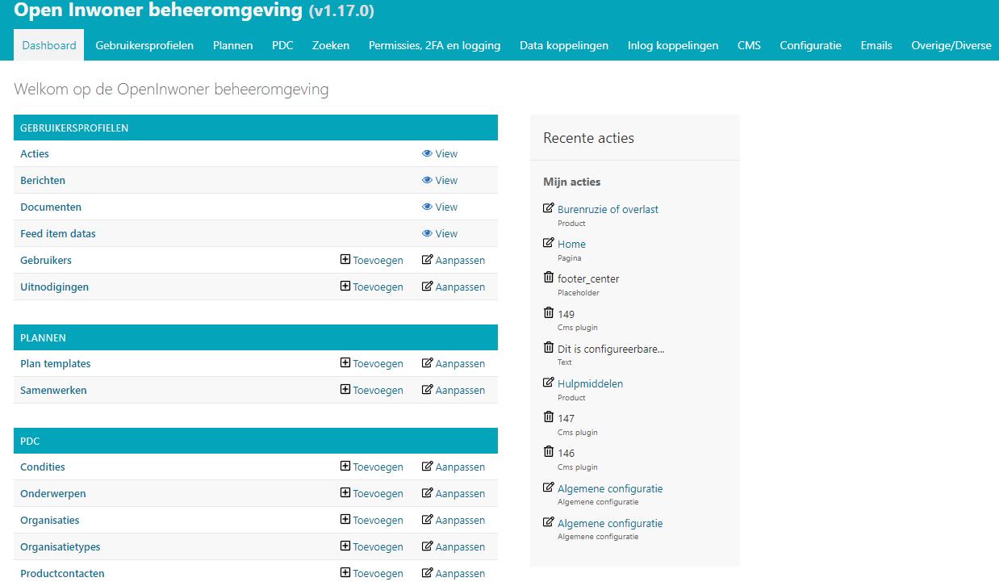
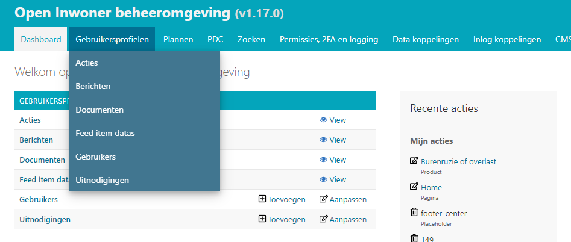
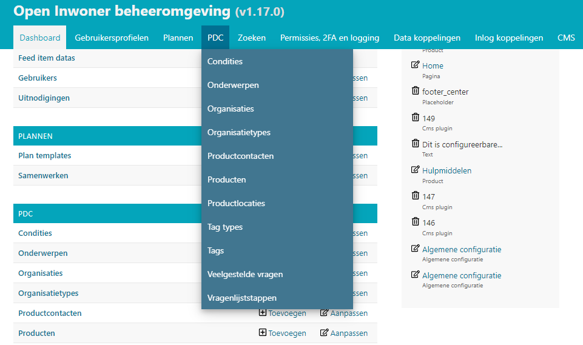
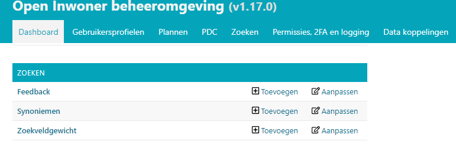
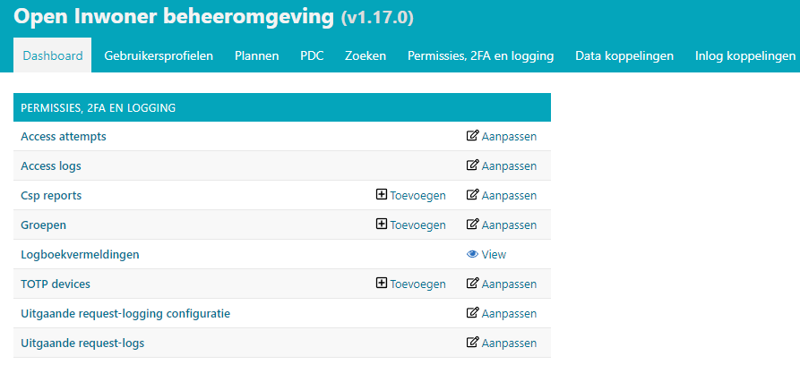
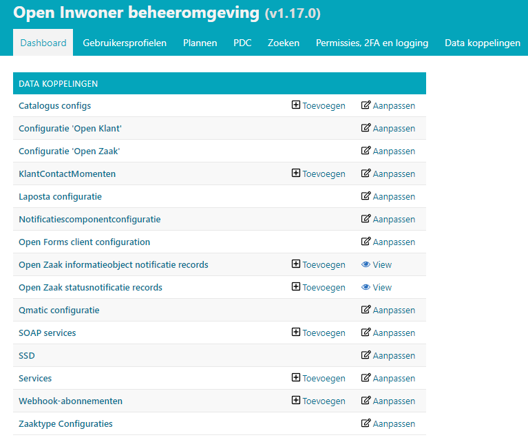
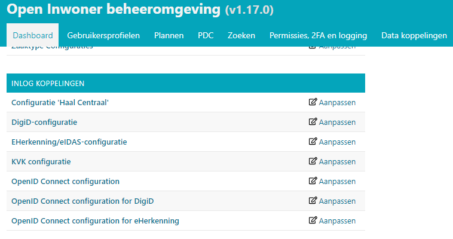

.. _dashboard:

============
3. Dashboard
============

Wanneer u bent ingelogd komt u terecht op de dashboardpagina. Dit is de overzichtspagina waar u uw recente acties kunt zien en waar u via de kortste route voor sommige onderdelen direct bepaalde wijzigingen kunt uitvoeren en informatie snel kunt raadplegen. In het dashboard vindt u (korte routes naar) de gebruikersprofielen, de plannen, de PDC (Producten en Diensten Catalogus), zoeken, de permissies, two factor authentication en logging, Datakoppelingen, Inlog koppelingen, het CMS, de configuratie, e-mails en overige/diverse.

3.1. Gebruikersprofielen
========================

Op het dashboard vindt u een overzicht van onderdelen die u rond de gebruikersprofielen kunt bekijken
en (indien noodzakelijk) wijzigen. Via het dashboard kunt u de onderliggende elementen direct wijzigen
of extra elementen aan de onderdelen toevoegen. Toevoegen doet u door te klikken op de knop [ +
toevoegen]. Wijzigen doet u door te klikken op de knop [aanpassen].

3.2. Plannen
============

Op het dashboard kunt u direct naar de plan templates of het overzicht van de door gebruikers
aangemaakte samenwerkingsplannen gaan. U kunt plan templates en plannen direct wijzigen of nieuwe
toevoegen. Toevoegen doet u door te klikken op de knop met [ + toevoegen]. Wijzigen doet u door te
klikken op de knop [aanpassen].

3.3. PDC
========

Op het dashboard vindt u het overzicht van de onderdelen van de PDC (producten en diensten
catalogus). Via het dashboard kunt u de onderliggende elementen direct wijzigen of extra elementen aan
de onderdelen toevoegen. Toevoegen doet u door te klikken op de knop met [ + toevoegen]. Wijzigen
doet u door te klikken op de knop [aanpassen].

3.4. Zoeken
===========

Via het dashboard kunt u direct doorklikken naar de onderdelen die bij de zoekfunctie horen, namelijk
feedback op de zoekfunctie, synoniemen voor zoekwoorden en zoekveldgewicht. U kunt deze
onderdelen direct wijzigen en extra items toevoegen. Toevoegen doet u door te klikken op de knop [ +
toevoegen]. Wijzigen doet u door te klikken op de knop [aanpassen].

3.5. Permissies, 2FA en Logging
===============================

Op het dashboard vindt u het overzicht van de onderdelen van Permissies, 2FA (two factor
authentication) en logging. Het gaat hier om onderdelen die te maken hebben met de gebruikersrollen
en permissies, de tweestaps authenticatie en zaken die gemonitord worden. Via het dashboard kunt u de
onderliggende onderdelen direct wijzigen en aan sommige onderdelen kunt u extra items toevoegen.
Toevoegen doet u door te klikken op de knop met [ + toevoegen]. Wijzigen doet u door te klikken op de
knop [aanpassen].

3.6. Datakoppelingen
====================

Op het dashboard vindt u het overzicht van de onderdelen datakoppelingen. Het gaat hier om onderdelen die te maken hebben met de koppeling van externe systemen aan het Open Inwoner Platform. Sommige onderdelen kunt u direct wijzigen en aan sommige onderdelen kunt u extra items toevoegen. Toevoegen doet u door te klikken op de knop met [ + toevoegen]. Wijzigen doet u door te klikken op de knop [aanpassen].

3.7. Inlog koppelingen
======================

Op het dashboard vindt u het overzicht van de onderdelen inlog koppelingen. Het gaat hier om
onderdelen die te maken hebben met de koppeling en configuratie van (soms verplichte) inlogwijzes aan
het Open Inwoner Platform. Denk aan DigiD, eHerkenning en KVK. U kunt onderdelen kunt u direct
wijzigen door te klikken op de knop [aanpassen].

3.8. CMS
========

Op het dashboard vindt u het overzicht van de onderdelen van het CMS. Het gaat hier om Page types en
pagina’s. U kunt direct via het dashboard wijzigingen doorvoeren en extra items toevoegen. Toevoegen
doet u door te klikken op de knop met [ + toevoegen]. Wijzigen doet u door te klikken op de knop
[aanpassen].

3.9. Configuratie
=================

Op het dashboard vindt u het overzicht van de onderdelen rond de algemene configuratie. Via het
dashboard kunt u sommige onderliggende elementen direct wijzigen of extra elementen aan de
onderdelen toevoegen. Toevoegen doet u door te klikken op de knop met [ + toevoegen]. Wijzigen doet
u door te klikken op de knop [aanpassen].

3.10. E-mails
=============

Op het dashboard vindt u het overzicht van de onderdelen van e-mails. Het gaat hier om e-mailadressen
die op de zwarte lijst staan, logs van door het systeem verzonden e-mails en Mijn Berichten. U kunt
direct via het dashboard wijzigingen doorvoeren en extra items toevoegen. Toevoegen doet u door te
klikken op de knop met [ + toevoegen]. Wijzigen doet u door te klikken op de knop [aanpassen].

3.11. Overige / diverse
=======================

Op het dashboard vindt u het overzicht van de overige of diverse onderdelen. Via het dashboard kunt u
sommige onderliggende elementen direct wijzigen of extra elementen aan de onderdelen toevoegen.
Application groups omvat de menu items en Mappen bevat alle op uw Open Inwoner omgeving
gebruikte afbeeldingen. Toevoegen doet u door te klikken op de knop met [ + toevoegen]. Wijzigen doet
u door te klikken op de knop [aanpassen]. Tot slot vindt u hier directe links naar de documentatie,
Github en Maykin.
