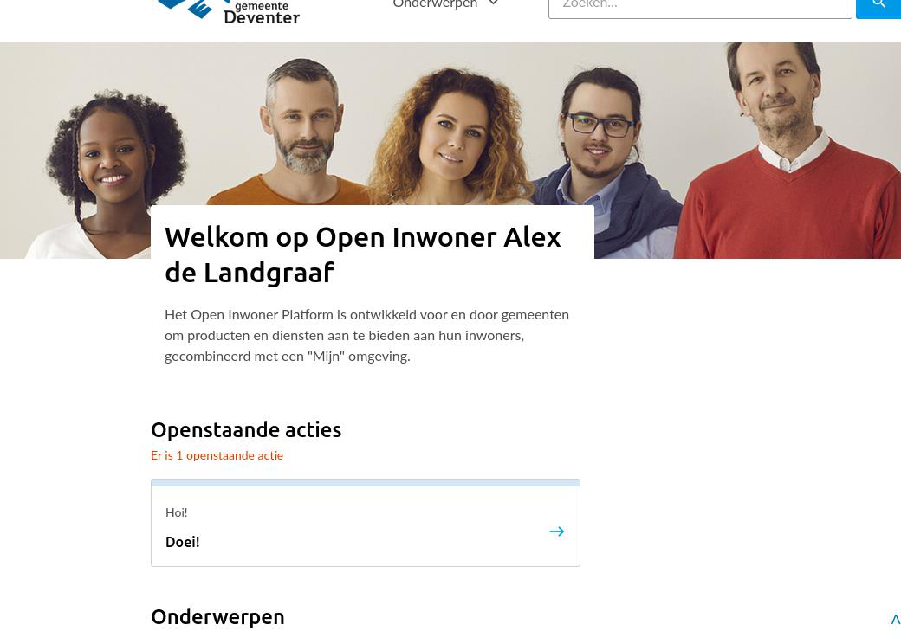

.. _gebruikersprofielen:

======================
4. Gebruikersprofielen
======================

In het topmenu vindt u de knop Gebruikersprofielen. Wanneer u hier met uw muis over hovert,
verschijnt er een submenu met daarin alle onderdelen die bij Gebruikersprofielen horen. Deze lijst is
tevens zichtbaar in het dashboard van Open Inwoner. Zowel via het menu als via het dashboard kunt u
naar het gewenste onderdeel doorklikken.

4.1. Acties
===========

Onder acties vindt u alle acties die gebruikers aan de voorkant van Open Inwoner (onder Mijn Profiel)
hebben aangemaakt. U kunt de acties eenvoudig filteren op gebruiker. U ziet dan enkel de acties die bij
een bepaalde gebruiker horen. Dit onderdeel is enkel in te zien (read-only).

4.1.1. Actieoverzicht sorteren
------------------------------

U kunt het actieoverzicht sorteren op naam, creatiedatum en gebruiker. Dit doet u door op de gewenste
kolomnaam te klikken. U kunt oplopend of aflopend sorteren op één of meerdere kolommen. Wanneer u
alleen wilt sorteren op Naam klikt u enkel op deze kolom. Om te wisselen tussen oplopend en aflopend
klikt u op het icoontje van het driehoekje dat naar boven of naar beneden wijst.

Om vervolgens nog te sorteren op creatiedatum, klikt u ook op deze kolom. De lijst wordt dan gesorteerd
op creatiedatum + naam. Wilt u op alle drie de kolommen sorteren, dan klikt u ook op de kolom
gebruiker. De lijst is nu gesorteerd op creatiedatum + naam + gebruiker. Het is belangrijk te weten dat de
nieuw aangeklikte kolom óver de al actieve sortering wordt gezet. De laatste kolom geldt in dat geval dus
als ‘hoofd’. Om de voorwaarde voor de sortering te verwijderen, klikt u op het icoontje van de twee driehoekjes met
de streep erdoor.

4.2. Berichten
==============

Onder berichten vindt u alle berichten die door gebruikers verzonden zijn via de Open Inwoner
omgeving. Dit onderdeel is read-only: er kunnen geen wijzigingen worden aangebracht. U kunt de
berichten eenvoudig filteren op afzender. U ziet dan enkel de berichten die verzonden zijn door een
bepaalde gebruiker. Daarnaast kunt u in de backend zien welke berichten gezien en verzonden zijn. Dit
wordt respectievelijk weergegeven door middel van een rood kruisje en een groen vinkje.

4.2.1. Details berichten
------------------------

Door op een specifiek bericht te klikken kunt u de details van het bericht raadplegen. Hier vind u de
UUID (Universally Unique ID), de afzender, de ontvanger, de content, of het bericht correct verzonden is,
of het bericht gezien is en een eventuele bijlage.

4.3. Documenten
===============

Onder documenten vindt u alle documenten die gebruikers aan de voorkant van Open Inwoner (onder
Mijn Profiel) hebben aangemaakt. Dit onderdeel is read-only: er kunnen geen wijzigingen worden
aangebracht. U kunt documenten eenvoudig filteren op gebruiker. U ziet dan enkel de documenten die
toegevoegd zijn door een bepaalde gebruiker.

4.3.1. Documentenoverzicht sorteren
-----------------------------------

U kunt het documentenoverzicht sorteren op naam, bestandsnaam, creatiedatum, en gebruiker. Dit doet
u door op de gewenste kolomnaam te klikken. U kunt oplopend of aflopend sorteren op één of
meerdere kolommen. Wanneer u alleen wilt sorteren op naam klikt u enkel op deze kolom. Om te
wisselen tussen oplopend en aflopend klikt u op het icoontje van het driehoekje dat naar boven of naar
beneden wijst. Voor meer details over het sorteren van de documenten, raadpleegt u de beschrijving bij
hoofdstuk 4.1.1.

4.4. Feed item data
===================

Onder feed item data kunt u zien welke openstaande acties er op de homepage van gebruikers zichtbaar
zijn, zoals op het onderstaande screenshot te zien is. Gebruikers zien, na inloggen, welke openstaande
acties zij nog hebben. Deze worden weergegeven in een blokje met daarin de titel van de actie en de
omschrijving van de actie.

In de backend is het overzicht van de feed item data te raadplegen. Er is informatie te vinden over voor welke betreffende gebruiker de feed item data is, het soort feed item data, de datum waarop de actie is aangemaakt en of de informatie in de feed bekeken is of dat de actie is voltooid en zo ja, op welke datum. De gegevens kunnen worden gefilterd en gesorteerd op de al deze elementen.

   .. image:: images/image14.png
      :width: 624px
      :height: 274px

4.5. Gebruikers
===============

Onder gebruikers vindt u alle gebruikers van uw Open Inwoner. Indien gewenst kunt u gebruikers
toevoegen, wijzigen en verwijderen. Daarnaast kunt u de permissies van gebruikers wijzigen en een
gebruikersaccount overnemen (kapen). Bovendien kunt u de gebruikers eenvoudig filteren op
beheerstatus, supergebruikerstatus of op activiteit.

4.5.1. Gebruikersoverzicht sorteren
-----------------------------------

U kunt het gebruikersoverzicht sorteren op e-mailadres, voornaam, achternaam en beheerstatus. Dit
doet u door op de gewenste kolomnaam te klikken. U kunt oplopend of aflopend sorteren op één of
meerdere kolommen. Wanneer u alleen wilt sorteren op achternaam klikt u enkel op deze kolom. Om te
wisselen tussen oplopend en aflopend klikt u op het icoontje van het driehoekje dat naar boven of naar
beneden wijst. Voor meer details over het sorteren van de gebruikers, raadpleegt u de beschrijving bij
hoofdstuk 4.1.1.

4.5.2. Gebruiker toevoegen
--------------------------
Door in het gebruikersoverzicht op de knop [Gebruiker toevoegen +] rechts bovenin uw scherm te
klikken kunt u een nieuwe gebruiker toevoegen. Er wordt een nieuw scherm geopend waar u enkele
gegevens dient in te vullen. Wanneer alle gegevens zijn ingevuld klikt u op [ opslaan ].

E-mailadres
~~~~~~~~~~~
Dit is het e-mailadres waarmee de nieuwe gebruiker kan inloggen.

Wachtwoord
~~~~~~~~~~
Voer hier het gewenste wachtwoord in

Bevestiging wachtwoord
~~~~~~~~~~~~~~~~~~~~~~
Herhaal hier het wachtwoord ter controle.

4.5.3. Gebruiker wijzigen
-------------------------
Door op een gebruiker in het overzicht te klikken, kunt u deze wijzigen. Er wordt een nieuw scherm
geopend waar u naast de persoonlijke gegevens diverse wijzigingen kunt aanbrengen.

E-mailadres
~~~~~~~~~~~
Dit is het e-mailadres waarmee de nieuwe gebruiker kan inloggen.

Wachtwoord
~~~~~~~~~~

Voer hier het gewenste wachtwoord in

Login type
~~~~~~~~~~

Hier kunt u de manier van inloggen wijzigen. Kies in het dropdown menu voor e-mail en wachtwoord, DigiD of eHerkenning.

Persoonlijke informatie
~~~~~~~~~~~~~~~~~~~~~~~

Hier kunt u de persoonlijke gegevens van de gebruiker wijzigen. Dit gaat om alle persoonsgegevens, een
eventuele pasfoto en er wordt weergegeven of de gebruiker OpenID Connect heeft gebruikt om in te loggen.

Contact type
~~~~~~~~~~~~
Hier kunt u selecteren om wat voor soort contactpersoon het gaat. In het dropdown menu kunt u kiezen
uit ‘contactpersoon’, ‘begeleider’ of ‘organisatie.

Geselecteerde onderwerpen
~~~~~~~~~~~~~~~~~~~~~~~~~

Hier kunt u de onderwerpen waar de gebruiker in geïnteresseerd is wijzigen. Selecteer de betreffende
onderwerpen in de lijst of voeg een nieuw onderwerp toe door op [+] te klikken.

Belangrijke datums
~~~~~~~~~~~~~~~~~~

Hier kunt u de datum en tijd van de creatie van de account en de datum en tijd van de laatste aanmelding wijzigen.
Hier wordt het e-mailadres van de gebruiker die het document geüpload heeft weergegeven. Door op [+]
te klikken kunt u een extra gebruiker toevoegen.

Opslaan of verwijderen
~~~~~~~~~~~~~~~~~~~~~~

U kunt in dit scherm ook de betreffende gebruiker verwijderen door onderaan het scherm op de rode
knop [verwijderen] te klikken.
Als u uw wijzigingen tussentijds wilt opslaan, klikt u op [opslaan en opnieuw bewerken]. Wanneer u
tevreden bent met uw wijzigingen klikt u op [opslaan] om terug te keren naar het overzicht. Of u klikt op
[opslaan en nieuwe toevoegen] als u een extra item wilt toevoegen.

4.5.4. Permissies wijzigen
--------------------------

Door in het gebruikersoverzicht op een bepaalde gebruiker te klikken kunt u deze wijzigen, zoals in 4.6.3
beschreven. Wanneer u de permissies van een gebruiker wilt aanpassen, klikt u in het wijzigingsscherm
in de blauwe balk met Permissies op [tonen]. U kunt nu de diverse wijzigingen rond de permissies
aanbrengen.

Actief
~~~~~~
Door hier het vinkje weg te halen zet u de gebruikersaccount op inactief.

Beheerstatus
~~~~~~~~~~~~
Zet hier een vinkje wanneer u de gebruiker een beheerdersrol wilt geven. Let op! De gebruiker krijgt hiermee toegang tot de beheeromgeving.

Supergebruikerstatus
~~~~~~~~~~~~~~~~~~~~
Zet hier een vinkje wanneer u de gebruiker de rol van supergebruiker wilt geven. Let op! De gebruiker
krijgt hiermee alle rechten.
Gedeactiveerd op:
Selecteer hier de datum waarop u de gebruikersaccount wilt deactiveren.

Groepen
~~~~~~~
Hier kunt u de gebruikersaccount aan bepaalde groepen toevoegen, waardoor zij automatisch bepaalde
rechten krijgen. Het gaat hier om beheerdergroepen. Klik op [+] om een nieuwe groep aan te maken.

Laat dit veld leeg als de gebruiker niet tot een groep behoort. U kunt de gebruiker dan in het volgende
veld specifieke permissies geven.

Gebruikersrechten
~~~~~~~~~~~~~~~~~
Hier kunt u de gebruikersaccount bepaalde rechten toewijzen. Houd de {ctrl} toets op uw toetsenbord
ingedrukt om meerdere rechten te selecteren. Wanneer u tevreden bent met uw selectie klikt u op het
icoontje van het pijltje naar rechts, waardoor de gekozen permissies naar het veld Gekozen worden
verplaatst. Wilt u alle permissies kiezen? Dan klikt u op de knop [alle kiezen]. Om alle gekozen permissies
te verwijderen klikt u op [alle verwijderen].
Wanneer u de permissies naar wens hebt gewijzigd, scrolt u naar de onderkant van het venster en kunt u
de gebruikersaccount opslaan zoals aangegeven onder 4.5.3.

4.5.5. Notificatie-instellingen aanpassen
-----------------------------------------

Wanneer u in de blauwe balk bij notificaties op [tonen] klikt, krijgt u de mogelijkheid de
gebruikersinstellingen rond notificaties aan te passen. Wanneer getoond, krijgt u de mogelijke
notificaties van de betreffende gebruiker te zien. De blauwe vinkjes geven aan voor welk soort
notificaties de gebruiker zich voor heeft ingeschreven. Indien gewenst kunnen deze gegevens worden
gewijzigd, zodat de gebruiker bepaalde notificaties juist wel of juist niet ontvangt.

4.5.6. Contacten - uitnodigingen
--------------------------------

Onder contacten – uitnodigingen kunnen beheerders contactpersonen toevoegen aan gebruikers. In het
linker veld staan de beschikbare contacten. Selecteer een contactpersoon of typ een gedeelte van een
naam om de beschikbare contactpersonen te zien. Klik op het pijltje naar rechts  om de
contactpersoon toe te voegen aan de gebruiker. Om meerdere contactpersonen tegelijk te selecteren
houdt u [ctrl] of de [command] knop ingedrukt.
Wanneer de gebruiker in zijn profiel zelf contactpersonen toevoegt zijn deze hier ook aan de rechterzijde
zichtbaar. De toegevoegde contactpersoon komt in eerste instantie rechts bij ‘beschikbare contacten ter
goedkeuring’ te staan. Na wederzijdse goedkeuring door het toegevoegde contact wordt de
contactpersoon weergegeven aan de rechterzijde van het veld ‘beschikbare contacten’.

Onder contacten ter goedkeuring staan alle contacten die nog dienen te worden goedgekeurd. Een
gebruiker kan ook contacten toevoegen die nog geen account hebben. Deze toekomstige contacten
ontvangen dan eerste een uitnodiging om een account aan te maken.

   .. image:: images/image19.png
      :width: 624px
      :height: 406px

4.6. Uitnodigingen
==================

Onder uitnodigingen vindt u een overzicht van de door gebruikers uitgenodigde personen. U kunt in het
overzicht raadplegen wie degene is die de persoon heeft uitgenodigd én wie er is uitgenodigd. Bij
‘geaccepteerd’ kunt u zien of de uitnodiging is afgerond. Daarnaast kunt u uitnodigingen toevoegen,
wijzigen of verwijderen.

4.6.1. Uitnodiging toevoegen
----------------------------

Door in het uitnodigingsoverzicht op de knop [Uitnodiging toevoegen +] rechts bovenin uw scherm te
klikken kunt u een nieuwe uitnodiging toevoegen. Er wordt een nieuw scherm geopend waar u enkele
gegevens dient in te vullen. Wanneer alle gegevens zijn ingevuld klikt u op [opslaan].

Uitnodiger
~~~~~~~~~~
Selecteer in het dropdown menu het e-mailadres van de uitnodiger. Door op [+] te klikken kunt u een
extra uitnodiger aan de uitnodiging toevoegen.

Uitgenodigde
~~~~~~~~~~~~
Selecteer in het dropdown menu het e-mailadres van degene die uitgenodigd moet worden. Klik op het
icoontje van het potlood om een nieuw e-mailadres in uw Open Inwoner toe te voegen. Door op [+] te
klikken kunt u een extra ontvanger aan de uitnodiging toevoegen.

Voornaam + Achternaam
~~~~~~~~~~~~~~~~~~~~~
Hier wordt de voor- en achternaam van de uitgenodigde weergegeven.

E-mailadres uitgenodigde
~~~~~~~~~~~~~~~~~~~~~~~~
Hier wordt het e-mailadres weergegeven waar de uitnodiging naartoe gestuurd is.

Geaccepteerd
~~~~~~~~~~~~
Hier wordt aangegeven of de uitnodiging is geaccepteerd of niet. Wanneer de uitnodiging niet is
geaccepteerd is de checkbox leeg en staat er in het overzicht een rood kruisje.

4.6.2. Uitnodiging wijzigen
---------------------------
Door op een uitnodiging in het overzicht te klikken, kunt u deze wijzigen. Er wordt een nieuw scherm
geopend waar u diverse wijzigingen kunt aanbrengen. Meer informatie over de te wijzigen velden vindt u
bij 4.6.1.

4.6.3. Uitnodiging verwijderen
------------------------------
Wanneer u een of meerdere uitnodigingen wilt verwijderen, kikt u in de checkbox links van de
uitnodiging. Selecteer vervolgens in het dropdown menu bij ‘Actie’ de actie ‘Geselecteerde
uitnodigingen verwijderen’ en klik op de knop [uitvoeren]. De geselecteerde uitnodigingen zijn nu
verwijderd.

**Let op! Als de uitnodiging is verwijderd voordat deze is geaccepteerd, zal de uitnodiging ongeldig
worden en kan de ontvanger de uitnodiging niet voltooien.**
