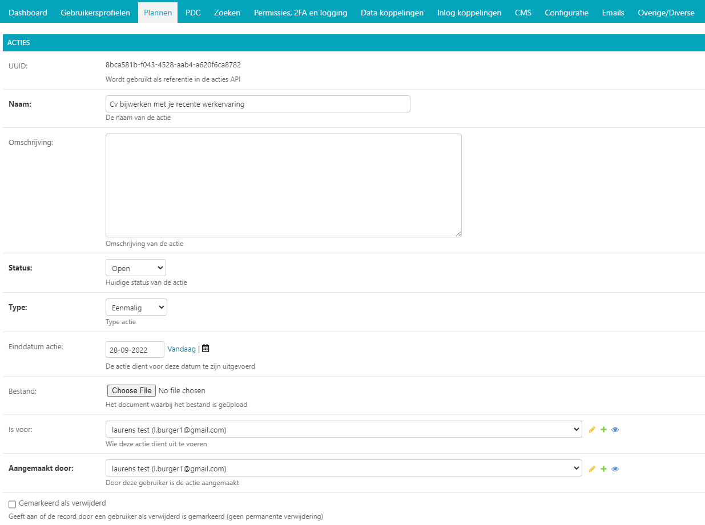

.. _plannen:

==========
5. Plannen
==========

Onder plannen vindt u de plan templates of het overzicht van de door
gebruikers aangemaakte samenwerkingsplannen. Plan templates zijn vooraf
gecreëerde sjablonen die gebruikers kunnen gebruiken als uitgangspunt
voor hun samenwerkingsplan. Zo hoeven ze niet blanco te beginnen. U kunt
plan templates en samenwerkingsplannen wijzigen of verwijderen en u kunt
nieuwe toevoegen.

5.1. Plan templates
===================

Onder plan templates vindt u het overzicht van de beschikbare sjablonen
voor samenwerkingsplannen. U kunt eenvoudig een nieuwe template aanmaken
U kunt plan templates en plannen direct wijzigen of bestaande templates
verwijderen.

5.1.1. Item toevoegen
=====================

Door op de knop [plan template toevoegen +] rechts bovenin uw scherm te
klikken kunt u een nieuwe plan template toevoegen. Er wordt een nieuw
scherm geopend met allerlei velden die aangepast kunnen worden. Dit
scherm is hetzelfde als wanneer u een item wijzigt (zie 5.1.2).

5.1.2. Item wijzigen
====================

U kunt een plan template wijzigen door op de betreffende template in het
overzicht te klikken. Er wordt een nieuw scherm geopend waar u diverse
wijzigingen kunt aanbrengen.

| *Naam*
| Hier kunt u de template een andere naam geven.

| *Bestand*
| Hier kunt een bestand uploaden of het bestaande document vervangen
  door een nieuw te kiezen bestand. Om dit te doen klikt u op het
  potloodje. U kunt nu een nieuw document selecteren in de directory of
  een nieuw bestand uploaden. U kunt ook het huidige bestand verwijderen
  door op [x] te klikken.

| *Doel*
| Hier komt het doel van het samenwerkingsplan te staan dat met deze
  plansjabloon wordt gemaakt. Wat wil de gebruiker bereiken met deze
  samenwerking?

*Let op: deze tekst is voor de gebruiker zichtbaar bij de*
**omschrijving** *van het samenwerkingsplan én na de selectie van de
sjabloon bij* **doel**\ *. De gebruiker*

| **Actiesjablonen / Action templates**
| Dit zijn de vooraf ingevulde elementen van de plan template die met
  acties te maken hebben. Welke acties wil de gebruiker ondernemen om
  het doel van de samenwerking te bereiken? De teksten die hier staan
  zijn voor de gebruiker zichtbaar onder het kopje ‘acties’. Ze kunnen
  door de gebruiker aan de voorzijde van het platform worden
  gepersonaliseerd.

| *Naam action template object (1)…*
| Dit is de vooraf ingestelde naam van het eerste actiepunt. Bij (2)
  etc. kunt u eventueel meerdere actiepunten neerzetten.

| *Omschrijving action template object (1)…*
| Dit is de vooraf ingestelde omschrijving van het eerste actiepunt. Vul
  voor ieder actiepunt een omschrijving in.

| *Doel action template object (1)…*
| Dit is de vooraf ingestelde doel van het eerste actiepunt. Vul voor
  ieder actiepunt een doel in.

| *Type action template object (1)…*
| Hier kunt u vooraf ingeven of het een eenmalig of terugkerend
  actiepunt is. Vul dit in voor ieder actiepunt.

| *Eindigt in X dagen*
| Hier kunt u vooraf ingeven over hoeveel dagen het actiepunt dient te
  zijn afgerond.. Vul dit in voor ieder actiepunt.

*Verwijderen?*

Hier kunt u een vooraf ingesteld actiepunt uit de template verwijderen.
Zet een vinkje in de betreffende checkbox. Wanneer de template is
opgeslagen wordt het betreffende actiepunt verwijderd.

| *Opslaan of verwijderen*
| U kunt in dit scherm ook het betreffende plan template verwijderen
  door onderaan het scherm op de rode knop [verwijderen] te klikken.

Als u uw wijzigingen tussentijds wilt opslaan, klikt u op [opslaan en
opnieuw bewerken]. Wanneer u tevreden bent met uw wijzigingen klikt u op
[opslaan] om terug te keren naar het overzicht. Of u klikt op [opslaan
en nieuwe toevoegen] als u een extra item wilt toevoegen.

5.2. Samenwerken
================

Onder samenwerken vindt u een overzicht van de door gebruikers
aangemaakte samenwerkingsplannen. U kunt vanuit deze vanuit de
beheeromgeving inzien, wijzigen of verwijderen en u kunt een nieuw
samenwerkingsplan toevoegen.

5.2.1. Plan toevoegen
---------------------

Door in het overzicht op de knop [toevoegen +] rechts bovenin uw scherm
te klikken kunt u een nieuw samenwerkingsplan toevoegen. Er wordt een
nieuw scherm geopend waar u enkele gegevens dient in te vullen. Wanneer
alle gegevens zijn ingevuld klikt u op [opslaan].

5.2.2. Plan wijzigen
--------------------

Door op een samenwerkingsplan in het overzicht te klikken, kunt u deze
wijzigen. Er wordt een nieuw scherm geopend waar u diverse wijzigingen
kunt aanbrengen. Dit scherm bestaat uit twee delen: het algemene deel en
het actiedeel. In het actiedeel kunt u direct de bij het
samenwerkingsplan horende acties wijzigen of deze toevoegen. Alle
informatie over de elementen binnen het actiedeel vindt u in hoofdstuk 4.1

| *UUID (Universally Unique ID)*
| Dit is de automatisch gegenereerde user ID. Deze code kunt u niet
  wijzigen.

| *Titel*
| Hier kunt u het samenwerkingsplan een andere naam geven.

| *Doel*
| Hier komt het doel van het samenwerkingsplan te staan. Wat wil de
  gebruiker bereiken met deze samenwerking?

| *Einddatum*
| Hier kunt u de einddatum van het samenwerkingsplan wijzigen. Dit is de
  datum waarvoor het doel van het samenwerkingsplan door de gebruiker
  dient te zijn behaald.

| *Aangemaakt door*
| Hier wordt het e-mailadres van de gebruiker die het samenwerkingsplan
  aangemaakt heeft weergegeven. Door op [+] te klikken kunt u een extra
  gebruiker toevoegen.

| *Contacten*
| Hier wordt de betrokken contactpersoon weergegeven. Klik op een naam
  om een andere contactpersoon te selecteren. Door op [+] te klikken
  kunt u een extra contactpersoon aan het samenwerkingsplan toevoegen.

Door een vinkje te zetten bij *Notificeer contact* ontvangt de betrokken
contactpersoon een notificatie dat deze bij de samenwerking betrokken
is. Om de contactpersoon van de samenwerking te verwijderen zet u een
vinkje bij [verwijderen] alvorens de samenwerking op te slaan.

| *Opslaan of verwijderen*
| U kunt in dit scherm ook het betreffende document verwijderen door
  onderaan het scherm op de rode knop [verwijderen] te klikken.

Als u uw wijzigingen tussentijds wilt opslaan, klikt u op [opslaan en
opnieuw bewerken]. Wanneer u tevreden bent met uw wijzigingen klikt u op
[opslaan] om terug te keren naar het overzicht. Of u klikt op [opslaan
en nieuwe toevoegen] als u een extra item wilt toevoegen.

5.2.3. Acties samenwerkingsplan
===============================

Bij de samenwerkingsplannen horen acties. De acties die gekoppeld zijn
aan een samenwerking zijn onder *Samenwerken* in hetzelfde venster te
vinden. Alle gekoppelde acties worden hier onder elkaar weergegeven. De
onderdelen per actie zijn te zien in de onderstaande screenshot. Deze
onderdelen zijn tot op zekere hoogte hetzelfde als het onderdeel
*Acties* onder het menu item *Gebruikersprofielen,* met als verschil dat
de onderdelen onder *Samenwerken* kunnen worden gewijzigd.

In *Mijn profiel* vindt de gebruiker een overzicht van alle verzamelde
acties bij elkaar. Een voorbeeld van een scherm van de gebruikers aan de
voorkant van het platform is te zien in het volgende screenshot.

| *UUID (Universally Unique ID)*
| Dit is de automatisch gegenereerde user ID. Deze code kunt u niet
  wijzigen.

| *Naam*
| Hier kunt u de actie een andere naam geven.

*Omschrijving*

Hier kunt u een korte omschrijving van de actie invullen.

| *Status*
| Hier kunt u selecteren wat de huidige status van de actie is: open,
  accordering of afgerond.

| *Type*
| In dit dropdown menu kunt u selecteren of de actie eenmalig is of
  terugkerend.

| *Einddatum actie*
| Hier kunt u de einddatum van de actie wijzigen. Dit is de datum
  waarvoor de actie dient te zijn afgerond door de gebruiker.

| *Bestand*
| Hier kunt u een bestand met betrekking tot de actie uploaden of het
  bestaande document vervangen door een nieuw te kiezen bestand. Om dit
  te doen klikt u op [bestand kiezen]. U kunt nu een nieuwe versie van
  het document uploaden, of een geheel ander bestand kiezen.

| *Is voor*
| Hier kunt u aangeven bij welke gebruiker de actie hoort (welke
  gebruiker de actie dient uit te voeren), of de gebruiker wijzigen.
  Door op [+] te klikken kunt u een extra gebruiker toevoegen.

| *Aangemaakt door*
| Hier kunt u aangeven wie de actie heeft aangemaakt, of de initiator
  wijzigen. Door op [+] te klikken kunt u een extra initiator toevoegen.

| *Gemarkeerd als verwijderd*
| Hier kunt u selecteren of de actie als verwijderd moet worden
  gemarkeerd. Indien de gebruiker de actie als verwijderd heeft
  gemarkeerd staat hier een vinkje. Let op, het gaat hier niet om een
  permanente verwijdering.

5.2.4. Plan verwijderen
=======================

Wanneer u een of meerdere samenwerkingsplannen wilt verwijderen, kikt u
in de checkbox links van de titel van het samenwerkingsplan. Selecteer
vervolgens in het dropdown menu bij ‘Actie’ de actie ‘Geselecteerde
samenwerkingsplannen verwijderen’ en klik op de knop [uitvoeren]. De
geselecteerde samenwerkingsplannen zijn nu verwijderd.
