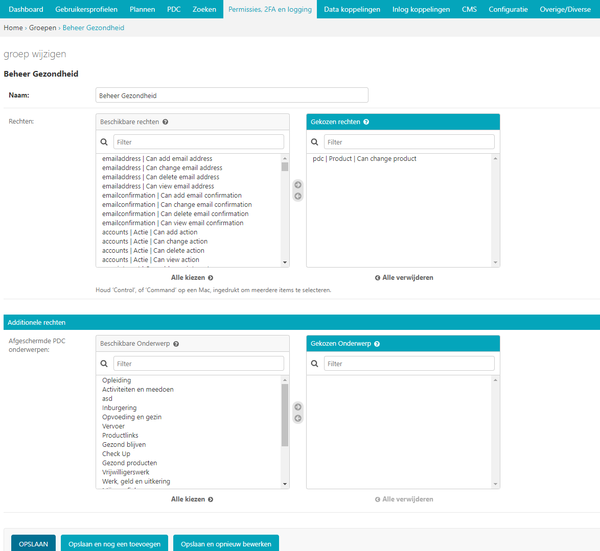
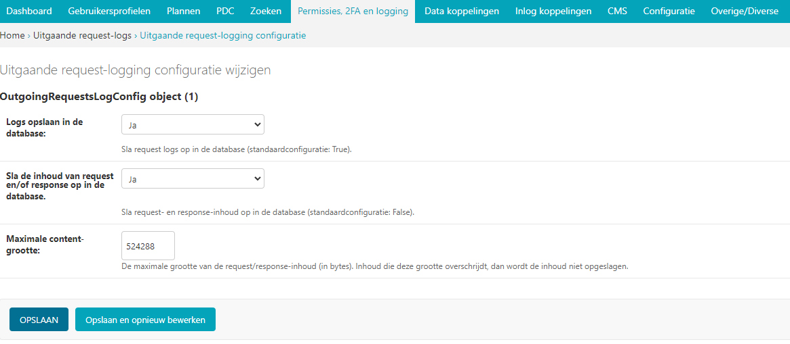

.. _permissies_2fa_logging:

=============================
8. Permissies, 2FA en Logging
=============================

Onder Permissies, 2FA (two factor authentication) en logging vindt u alle elementen van het Open
Inwoner platform die te maken hebben met de gebruikersrollen en bijbehorende permissies, de
tweestaps authenticatie en zaken die gemonitord worden zoals foutieve inlogpogingen.

8.1. Access attempts
====================

Bij Access attempts vindt u een overzicht van alle mislukte
inlogpogingen op uw Open Inwoner omgeving. In dit overzicht vindt u
data, IP-adressen en via welk gebruikersaccount is geprobeerd in te
loggen. Op deze manier kan worden gemonitord wie er geprobeerd heeft in
te loggen of welk gebruikersaccount wellicht in verkeerde handen is
gevallen.

8.2. Access logs
================

Bij Access logs vindt u een overzicht van alle succesvolle
inlogpogingen. In dit overzicht worden het moment van in- en uitloggen,
het IP-adres, de gebruikersnaam, de manier van inloggen en de
apparaatgegevens getoond. Het overzicht kan worden gefilterd op datum
van in- of uitloggen of op de manier van inloggen (de gevolgde route).
Daarnaast kan het overzicht eenvoudig worden gesorteerd door op de
gewenste kolomnamen te klikken.

8.3. CSP reports
================

Dit onderdeel is bedoeld voor technische controles van de content
security policy header. Dit is enkel voor de technisch beheerder.

8.4. Groepen
============

Bij Groepen vindt u een overzicht van de beschikbare gebruikersgroepen
(beheerders) van de Open Inwoner omgeving. Het gebruik van
beheerdersgroepen stelt u in staat op groepsniveau permissies en rollen
toe te kennen. Via groepenbeheer kunnen afzonderlijke gebruikersgroepen
of beheergroepen worden ingericht door een (overkoepelend) functioneel
beheerder. Hiermee kunnen specifieke rechten worden toegekend aan
beheerders van het platform, of kan het beheer van bepaalde onderdelen
worden gedelegeerd aan beheerders die slechts toegang hebben tot een
deel van de beheeromgeving.

8.4.1. Groep toevoegen
----------------------

Door in het overzicht op de knop [groep toevoegen +] rechts bovenin uw
scherm te klikken kunt u een nieuwe groep toevoegen. Er wordt een nieuw
scherm geopend waar u de groep een naam dient te geven. Vervolgens
selecteert u alle voor deze groep gewenste rechten. Indien alle gewenste
rechten zijn geselecteerd klikt u op [opslaan].

**Tip! Houd de [ctrl] toets ingedrukt om één voor één meerdere rechten
in één keer te selecteren. Houd de [shift] toets ingedrukt om in één
keer meerdere opeenvolgende rechten te selecteren.**

8.4.2. Additionele rechten
--------------------------

Door in het venster onderwerpen te selecteren kunt u een beheerdergroep
additionele rechten geven. Hier selecteert u de onderwerpen die voor de
betreffende beheerdersgroep van toepassing zijn. Op deze manier kunt u
de beheerdersgroep op onderwerpniveau bepaalde rechten geven. De
betreffende beheerdersgroep heeft dan enkel de geselecteerde rechten
over de geselecteerde onderwerpen.

8.5. Logboekvermeldingen
========================

Bij logboekvermeldingen vindt u een read-only register van op het Open
Inwoner platform uitgevoerde acties. In dit logboek wordt geregistreerd
wie er wanneer welke actie uitvoerde. Het gaat hier zowel om
gebruikersacties als beheerdersacties.

8.6. Logs
=========

Bij logs vindt u een overzicht van alle mails die door het systeem
verstuurd zijn. Deze logs zijn read-only en kunnen enkel worden
gesorteerd en gefilterd.

8.7. Verzonden e-mails
======================

Bij verzonden e-mails vindt u het overzicht van alle door het systeem
verzonden e-mails. Ook deze logs zijn read-only en kunnen enkel worden
gesorteerd en gefilterd.

8.8. TOTP devices
=================

Bij TOTP devices vindt u de middels TOTP (time-based one time password)
goedgekeurde apparaten waarmee kan worden ingelogd. TOTP is een van de
meest gebruikte vormen van two-factor authentication. U kunt TOTP
devices toevoegen, wijzigen of verwijderen.

8.8.1. TOTP device toevoegen
----------------------------

| Door in het overzicht op de knop [TOTP devices toevoegen +] rechts
  bovenin uw scherm te klikken kunt u een nieuw apparaat wat door middel
  van TOTP kan worden gebruikt om in te loggen worden
| toegevoegd. Er wordt een nieuw scherm geopend waar u enkele gegevens
  dient in te vullen. Wanneer alle gegevens zijn ingevuld klikt u op
  [opslaan].

8.8.2. TOTP device wijzigen
---------------------------

Door op een e-mailadres in het overzicht te klikken, kunt u het
goedgekeurde TOTP device wijzigen. Er wordt een nieuw scherm geopend
waar u diverse wijzigingen kunt aanbrengen.

| *Gebruiker*
| Hier ziet u het gebruiker-ID van degene aan wie het TOTP device is
  gekoppeld en het bijbehorende mailadres. Wijzig dit ID niet.

| *Naam*
| Hier zet u de naam van het TOTP device. Dit staat standaard op
  ‘default’.

**Let op!**

**De velden onder de onderdelen Configuration, State en Throttling zijn
technische velden die enkel in overleg met de leverancier aangepast
dienen te worden.**

| *Opslaan*
| Als u uw wijzigingen tussentijds wilt opslaan, klikt u op [opslaan en
  opnieuw bewerken]. Wanneer u tevreden bent met uw wijzigingen klikt u
  op [opslaan] om terug te keren naar het overzicht. Of u klikt op
  [opslaan en nieuwe toevoegen] als u een extra item wilt toevoegen.

8.8.3. TOTP device verwijderen
------------------------------

Wanneer u een of meerdere TOTP devices wilt verwijderen, kikt u in de
checkbox links van de titel van de template. Selecteer vervolgens in het
dropdown menu bij ‘Actie’ de actie ‘Geselecteerde TOTP devices
verwijderen’ en klik op de knop [uitvoeren]. De geselecteerde TOTP
devices zijn nu verwijderd.

**Let op! Door een TOTP device te verwijderen wordt de beheerder bij
opnieuw inloggen gevraagd de QR-code nogmaals te scannen. Dit is
noodzakelijk als de beheerder zijn 2FA code is kwijtgeraakt of vergeten.
Op deze manier kan dit TOTP device worden gereset.**

8.9. Uitgaande request-logs configuratie
========================================

Bij de uitgaande request-logs configuratie kunt u instellen dat
uitgaande request logs zichtbaar worden.

8.10. Uitgaande request-logs
============================

Onder uitgaande request-logs vindt u een overzicht van alle verzoeken
die het Open Inwoner platform stuurt naar andere API’s. U kunt dit
overzicht filteren op methode, tijdstip van de request, statuscode en
hostnaam. In dit read-only register wordt tevens het antwoord
(statuscode) geregistreerd en wordt er opgeslagen hoe lang de API over
het betreffende verzoek heeft gedaan. Door bepaalde requests te
selecteren kunt u deze – indien gewenst – verwijderen.
